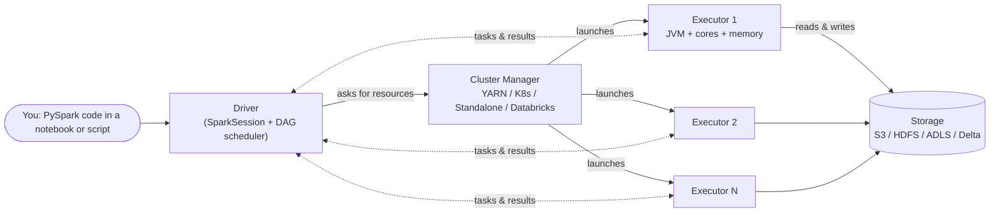

# 02 — Architecture overview (the picture you'll re-use everywhere)

## Why this matters

Every Spark debugging session, every "why is this slow" question, every interview answer — starts with this picture. Memorize it.

## The picture

(See [`diagrams/driver-executor.mmd`](../01_fundamentals/diagrams/driver-executor.mmd) for the deeper-dive version used in Module 01.)

## The five roles

### 1. The driver

The driver is one JVM process that runs *your* code. In a notebook, it's the kernel. In a `spark-submit` job, it's the process spawned by the submit command. Its job:

- Holds the `SparkSession`.
- Translates your DataFrame/SQL code into a logical plan, then a physical plan (Catalyst — Module 03).
- Splits the plan into **jobs**, **stages**, and **tasks**.
- Schedules tasks onto executors and tracks them.
- Collects results back (and *this is where `collect()` can OOM you*).

The driver is a single point of failure. If it dies, the application dies. Don't run heavy logic on it (Module 03 covers `collect()` vs `take()` vs `write()`).

### 2. The cluster manager

Spark doesn't manage machines itself — it asks a cluster manager for executors. The four common ones:

| Cluster manager | Where you meet it |
|---|---|
| **Local** | Your laptop. `local[*]` mode. |
| **Standalone** | Bare-metal or VM clusters. Rare in production today. |
| **YARN** | On-prem Hadoop, EMR. |
| **Kubernetes** | Cloud-native deployments, Spark Operator. |
| **Databricks-internal** | Databricks-managed; you never see the manager directly. |

Day-to-day you don't write code that talks to the cluster manager. You configure it via `spark-submit --master yarn` or via the Databricks cluster config UI.

### 3. The executors

Executors are the JVM processes that actually run your code. Each executor:

- Lives on one cluster node.
- Has a fixed number of cores (`spark.executor.cores`, e.g. 4).
- Has a fixed memory budget (`spark.executor.memory`, e.g. 8 GB).
- Runs N tasks in parallel, where N = number of cores.
- Caches data in its own JVM heap when you `.cache()`.

A cluster with 10 executors × 4 cores each = **40 tasks running in parallel**. Your data needs to be split into ≥ 40 partitions or some cores idle.

### 4. The tasks

A **task** is the smallest unit of work — one function applied to one partition of data on one core of one executor. If your DataFrame has 200 partitions and you run a `count()`, Spark launches 200 tasks.

### 5. The storage layer (not part of Spark, but always present)

Spark doesn't store data. Storage is separate:

- **Object stores**: S3 (AWS), ADLS Gen2 (Azure), GCS (GCP).
- **HDFS**: classic on-prem.
- **Delta / Iceberg / Hudi**: open table formats layered on object stores.
- **JDBC sources**: Postgres, MySQL, etc.
- **Kafka**: for streaming.

Spark's job is to read from storage, transform, write back. This is the **decoupled storage and compute** model that makes cloud Spark cheap and elastic.

## A concrete example

You have a 100 GB Parquet dataset on S3, partitioned into 200 files. Your cluster is 4 executors × 8 cores = 32 task slots.

1. You call `spark.read.parquet("s3://.../data/").filter("date='2024-01-01'").groupBy("country").count().show()`.
2. **Driver**: builds the logical plan, Catalyst pushes the filter to the scanner, the physical plan emerges.
3. **Job 1** is created (because `.show()` is an action). The job has two stages:
   - Stage A: scan + filter + partial group-by per partition (no shuffle).
   - Stage B: shuffle and final aggregate (shuffle boundary).
4. **Stage A** launches 200 tasks (one per file). Only 32 run at a time. Each executor reads its file from S3, filters, computes a partial count per country, writes shuffle blocks to its local disk.
5. **Stage B** launches as many tasks as `spark.sql.shuffle.partitions` (default 200). Each task pulls its assigned shuffle blocks from every other executor, merges them, computes the final count.
6. **Driver** collects 20 rows back and prints them.

That paragraph contains 90% of what you need to know to be productive in Spark. Read it twice.

## Quick glossary you'll hear constantly

- **Application** = one `SparkSession`, one driver + N executors.
- **Job** = one action (`count`, `write`, `show`, `collect`). Composed of stages.
- **Stage** = a set of tasks separated by a shuffle.
- **Task** = one partition processed by one core.
- **Partition** = a chunk of the data that a task handles.
- **Shuffle** = data being re-distributed across executors over the network. Expensive.

Module 01 unpacks job/stage/task and the shuffle in detail.

## References

- [LS Ch.2 §"Distributed Execution Engine"]
- [HPS Ch.2 — "How Spark Works"]
- 📺 [Anatomy of a Spark Job — Conor Murphy, Databricks](https://www.youtube.com/watch?v=rNpzrkB5KQQ)
