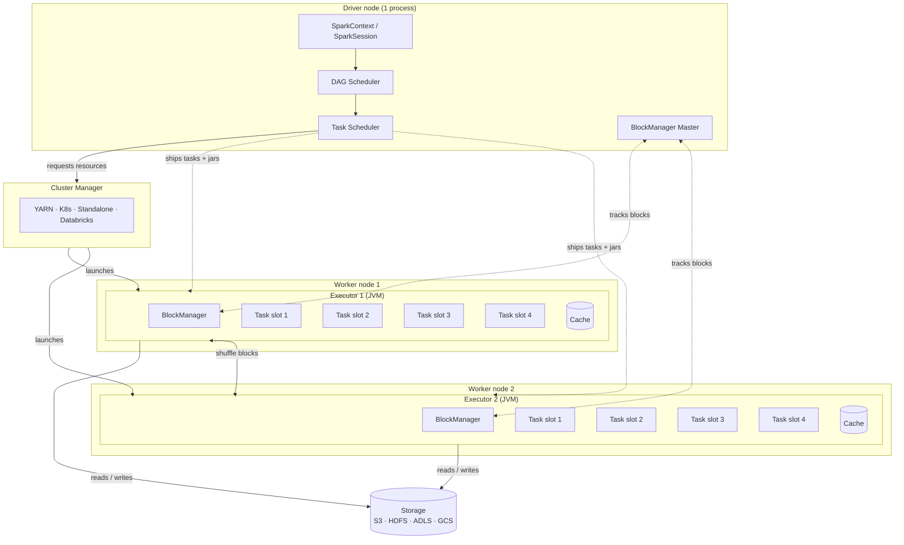
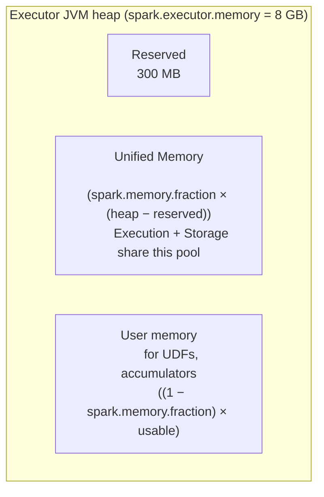

# 01 — Cluster architecture (deep dive)

## Why this matters

Every Spark performance issue is a story about one of: driver, executor, network, or storage. If you can't picture where data is sitting at each moment, you can't diagnose anything.

## The full picture

## The driver, in detail

The driver is one JVM process. Three modes determine *where* that JVM runs:

| Deploy mode | Driver runs on | Used in |
|---|---|---|
| **Client mode** | The machine you submitted from (your laptop / a notebook server). | Interactive notebooks, `pyspark` shell, Databricks notebooks. |
| **Cluster mode** | One of the cluster nodes (chosen by the cluster manager). | Production `spark-submit` jobs on YARN/K8s where you don't want the job tied to your laptop. |
| **Local mode** | Same process as the executors. | `local[*]` — your laptop only. |

Inside the driver JVM, the components that matter:

- **SparkSession** (and the older **SparkContext** it wraps) — your handle to everything.
- **DAG Scheduler** — turns your DataFrame ops into a graph of stages.
- **Task Scheduler** — sends stages' tasks to executors, retries failures.
- **BlockManager Master** — keeps the index of which executor has which cached block / shuffle block.

**Driver memory** (`spark.driver.memory`, default 1 GB) is what kills you when:

- You `collect()` a huge DataFrame back to the driver.
- You broadcast a 5 GB DataFrame (broadcast variables live on the driver before being shipped).
- You use the wrong UDF pattern and accumulate state.

When the driver dies, the application dies. There is no driver retry.

## The executor, in detail

An executor is a JVM process running on a worker node. It has three jobs:

1. Run tasks (in parallel, up to `spark.executor.cores`).
2. Cache data in its heap when you call `.cache()`.
3. Store shuffle output on its local disk for other executors to fetch.

Executor memory layout (the famous bar chart):

Defaults at PySpark 3.5:

- `spark.memory.fraction = 0.6` → 60% of usable heap is the "unified" pool (execution + storage).
- `spark.memory.storageFraction = 0.5` → storage can hold up to half of unified before execution evicts cached blocks.

You almost never tune these directly. You tune `spark.executor.memory`, `spark.executor.cores`, and the number of executors.

Beyond the JVM heap, executors also have:

- **Off-heap memory** (`spark.memory.offHeap.size`) — for Tungsten's binary format.
- **Overhead memory** (`spark.executor.memoryOverhead`, ~10% of heap) — for Python workers, network buffers, native libraries. **PySpark eats this constantly** because every PySpark UDF forks a Python worker process *outside* the JVM heap.

That last point matters: if you OOM in PySpark and `executor.memory` looks fine, you're often blowing through `memoryOverhead`. Bumping it to 20% or even 30% is a common fix.

## The cluster manager

You don't write code that talks to the cluster manager — you configure it. The four common managers:

| Manager | Spec | When you'd choose it |
|---|---|---|
| **Standalone** | `--master spark://host:7077` | Rare today. Spark's built-in manager. |
| **YARN** | `--master yarn` | On-prem Hadoop, EMR. Dominant in legacy enterprise. |
| **Kubernetes** | `--master k8s://...` | Cloud-native, multi-tenant. Increasingly default. |
| **Databricks-internal** | (managed) | Databricks workspaces. You see "compute" not "cluster manager". |

The cluster manager handles: allocating executors, restarting them when they die, killing the application when you ask.

## Quick math: how to size a cluster

The classic rules of thumb [HPS Ch.9]:

- **Cores per executor: 4–5.** More than 5 cores per executor hurts HDFS throughput and creates GC pressure.
- **Memory per executor: ~32 GB max.** Past that, JVM GC pauses get bad. If you need more, use *more* executors, not bigger ones.
- **Overhead: ~10%** of executor memory, minimum 384 MB. Bump to 20–30% for PySpark-heavy workloads.

Example: 200 GB raw data, 1 hour budget.

- Assume 3× shuffle multiplier → ~600 GB in-flight.
- Aim for partition size 128–256 MB → ~2,500 partitions.
- Want parallelism: ~500 cores running concurrently.
- 100 executors × 5 cores × 8 GB = 100 executors. Or 50 × 10 cores × 16 GB. Pick what your cluster manager will give you.

Don't over-think this for learning. The point is the *ratios*: cores per exec, memory per exec, partitions per core.

## Failure modes by role

| Symptom in UI | Likely culprit |
|---|---|
| Driver OOM | `collect()`, broadcast too big, too many accumulators |
| One executor much slower than others | Skew (one partition has 90% of the rows). Module 03. |
| Tasks failing then re-running, eventually succeeding | Transient executor death — Spark retries 4× per task by default |
| Whole stage fails after 4 retries | Real bug (e.g. div by zero), or persistent skew |
| GC time > 20% of task time (visible in Executors tab) | Memory pressure. Bump `spark.executor.memory` or reduce partition size. |
| "Spilling in-memory map" log lines | Shuffle / aggregation didn't fit in memory and spilled to disk. Slower but not fatal. |

## References

- [LS Ch.2 §"Spark's Distributed Execution Engine"]
- [HPS Ch.2 §"How Spark Works"], [HPS Ch.9 §"Memory Management"]
- 📺 [Apache Spark Memory Management — Daniel Tomes](https://www.youtube.com/watch?v=8E9JjjmJ8XU)
