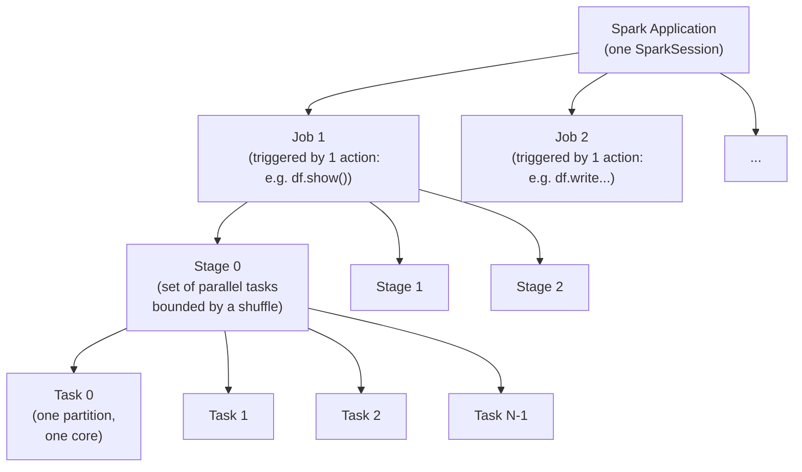

# 02 — Job, stage, task: how your code becomes parallel work

## Why this matters

Every Spark UI page, every "is my job slow" question, every "how many partitions should I use" decision uses these three words. Get them wrong and the rest of Spark is fog.

## The hierarchy in one diagram



## Application

A Spark **application** is one `SparkSession` and the executors it controls. A notebook is typically one application. A long-running Databricks job is one application per run. The application has an ID like `application_1719000000_0042` in YARN, or `local-1719000000` locally.

## Job

A **job** is what Spark triggers when you call an **action**. One action → one job. Examples of actions:

- `df.show()`
- `df.count()`
- `df.collect()`
- `df.write.parquet("...")`
- `df.first()`, `df.take(n)`
- `rdd.reduce(...)`

Transformations (`select`, `filter`, `withColumn`, `groupBy`, `join`, …) do **not** create jobs. They extend the logical plan. Module [`07-actions-vs-transformations.md`](./07-actions-vs-transformations.md) lists them all.

If you call `.show()` after writing 30 transformations, you get **one** job that runs the whole pipeline. If you `cache()` an intermediate DataFrame and `.show()` it before continuing, you get **two** jobs.

## Stage

Within a job, Spark draws stage boundaries at every **shuffle**. A stage is "a set of tasks that can run in parallel without exchanging data across the network."

Examples:

| Code | Stages |
|---|---|
| `df.filter().select().show()` | 1 stage (no shuffle) |
| `df.groupBy("k").count().show()` | 2 stages (group requires shuffle) |
| `df.join(df2, "k").show()` if neither is broadcast | 3 stages (each side scans, then both shuffle for the join) |
| `df.groupBy("k").count().orderBy("count").show()` | 3 stages (group shuffle + global sort shuffle) |

A stage = "what you can do on one machine before having to talk to other machines."

Stage boundaries you'll see in `explain()`:

- `Exchange` operator = the shuffle = stage boundary.
- `HashAggregate` followed by `Exchange` followed by another `HashAggregate` = partial agg + shuffle + final agg.

## Task

A **task** is one stage applied to one partition. If your DataFrame has 200 partitions and your stage has no shuffle, that stage runs 200 tasks. If the next stage has `spark.sql.shuffle.partitions = 200`, it also runs 200 tasks.

Tasks are the atomic unit of:

- **Scheduling**: the driver hands tasks to executors.
- **Retry**: if a task fails, Spark retries it (up to 4× by default — `spark.task.maxFailures`).
- **Parallelism**: total parallelism = `Σ executors.cores`. Tasks beyond that wait in a queue.

## How partition count drives task count

```
tasks-in-stage = partitions-of-input-of-that-stage
```

For the first stage of a job (reading from storage), partitions are determined by the input:

- **Parquet**: roughly 128 MB per partition by default (`spark.sql.files.maxPartitionBytes`).
- **CSV**: similar, but Spark can't split a gzipped file — gzip is non-splittable, so one task per file.
- **JDBC**: 1 partition by default (often the slowest read in Spark — set `partitionColumn`, `lowerBound`, `upperBound`, `numPartitions`).
- **createDataFrame** on a tiny list: `spark.sparkContext.defaultParallelism` (your core count).

For stages *after* a shuffle, partitions are controlled by `spark.sql.shuffle.partitions` (default **200**). This is the single most-tuned configuration in Spark history. AQE (Module 03) finally automated it.

## A worked example

```python
df = spark.read.parquet("orders/")          # input: 50 Parquet files
df2 = (
    df.filter("status = 'paid'")            # narrow op
      .groupBy("country")                   # wide op → shuffle
      .agg(F.sum("amount").alias("rev"))
      .orderBy(F.desc("rev"))               # wide op → shuffle (global sort)
)
df2.show()
```

What runs:

- **1 job** (one action: `show`).
- **3 stages**:
  - **Stage 0**: scan 50 Parquet files + filter + partial sum per country. 50 tasks.
  - **Stage 1**: shuffle-read the partial sums, final group + sum. 200 tasks (default shuffle partitions).
  - **Stage 2**: shuffle-read partitions for the global sort, sort, take top 20. 200 tasks, but only ~1 actually has data after the sort.

You can confirm this in the **SQL** tab of the Spark UI by hovering each node. Try it after running `examples/04_narrow_wide_demo.py`.

## How this maps to performance

- More partitions than cores → tasks queue. Fine, but at the cost of per-task overhead.
- Fewer partitions than cores → cores idle. Bad.
- **Sweet spot**: 2–4× more partitions than total cores, with each partition ~128 MB after compression. [HPS Ch.5]

If a stage has 200 tasks and 197 finish in 5 seconds but 3 finish in 5 *minutes*, you have **skew**. One partition holds 90% of the data for that stage. Module 03 covers skew fixes.

## Failure analysis using the UI

Open Spark UI → Jobs → click a job → you see stages. Click a stage:

- **Duration** — total wall clock.
- **Tasks (Succeeded/Total)** — if "Failed" > 0, click "Failed" filter to see exception traces.
- **Input size / Records** — how much each task read.
- **Shuffle Read / Shuffle Write** — bytes transferred.
- **Summary Metrics** — Min / Median / 75% / Max for everything. **If Max ≫ Median, you have skew.**

That "Max vs Median" comparison is the single fastest skew diagnostic. Memorize it.

## References

- [LS Ch.2 §"How Spark Schedules Work"], Ch.7 §"Spark Application Anatomy"]
- [HPS Ch.2 §"Spark Job Scheduling"]
- 📺 [Anatomy of a Spark Job — Conor Murphy](https://www.youtube.com/watch?v=rNpzrkB5KQQ)
