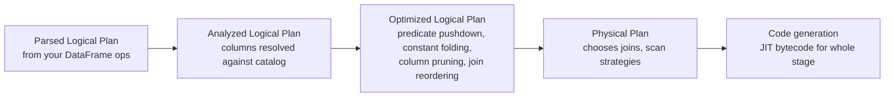

# 04 — DataFrames vs RDDs (and why DataFrames won)

## Why this matters

You'll hear: *"Just use DataFrames."* Why? Because in 99% of cases they're materially faster and the code is shorter. This note shows you *why* — and the edge cases where RDDs still pay off.

## What changed

RDDs (2010) are an abstraction over opaque Python/Scala/Java objects. Spark can parallelize them but can't see inside them — to Spark, a `map(lambda x: x.upper())` is a black box. Catalyst, the query optimizer, can't reason about that.

DataFrames (2015) added a **schema** — Spark knows your data has columns, types, and statistics. Now Catalyst can:

- Reorder operations (push filters down to the scan, e.g. into the Parquet file format).
- Combine multiple `withColumn` calls into one expression.
- Choose between three different join algorithms based on table size.
- Generate bytecode at runtime that operates on Tungsten's binary in-memory format instead of Java objects.

These optimizations are why a DataFrame `groupBy` is typically **5–20× faster** than the equivalent RDD `reduceByKey` *on the same hardware*.

## Side-by-side

The same task in both APIs:

> Read a CSV of orders, keep only paid orders, sum revenue per country.

### RDD version

```python
rdd = (
    sc.textFile("orders.csv")
      .map(lambda line: line.split(","))            # ['id','status','country','amount']
      .filter(lambda r: r[1] == 'paid')             # filter
      .map(lambda r: (r[2], float(r[3])))           # (country, amount)
      .reduceByKey(lambda a, b: a + b)
)
result = rdd.collect()
```

What's wrong:

- We hand-parsed the CSV. Quoted commas? Multi-line strings? Date columns? Yours to handle.
- `r[3]` — if it's `None` or `""` we crash at runtime.
- Catalyst sees `RDD<Tuple>`. It cannot push the filter down into the file scan.
- `reduceByKey` is fine, but the whole pipeline runs on JVM-boxed Python objects via Py4J. Serialization cost is real.

### DataFrame version

```python
df = spark.read.option("header", True).csv("orders.csv", inferSchema=True)
result = (
    df.filter(F.col("status") == "paid")
      .groupBy("country")
      .agg(F.sum("amount").alias("revenue"))
)
result.show()
```

What changed:

- Spark parses the CSV with proper handling.
- Catalyst sees the filter, knows the column is `status`, and pushes the predicate down to the CSV scan — Spark only deserializes paid rows. For Parquet this is even bigger (it skips entire row groups).
- The aggregation runs as native generated bytecode on Tungsten's columnar binary format. No Py4J round-trips per row.

## The performance gap, visually

For "sum revenue per country" on a 10 GB Parquet file on a 4-node cluster:

| API | Wall time | Why |
|---|---|---|
| RDD `reduceByKey` | ~120 s | Full file read, per-row Python ↔ JVM serialization |
| DataFrame `groupBy().agg()` | ~12 s | Predicate pushdown, columnar reading, codegen |
| DataFrame + Parquet partitioning | ~3 s | Partition pruning skips most of the file |

Numbers are rough — depends on data, cluster, and skew. The order of magnitude is real. [HPS Ch.3].

## The three things DataFrames give you that RDDs don't

### 1. Schema → query planning

`df.printSchema()` shows Catalyst what it can work with:

```
root
 |-- order_id: long (nullable = true)
 |-- status:   string (nullable = true)
 |-- country:  string (nullable = true)
 |-- amount:   double (nullable = true)
```

With this, Catalyst can:

- Prove that `F.col("status") == "paid"` only touches `status`, so it can push the filter to the Parquet reader.
- Detect that `country` is a string and broadcast a small lookup table for a join.
- Constant-fold `F.lit(1) + F.lit(2)` to `3` before shipping the plan.

### 2. Catalyst optimizer



Module 03 unpacks each box. The point here: this only works because DataFrames have a schema.

### 3. Tungsten

Tungsten is Spark's binary in-memory format. Instead of JVM `Row` objects with pointers, Tungsten stores columns in contiguous off-heap memory like Apache Arrow. This:

- Cuts memory usage 2–5×.
- Enables vectorized operations (SIMD on CPU).
- Makes GC pauses go away (off-heap doesn't trigger Java GC).

## When RDDs still win

[HPS Ch.5] lists the small set:

- **`mapPartitions` with expensive setup.** Opening one DB connection per partition rather than per row, and you can't push it into a UDF/sink.
- **Custom partitioners.** A `HashPartitioner` based on a slice of a key, or a domain-specific bucketing.
- **Binary / unstructured payloads** where there is no useful schema.
- **Low-level RDD APIs in libraries.** Some MLlib bits, custom data sources.

For everyday business logic — read, filter, join, aggregate, write — DataFrames every time.

## How to convert between them

```python
# DataFrame → RDD of Rows (each row is a Row object, dict-like access)
rdd = df.rdd

# RDD → DataFrame (need a schema)
from pyspark.sql.types import StructType, StructField, StringType, IntegerType
schema = StructType([
    StructField("name", StringType()),
    StructField("age", IntegerType()),
])
df = spark.createDataFrame(rdd, schema=schema)

# Or let Spark infer (slower; one extra job to sample):
df = rdd.toDF(["name", "age"])
```

Every `df → rdd → df` round trip costs Catalyst all its visibility. Avoid mid-pipeline.

## Industry use cases

- **Daily ETL** (DataFrame) — 99% of data engineering jobs.
- **ML feature engineering** (DataFrame) — even MLlib expects DataFrames now.
- **Streaming pipelines** (DataFrame / Structured Streaming) — RDD-based DStreams are deprecated.
- **Geospatial / image processing** (RDD, mostly) — when the per-record op is too complex for the SQL engine.

## Failure modes specific to RDD → DataFrame mixing

- **`df.rdd.map(...)` kills predicate pushdown** — Spark stops seeing your filters.
- **Inferring schema from a big RDD** is *slow* — it runs a sample-and-merge job before building the DataFrame. Provide a schema explicitly when you can.

## References

- [LS Ch.3 §"Apache Spark's Structured APIs"]
- [HPS Ch.3 §"DataFrames, Datasets, and Spark SQL"]
- [DAS Ch.1 §"Why DataFrames?"]
- 📺 [Deep Dive into Spark SQL's Catalyst Optimizer — Yin Huai](https://www.youtube.com/watch?v=GDeePbbCz2g)
- 📺 [Project Tungsten — Reynold Xin](https://www.youtube.com/watch?v=pnhO8AQpZf8)
