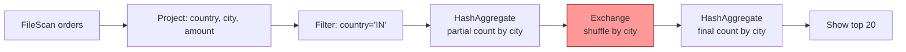

# 05 — Lazy evaluation and the DAG

## Why this matters

This is the most counter-intuitive Spark feature for newcomers from pandas/SQL:

```python
df = spark.read.parquet("huge.parquet")    # instant
df2 = df.filter("status='paid'")            # instant
df3 = df2.groupBy("country").count()        # instant
# 5 minutes have passed. Nothing has run yet.
df3.show()                                   # 5 minutes of work happens here
```

In pandas, each line executes immediately. In Spark, lines 1–3 just *build a plan*. The plan executes on line 4.

This is **lazy evaluation**, and it's the foundation of everything Catalyst can optimize.

## What "lazy" means

Every DataFrame transformation (`filter`, `select`, `groupBy`, `withColumn`, `join`, …) returns a *new* DataFrame whose only contents are:

- A reference to its parent DataFrame.
- A description of the operation to apply.

The result is a **logical plan** — a tree of nodes describing what *should* happen, not a result.

When you call an **action** (`show`, `count`, `collect`, `write`, …), Spark:

1. Hands the logical plan to Catalyst.
2. Catalyst rewrites it (predicate pushdown, constant folding, column pruning, join reordering).
3. Catalyst picks a physical plan (join algorithms, shuffle vs broadcast).
4. The DAG scheduler splits it into stages.
5. The task scheduler ships tasks to executors.
6. Results stream back.

## Why this is a feature, not a bug

Take this code:

```python
df = spark.read.parquet("orders.parquet")    # 100 GB, 50 columns
result = (
    df.select("order_id", "country", "amount")  # column prune
      .filter("country = 'IN'")                  # predicate
      .filter("amount > 100")
)
result.count()
```

If Spark were eager:

- Line 1: read 100 GB.
- Line 2: copy 100 GB with 3 columns.
- Line 3: filter the copy → 5 GB.
- Line 4: filter again → 2 GB.
- Line 5: count.

Total IO: ~107 GB.

Because Spark is lazy, Catalyst sees the *whole pipeline* before executing:

- The filters can be combined and pushed down into the Parquet file scan.
- Only `country`, `order_id`, `amount` columns are read (Parquet is columnar).
- Parquet's row-group statistics let Spark skip groups where no `country='IN'` rows exist.

Total IO often drops to **2–5 GB**. Lazy evaluation is what makes that possible.

## Seeing the plan

```python
df = spark.read.parquet("orders.parquet")
result = df.filter("country='IN'").groupBy("city").count()

result.explain(mode="formatted")
```

Four sections in the output:

1. **== Parsed Logical Plan ==** — your code, syntactically resolved.
2. **== Analyzed Logical Plan ==** — column types resolved against the catalog.
3. **== Optimized Logical Plan ==** — after Catalyst rewrites (predicate pushdown shows up here).
4. **== Physical Plan ==** — what actually runs (HashAggregate, Exchange, Project, Filter, FileScan).

For your daily debugging, `.explain()` without args = the physical plan only, which is enough 90% of the time. Module 03 has a full tour.

## The DAG (Directed Acyclic Graph)

Once Catalyst hands the physical plan to the DAG scheduler, it splits the plan into a DAG of stages:



Everything before the `Exchange` is one stage. Everything after is the next stage. The DAG is **acyclic** — you never loop back. That's why Spark can recover any partition from lineage: there's a clear path of parents.

## Action types and what they do

| Action | What it triggers |
|---|---|
| `.show(n)` | Computes enough rows to display n. Spark may push a `LIMIT` early. |
| `.collect()` | Computes everything, ships every row to the driver. **OOM risk if df is large.** |
| `.count()` | Computes the whole pipeline but only returns a scalar. |
| `.first()`, `.take(n)`, `.head(n)` | Computes only enough partitions. |
| `.write.parquet(...)` | Computes everything, writes to storage. The most common production action. |
| `.toPandas()` | Like `collect`, plus converts to pandas. Same OOM risk. |
| `.foreach(f)`, `.foreachPartition(f)` | Side-effect actions; no return. |

## Lazy-eval gotchas

### 1. Caching needs an action

```python
df.cache()        # marks df for caching
df.count()        # only NOW is df actually materialized in cache
```

`cache()` is *not* an action. It's a hint. Cache only materializes when you trigger an action on the DataFrame. People forget this.

### 2. Side effects inside transformations break

```python
counter = 0
def my_filter(row):
    global counter
    counter += 1
    return row["amount"] > 100

df.rdd.filter(my_filter).count()
print(counter)   # 0 (or something weird)
```

The lambda runs on executors, not the driver. Mutating Python state in transformations doesn't work. Use **accumulators** if you need counters across executors.

### 3. Two actions = two executions

```python
df = spark.read.parquet("big.parquet").filter("x > 0")
df.count()        # job 1: scan + filter + count
df.show()          # job 2: scan + filter + show (re-runs the read!)
```

Spark does *not* automatically remember intermediate results. If you reference the same DataFrame from multiple actions, it re-runs unless you `cache()` (or write to disk and read back).

### 4. `printSchema()` is not an action

It uses metadata only and never triggers execution. Useful for sanity-checking your plan without paying for it.

## Industry use cases / patterns

- **The "build a big pipeline of transformations, materialize once at the end" pattern.** This is what every production ETL looks like — chain 30 transformations, then `.write.parquet(...)`. Lazy eval is what makes the chain efficient.
- **Quick exploratory `.show()` after every step** — convenient locally, *catastrophic* on production data because each `.show()` re-runs the prior pipeline. Cache or write-and-read between steps if you're iterating.

## Failure analysis

| Symptom | Cause |
|---|---|
| "Why is line 1 (`read`) taking 0 ms?" | Lazy. It hasn't run yet. |
| Job seems to run again when you call a second action | No cache between actions. Add `.cache()` or write to Parquet. |
| `explain()` shows operations in a different order than your code | Catalyst reordered them. This is correct. |
| Tweak to a UDF doesn't take effect | The DataFrame still references the old closure. Re-build the DataFrame after editing the UDF. |

## References

- [LS Ch.3 §"Lazy Evaluation"], Ch.6 §"Spark SQL"]
- [HPS Ch.3 §"Catalyst Optimizer"]
- 📺 [Spark Catalyst Deep Dive — Yin Huai](https://www.youtube.com/watch?v=GDeePbbCz2g)
