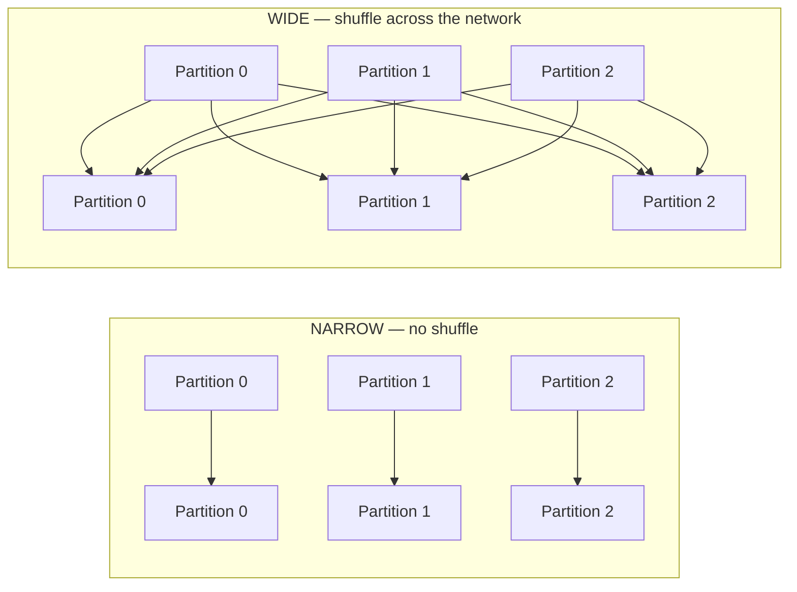

# 06 — Narrow vs wide transformations (the most important performance distinction)

## Why this matters

Every Spark performance problem reduces to "too much shuffling" or "shuffling the wrong thing." Knowing which operations shuffle (wide) and which don't (narrow) is how you predict performance before you press run.

## The distinction in one diagram



- **Narrow**: each output partition reads from exactly one input partition. No network. Pipelined inside one stage.
- **Wide**: each output partition can read from *every* input partition. Requires shuffle: data is hashed by key, written to local disk, then pulled across the network by downstream tasks.

## Common operations, classified

### Narrow

| Op | Notes |
|---|---|
| `select` / `selectExpr` | column projection |
| `filter` / `where` | predicate |
| `withColumn` | adds or replaces a column |
| `withColumnRenamed` | rename only |
| `drop` | column drop |
| `cast` (via `F.col(...).cast(...)`) | type change |
| `map`, `flatMap`, `mapPartitions` (RDD) | per-record |
| `union` / `unionByName` | concatenates partitions; no shuffle |
| `coalesce(n)` when n < current | merges partitions without shuffle |

### Wide

| Op | Why it shuffles |
|---|---|
| `groupBy(...).agg(...)` | rows for the same key must converge |
| `distinct()` / `dropDuplicates()` | same — must compare across all rows |
| `orderBy()` / `sort()` | global sort needs range partitioning |
| `join` (most types) | matching keys must end up together |
| `repartition(n)` | full re-hash to n partitions |
| `repartition("col")` | hash by column, full shuffle |
| Window functions with `partitionBy` | rows for the window key must converge |
| `intersect`, `except` | requires shuffle-based hash matching |

### Sometimes-narrow special cases

- **Broadcast join** — when one side fits in memory, Spark broadcasts it to all executors and the join becomes narrow on the large side. This is the single biggest optimization you can apply manually. [HPS Ch.4]
- **Map-side combine** (`reduceByKey`, `aggregateByKey`) — these still shuffle, but they combine *locally* per partition first, so the shuffle is much smaller.

## Why shuffles are expensive

A shuffle does *all* of the following:

1. **Compute** the hash of each row's key.
2. **Serialize** the row.
3. **Write** to local disk on the producing executor.
4. **Notify** the driver of block locations.
5. **Pull** blocks across the network on the consumer side.
6. **Deserialize**.
7. **Merge** (often spilling to disk if the merge doesn't fit in memory).

Order-of-magnitude cost: a 1 GB shuffle on a 4-node cluster takes 5–30 seconds. A 100 GB shuffle: minutes to tens of minutes. Disk I/O dominates; network is usually secondary.

For comparison, scanning 1 GB of Parquet from local SSD is ~0.5 seconds. **Shuffles are 50–100× more expensive than scans of the same volume.**

## How to see them

Two ways:

### 1. `explain()`

Look for `Exchange` nodes. Each `Exchange` is one shuffle.

```text
== Physical Plan ==
*(2) HashAggregate(keys=[country], functions=[sum(amount)])
+- Exchange hashpartitioning(country, 200)              ← SHUFFLE
   +- *(1) HashAggregate(keys=[country], functions=[partial_sum(amount)])
      +- *(1) Filter (status = 'paid')
         +- FileScan parquet [order_id, status, country, amount]
```

The `*(N)` prefix is the stage number. Every `Exchange` increments the stage.

### 2. Spark UI

Open the SQL/DataFrame tab → the visual plan shows `Exchange` nodes as their own boxes between stages. Hover one — it tells you the shuffle write size.

## How to eliminate or reduce shuffles

Roughly in order of priority [HPS Ch.5]:

1. **Filter early.** Push selectivity ahead of joins and aggregations. Catalyst usually does this, but only if your filter is expressible (no UDFs).
2. **Project only the columns you need.** Smaller rows = smaller shuffles.
3. **Broadcast small sides of joins.** `F.broadcast(small_df)` when the small side fits in driver memory (default broadcast threshold is 10 MB; you can raise it).
4. **Pre-partition data on disk** by the join key (bucketing) so the join becomes narrow.
5. **Combine multiple aggregations into one pass** instead of doing several `groupBy`s.
6. **Use `repartition` only when necessary.** It's a deliberate shuffle. Don't sprinkle it.
7. **Replace `groupByKey` with `reduceByKey`** in RDD code — partial aggregation makes the shuffle 10–100× smaller.

## A worked example: how much do shuffles cost?

You have 100 GB of orders, 4 executors × 4 cores = 16 task slots.

**Bad pipeline:**

```python
df.repartition("user_id")               # SHUFFLE 1 (100 GB)
  .groupBy("country").count()             # SHUFFLE 2 (still 100 GB, wrong key)
  .orderBy("count")                       # SHUFFLE 3 (sort)
  .show()
```

Three shuffles, ~300 GB of disk I/O. Time: minutes.

**Good pipeline:**

```python
(
    df.filter("status='paid'")            # narrow, ~30 GB output
      .groupBy("country").count()         # SHUFFLE 1 (~30 GB)
      .orderBy(F.desc("count")).limit(20) # SHUFFLE 2 (sort, tiny)
      .show()
)
```

One filter early kills 70% of the volume before the first shuffle, and the second shuffle is post-aggregation so it's tiny.

## Industry use cases / patterns

- **Filter-first ETL.** Every production pipeline puts predicates as early as possible. Catalyst can do this for SQL-style filters but cannot for UDF-based ones.
- **Broadcast joins for star schemas.** Dimension tables (users, products, countries) usually fit in memory. Broadcasting them turns a wide join into a narrow one — the single biggest win for warehouse-style data.
- **Bucketed Delta tables.** When two large tables are always joined on the same key, bucketing them at write time means future joins are shuffle-free.

## Failure modes

| Symptom | Likely cause | Fix |
|---|---|---|
| Stage takes 10× longer than the others | Skew on the shuffle key (one partition has 90% of rows) | Salting, AQE skew join (Module 03) |
| "Spilling in-memory map" in logs | Shuffle outgrew memory and spilled to disk | More executor memory, or fewer partitions per task |
| `OutOfMemoryError: GC overhead` after a shuffle | One key's value set didn't fit | Replace `groupByKey` with `reduceByKey`, or salt |
| Wall time barely improves when you double the cluster | Job is shuffle-bound, not CPU-bound | Reduce shuffle volume (filter, broadcast, bucket) |

## References

- [LS Ch.3 §"Narrow and Wide Transformations"]
- [HPS Ch.5 §"Effective Transformations"], Ch.6 §"Key/Value Reductions"]
- [DAS Ch.5 §"Partitioning Data"]
- 📺 [Apache Spark Core—Practical Optimization — Daniel Tomes](https://www.youtube.com/watch?v=daXEp4HmS-E)
