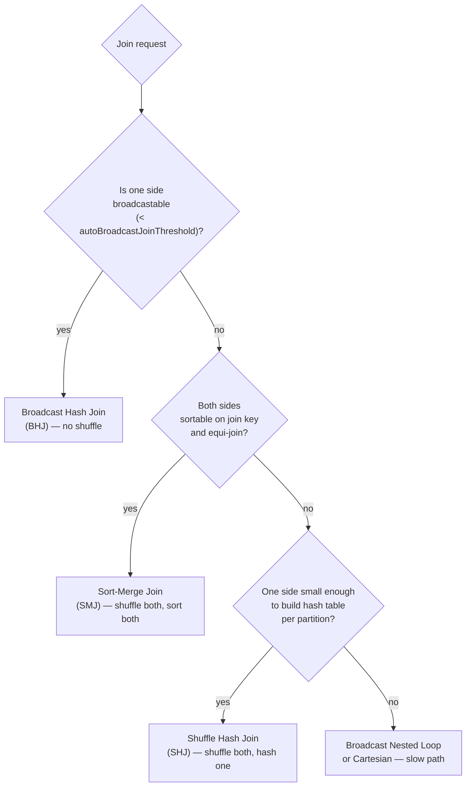

# 08 — Joins: strategies, broadcasting, skew

## Why this matters

Joins are where most production Spark jobs spend most of their time and most of their failures. The choice between four join strategies — made by Catalyst, but heavily influenced by your hints and config — is the single biggest performance lever in PySpark.

## Join types (the SQL side)

```python
big.join(small, on="id", how="inner")          # rows in both
big.join(small, on="id", how="left")           # all of big, matching small (or null)
big.join(small, on="id", how="right")          # all of small, matching big (or null)
big.join(small, on="id", how="full")           # all of both
big.join(small, on="id", how="left_semi")      # rows in big that have a match (no small columns)
big.join(small, on="id", how="left_anti")      # rows in big that have NO match
big.crossJoin(small)                           # cartesian — usually a bug
```

`left_semi` and `left_anti` are unique to Spark/SQL — use them for *existence checks*. They're much cheaper than `left + isNull` filters because Spark stops after the first match per row.

## Join strategies (the physical side)

Catalyst picks one of four strategies. Knowing which one and why is the whole game.



### 1. Broadcast Hash Join (BHJ) — the fastest

```python
from pyspark.sql.functions import broadcast
result = big.join(broadcast(small), "id")          # explicit hint
```
- Small side is collected to the driver, then **broadcast** to every executor.
- Each executor builds an in-memory hash map and probes it with its own partitions of the big side.
- **No shuffle**, no sort.
- Spark auto-broadcasts when the (estimated) size of one side is below `spark.sql.autoBroadcastJoinThreshold` (default 10 MB).

**When to broadcast manually:** any lookup / dim table under ~200 MB. Common: country codes, product catalog, user attribute snapshot.

```python
# Lift the threshold for the whole session if you broadcast a lot
spark.conf.set("spark.sql.autoBroadcastJoinThreshold", 200 * 1024 * 1024)
```

### 2. Sort-Merge Join (SMJ) — the default for big × big

- Both sides shuffled by join key.
- Within each partition, both sides sorted.
- Then merged in a single sequential pass (linear in input size).
- Robust at any scale but pays for two shuffles + two sorts.

### 3. Shuffle Hash Join (SHJ) — middle ground

- Both sides shuffled by join key.
- One side (smaller per-partition) is built into a hash map inside each task; the other probes it.
- Faster than SMJ when one side fits in memory per partition; slower than BHJ because of the shuffle.
- Disabled by default since Spark 3.0; AQE enables it dynamically when it sees the size advantage.

### 4. Broadcast Nested Loop / Cartesian

- Used only when there's no equi-join condition (e.g. `df1.id < df2.id`) or for `crossJoin`.
- O(N × M). Almost always a bug. If you actually need this on real data, you've modeled the problem wrong.

## How to *see* which strategy was chosen

```python
result.explain(mode="formatted")
```
Look for:
- `BroadcastHashJoin` — BHJ
- `SortMergeJoin` — SMJ
- `ShuffledHashJoin` — SHJ
- `BroadcastNestedLoopJoin` — last-resort cartesian-ish

In the Spark UI → SQL tab → click the query plan diagram — same info, graphical.

## Skewed joins — the production headache

A skewed key is when one value dominates. Classic case: `country='US'` is 80% of orders. Stage 0 finishes in 1 minute except for one task that runs 45 minutes. The job's wall clock is that one task.

### Fix 1: Adaptive Query Execution (AQE) — automatic

```python
spark.conf.set("spark.sql.adaptive.enabled", "true")
spark.conf.set("spark.sql.adaptive.skewJoin.enabled", "true")
```
At shuffle time, AQE detects partitions that are 5× the median (default), splits them, and runs them as multiple tasks. Works for sort-merge joins. **Turn this on for every production job on Spark 3.2+.**

### Fix 2: Salting (manual, for joins AQE can't help with)

The trick: spread the hot key over `N` synthetic keys.

```python
N = 20

# Salt the big side: one random salt per row
big_salted = big.withColumn("salt", (F.rand() * N).cast("int"))

# Explode the small side: one copy per possible salt
salts = spark.range(0, N).withColumnRenamed("id", "salt")
small_exploded = small.crossJoin(salts)

# Join on the composite key
result = big_salted.join(
    small_exploded,
    (big_salted.key == small_exploded.key) & (big_salted.salt == small_exploded.salt)
)
```
Now the hot key is split into 20 partitions of equal size. The cost is small-side replication (acceptable when small is small).

### Fix 3: Pre-aggregate or filter before the join

The cheapest fix is often "don't join that much." If you only need totals, aggregate the big side first.

## Bucketed joins — pay once, free joins forever

If both tables are bucketed on the join key with the same bucket count:
```python
big.write.bucketBy(200, "customer_id").saveAsTable("big_b")
small.write.bucketBy(200, "customer_id").saveAsTable("small_b")
spark.table("big_b").join(spark.table("small_b"), "customer_id")  # NO shuffle
```
Requires Hive metastore. Most teams have moved on to Delta + Z-order for similar payoff.

## Industry use cases

| Pattern | Strategy | Why |
| --- | --- | --- |
| Fact × tiny dim (orders × countries) | BHJ (broadcast) | dim < 10 MB |
| Fact × medium dim (orders × products, 500 MB) | BHJ if threshold raised | one shuffle saved |
| Fact × fact (orders × clickstream) | SMJ with AQE skew handling | both huge |
| Anti-join for "users who never bought" | `left_anti` | short-circuits, single output |
| Self-join on time gap (sessionization) | window function, not a join | windows handle this cleanly |

## Scale notes

| Scenario | Numbers |
| --- | --- |
| 1 TB × 5 MB BHJ | one shuffle saved → 5–10× faster than SMJ |
| 1 TB × 500 MB SMJ | ~2 TB of shuffle write/read |
| 1 TB × 1 TB SMJ | ~4 TB of shuffle; needs careful `shuffle.partitions` (5000–10000) |
| 1 TB × 1 TB with 1 hot key = 30% | one task gets 300 GB → AQE skew or salting required |

## Failure modes

| Symptom | Cause | Fix |
| --- | --- | --- |
| OOM on driver during broadcast | small side larger than driver memory | don't broadcast it; rely on SMJ |
| One task runs hours, rest finish in minutes | skewed key | enable AQE skew or salt |
| Cartesian product warning | missing join condition | check `on=...` is set; or accept `crossJoin` deliberately |
| Duplicates blow up row count | join key not unique on the "small" side | dedupe small side first or aggregate after |
| `SortMergeJoin` chosen instead of `BroadcastHashJoin` | one side's row count under threshold but bytes over | broadcast manually; check `spark.sql.statistics.size.autoUpdate.enabled` |

## References

- 📚 [LS Ch.7 §"Spark Joins"]
- 📚 [HPS Ch.4 (the whole chapter on joins — best resource in any book)]
- 📚 [DAS Ch.5 §"Joins"]
- 📺 [Daniel Tomes — "Apache Spark Core — Practical Optimization"](https://www.youtube.com/results?search_query=daniel+tomes+spark+core+optimization)
- 📺 [Sim Simeonov — "Optimizing Apache Spark SQL Joins"](https://www.youtube.com/results?search_query=sim+simeonov+spark+sql+joins)
