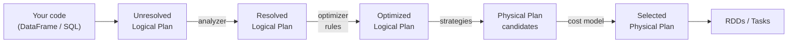

# 01 — Catalyst: the query optimizer

## Why this matters

Catalyst is why DataFrames are faster than RDDs. Everything you write — DataFrame API, SQL, Datasets — flows through Catalyst, which understands your intent semantically and rewrites it. Knowing what Catalyst can and cannot do lets you write queries it can actually optimize.

## The pipeline



1. **Parse** → `Unresolved Logical Plan`. Just the syntax tree. No types, no schema.
2. **Analyze** → resolves column names against the catalog, attaches schemas, type-checks.
3. **Optimize** → applies a long list of *rule-based* transformations (deterministic, semantic-preserving).
4. **Plan** → translates the logical plan into one or more *physical plans*.
5. **Cost-based selection** → with AQE/CBO, picks the cheapest plan based on size statistics.

## The big rule-based optimizations

You don't choose these; Catalyst applies them automatically *if* your code lets it.

### Predicate pushdown
Filters are pushed down through joins, projections, and *into the data source* when the source supports it (Parquet, ORC, JDBC).

```python
spark.read.parquet("orders/").filter(F.col("amount") > 100).select("order_id").explain()
```
You'll see `PushedFilters: [IsNotNull(amount), GreaterThan(amount,100)]` in the scan node. Parquet skips entire row groups whose `max(amount) <= 100`.

### Projection pruning
Only columns referenced downstream are read. A 100-column Parquet table queried for 3 columns reads ~3% of the bytes.

```python
spark.read.parquet("orders/").select("order_id", "amount").explain()
# ReadSchema: struct<order_id:bigint,amount:decimal(18,2)>   ← only 2 columns
```

### Constant folding
`F.col("x") + F.lit(2) + F.lit(3)` → `F.col("x") + F.lit(5)` at plan time. Free.

### Predicate combining
Two filter calls collapse into one. `df.filter(a).filter(b)` → `Filter(a AND b)`.

### Boolean simplification
`x AND true` → `x`. `x OR false` → `x`. `NOT (a > 5)` → `a <= 5`. Etc.

### Limit pushdown
`df.orderBy(x).limit(10)` becomes a *top-K* operation per partition before merging — vastly cheaper than full sort then take.

### Decimal precision propagation
Arithmetic on decimals tracks precision/scale through the plan so results don't silently truncate.

## What Catalyst can't help with

- **UDFs** — opaque. Filters can't push through them.
- **`F.expr` with non-SQL strings** — usually fine, but custom string expressions can confuse the analyzer.
- **Row-by-row Python loops via `.collect()` + map** — outside Catalyst entirely.
- **`spark.sparkContext.parallelize`** — RDD path skips Catalyst.

## Cost-based optimizer (CBO)

Static CBO uses table-level statistics:
```python
spark.sql("ANALYZE TABLE orders COMPUTE STATISTICS")
spark.sql("ANALYZE TABLE orders COMPUTE STATISTICS FOR COLUMNS amount, customer_id")
```
With these collected, the planner makes better decisions on:
- Join order (smallest first to keep intermediate sizes down).
- Join strategy (broadcast vs SMJ).
- Whether to repartition before an aggregation.

AQE (next note) replaces much of this with *runtime* statistics gathered from completed shuffle stages — usually superior.

## How to see Catalyst in action

```python
df = (spark.read.parquet("orders/")
        .filter(F.col("country") == "US")
        .filter(F.col("amount") > 100)
        .select("order_id", "amount"))
df.explain(extended=True)        # parsed → analyzed → optimized → physical
```

Each section will look slightly different. The **Optimized Logical Plan** is where you'll see filters combined and pushed.

## A small example: writing code Catalyst can optimize

❌ Optimizer-hostile:
```python
@udf("boolean")
def is_big(amount):
    return amount is not None and amount > 100

df.filter(is_big("amount")).select("order_id").explain()
# Filter happens AFTER the scan; no pushdown.
```

✅ Optimizer-friendly:
```python
df.filter(F.col("amount") > 100).select("order_id").explain()
# Predicate pushed into the Parquet scan.
```

## Industry use cases

| Symptom in your job | Likely Catalyst issue |
| --- | --- |
| "I have a 1 TB Parquet table but every query reads 1 TB" | Likely a UDF early in the chain blocking pushdown |
| "Filtering on partition column doesn't help" | Partition column is hidden behind an expression — Catalyst can't see it as a partition pruner |
| "Adding a column slows queries down a lot" | Removed projection pruning by selecting too much |
| "Join order matters more than expected" | No table stats — collect them, or rely on AQE |

## References

- 📚 [LS Ch.3 §"Catalyst Optimizer"]
- 📚 [HPS Ch.2 §"Spark SQL — Catalyst Optimizer" / Ch.3 (everything)]
- 📺 [Databricks Catalyst talks (Sameer Agarwal, Reynold Xin, Wenchen Fan)](https://www.youtube.com/results?search_query=spark+catalyst+optimizer)
- 📜 [The original Catalyst paper (Armbrust et al., 2015)](https://dl.acm.org/doi/10.1145/2723372.2742797)
