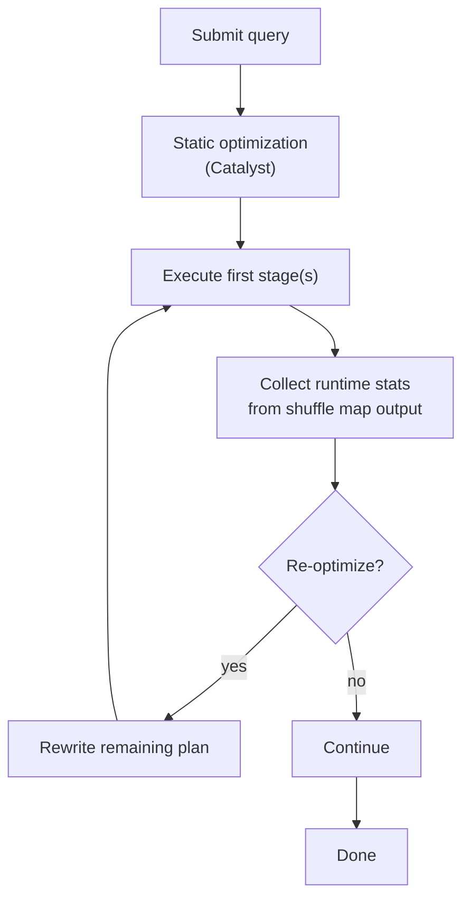

# 04 — Adaptive Query Execution (AQE)

## Why this matters

AQE is the single biggest reason Spark 3.x feels faster than 2.x without changing your code. It re-plans queries *during execution* using real shuffle statistics. Three things it fixes that the static optimizer can't:
1. **Wrong partition counts** after shuffles.
2. **Wrong join strategies** when actual sizes differ from estimates.
3. **Skew** in joins.

Enabled by default since Spark 3.2.

## How AQE works



AQE waits for shuffles to materialize, reads their map-output statistics (which it has anyway for fetching), and decides if the *remaining* plan should change.

[LS Ch.7 §"Adaptive Query Execution"], [HPS Ch.6 §"AQE"]

## The three rewrites

### 1. Coalesce shuffle partitions

You set `spark.sql.shuffle.partitions=200` (the default). After a heavily filtered join, you end up with 200 partitions averaging 2 MB each — way too many tiny tasks.

AQE coalesces them post-shuffle into the right size (target ~64 MB).

```python
spark.conf.set("spark.sql.adaptive.enabled", True)
spark.conf.set("spark.sql.adaptive.coalescePartitions.enabled", True)
spark.conf.set("spark.sql.adaptive.advisoryPartitionSizeInBytes", "64MB")
```

Plan signal: `CoalescedShuffleReader` or `AQEShuffleRead coalesced` in the executed plan.

### 2. Switch join strategy

If your statistics said `orders` had 50 GB but after filtering it has 8 MB, AQE will swap a planned `SortMergeJoin` for a `BroadcastHashJoin` automatically.

```python
spark.conf.set("spark.sql.adaptive.localShuffleReader.enabled", True)
```

Plan signal: the original plan has `SortMergeJoin`; the *final* plan (after execution) has `BroadcastHashJoin` with `BroadcastQueryStage`.

### 3. Skew join

If one shuffle partition is much larger than the median, AQE splits it into multiple sub-partitions and joins each separately (effectively a runtime salt).

```python
spark.conf.set("spark.sql.adaptive.skewJoin.enabled", True)
spark.conf.set("spark.sql.adaptive.skewJoin.skewedPartitionFactor", 5)
spark.conf.set("spark.sql.adaptive.skewJoin.skewedPartitionThresholdInBytes", "256MB")
```

A partition is "skewed" if both:
- its size > `skewedPartitionFactor` × median, AND
- its size > `skewedPartitionThresholdInBytes`.

Plan signal: `AQEShuffleRead ... isSkew=true`.

## The full settings you actually use

```python
spark.conf.set("spark.sql.adaptive.enabled", True)
spark.conf.set("spark.sql.adaptive.coalescePartitions.enabled", True)
spark.conf.set("spark.sql.adaptive.skewJoin.enabled", True)
spark.conf.set("spark.sql.adaptive.advisoryPartitionSizeInBytes", "64MB")
spark.conf.set("spark.sql.adaptive.coalescePartitions.minPartitionSize", "1MB")
spark.conf.set("spark.sql.autoBroadcastJoinThreshold", "100MB")  # AQE uses this for runtime broadcasts too
```

## When AQE doesn't help

- **Pure scan + write** (no shuffles) — AQE has nothing to re-optimize.
- **Tiny data** — overhead outweighs gains. (Negligible, but real.)
- **Streaming queries** — AQE applies only to micro-batches starting Spark 3.5; older versions: batch only.
- **You already hand-tuned partitions** — AQE may over-coalesce if your downstream needs 200-way parallelism. Disable coalesce in that case.

## Scale notes

- A 5-stage query reading 500 GB, doing a 100×10 GB join, used to need `shuffle.partitions=2000` and manual broadcast hints. With AQE: defaults are fine, ~30% faster.
- Skewed join with one 50× hot key: from "1 task running for 45 min" → "evenly split across 8 sub-tasks finishing in 6 min each".
- Don't expect miracles for queries that are already well-tuned — the gain there is 5–15%.

## Failure modes

| Symptom | Cause | Fix |
|---|---|---|
| Plan says `isFinalPlan=false` | You called `explain()` before execution | Run the query first |
| AQE didn't coalesce — still 200 tiny tasks | Disabled, or partitions ≥ advisory size already | Check `coalescePartitions.enabled`, lower `advisoryPartitionSizeInBytes` if needed |
| Broadcast swap didn't happen for an 80 MB side | `autoBroadcastJoinThreshold` too low | Raise it (cluster memory permitting) |
| Skew handling didn't trigger on a clearly skewed join | Partition under `thresholdInBytes` | Lower the threshold, or salt manually |
| One stage doing a `BroadcastNestedLoopJoin` after AQE | Statistics still wrong; AQE picked broadcast for too-large side | Run `ANALYZE TABLE ... COMPUTE STATISTICS`, or disable `autoBroadcastJoinThreshold` |

## References

- 📺 [Adaptive Query Execution: Speeding Up Spark SQL at Runtime — Databricks](https://www.youtube.com/results?search_query=adaptive+query+execution+spark+databricks)
- [LS Ch.7 §"AQE"]
- [HPS Ch.6 §"Adaptive Query Execution"]
- [Cert Guide §"AQE"] — every AQE flag is fair game on the exam
