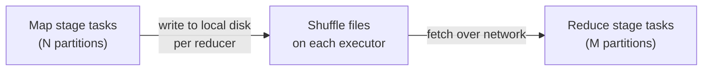

# 07 — Shuffle tuning

## Why this matters

Shuffle is the most expensive operation in Spark. Every wide transformation (`join`, `groupBy`, `repartition`, `distinct`, window functions) triggers one. A 1 TB shuffle on a sane cluster takes minutes; a misconfigured one takes hours or OOMs.

You can't avoid shuffles — but you can tune them.

## What a shuffle actually does



Each map task writes M files (one per reducer partition). Each reduce task fetches its file from every map task — that's M×N file fetches. Network and disk I/O scale together.

For a 1 TB shuffle with 1000 map × 1000 reduce tasks: 1M file fetches, 1 TB across the wire, 2 TB written to local disk total (input + spill).

[LS Ch.7 §"Spark Shuffle"], [HPS Ch.6 §"Shuffles"]

## The dial: `spark.sql.shuffle.partitions`

```python
spark.conf.set("spark.sql.shuffle.partitions", 800)
```

Default 200 — fine for ~50 GB of shuffled data, terrible for anything bigger or smaller.

- **Target partition size: 100–200 MB** post-shuffle.
- **Quick math**: `partitions = total_shuffled_bytes / 128 MB`.
- For most clusters, `2 × total_cores` to `4 × total_cores` is a safe range.

With AQE on, you can leave it high (e.g. 2000) — AQE will coalesce small partitions back down post-shuffle.

## The other dials

| Setting | Default | What it does |
|---|---|---|
| `spark.sql.shuffle.partitions` | 200 | Output partitions of an exchange |
| `spark.shuffle.file.buffer` | 32 KB | Per-map-task write buffer; bump to 1 MB for big shuffles |
| `spark.reducer.maxSizeInFlight` | 48 MB | Network buffer per reducer fetch; bump to 96 MB on fast networks |
| `spark.shuffle.io.maxRetries` | 3 | Retries on flaky fetches; bump to 10 on spot instances |
| `spark.shuffle.compress` | true | Compress shuffle blocks (LZ4 default) — leave on |
| `spark.shuffle.spill.compress` | true | Compress spilled blocks — leave on |
| `spark.shuffle.service.enabled` | false | External shuffle service — needed for dynamic allocation |
| `spark.sql.adaptive.coalescePartitions.enabled` | true (≥3.2) | Post-shuffle coalesce via AQE |

## How to read shuffle metrics

In Spark UI → Stages → click the stage → look at the **Shuffle Read** and **Shuffle Write** columns.

| Column | Healthy range | Red flag |
|---|---|---|
| Shuffle Write Size | 50–200 MB per task | > 1 GB → repartition before, or raise shuffle.partitions |
| Shuffle Read Size | 50–200 MB per task | Spilled memory > 0 means executor under-sized |
| Spill (Memory) | 0 | > 0 means tasks spilled — increase memory or partitions |
| Spill (Disk) | 0 | > 0 means disk-spilled — same fix |
| Max vs Median | within 2× | > 3× = skew |

## Reducing shuffle volume

1. **Filter before, not after.** A 100 GB → 100 GB join becomes 100 GB → 10 GB → 10 GB if you push the filter down.
2. **Pre-aggregate.** `reduceByKey > groupByKey`. For DataFrames, the optimizer does this automatically — but only if you use built-in aggs, not UDFs.
3. **Broadcast small dimensions.** Eliminates the shuffle on the big side entirely.
4. **Bucket large tables on the join key.** Recurring joins become shuffle-free.
5. **Project early.** Smaller rows = smaller shuffle. `select` what you need *before* the join, not after.
6. **Use `reduce` semantics.** `agg(F.sum(...))` shuffles only partial sums.

## Avoiding shuffles entirely

```python
df_a.repartition(64, "user_id").write...
df_b.repartition(64, "user_id").write...
# subsequent join on user_id WITH SAME PARTITIONER avoids shuffle
```

Bucketing is the persistent form:
```python
df_a.write.bucketBy(64, "user_id").saveAsTable("a")
df_b.write.bucketBy(64, "user_id").saveAsTable("b")
spark.table("a").join(spark.table("b"), "user_id")  # SortMergeJoin, no exchange
```

## Scale notes

- **Shuffle write pace**: ~50–100 MB/s per task on local NVMe. Slower on EBS gp2, much slower on shared HDD.
- **Network**: a 10 Gbps NIC = ~1.2 GB/s peak fetch. A 100 GB shuffle across 10 executors theoretically completes in ~80 s of pure network; in practice 3–5×.
- **Spill pain**: writing 50 GB of spill to disk on EBS is ~5 minutes per executor. Almost always cheaper to raise `executor.memory` or `shuffle.partitions`.

## Failure modes

| Symptom | Cause | Fix |
|---|---|---|
| `FetchFailedException` | Lost executor (preempted spot, OOM kill) holding shuffle files | Enable external shuffle service; increase `io.maxRetries` |
| Stage spending most time in shuffle write | Too few output partitions | Raise `shuffle.partitions` |
| One task in stage running 10× longer | Skew | AQE skew handling, or salt the key |
| Lots of disk spill | Partitions too large for executor memory | Raise `shuffle.partitions` or executor memory |
| Cluster CPU low but job slow | Network-bound | Reduce shuffle volume (project, broadcast, bucket) |
| Speculative tasks doing duplicate shuffle work | Slow stragglers | Enable speculation, but fix the underlying skew |

## References

- 📺 [Tuning Spark's Shuffle — Daniel Tomes](https://www.youtube.com/results?search_query=spark+shuffle+tuning+daniel+tomes)
- [LS Ch.7 §"Configuring Spark for Joins and Shuffles"]
- [HPS Ch.6 §"Shuffles"] — the canonical chapter on this topic
- [DAS Ch.5 §"Reducing Shuffle"]
