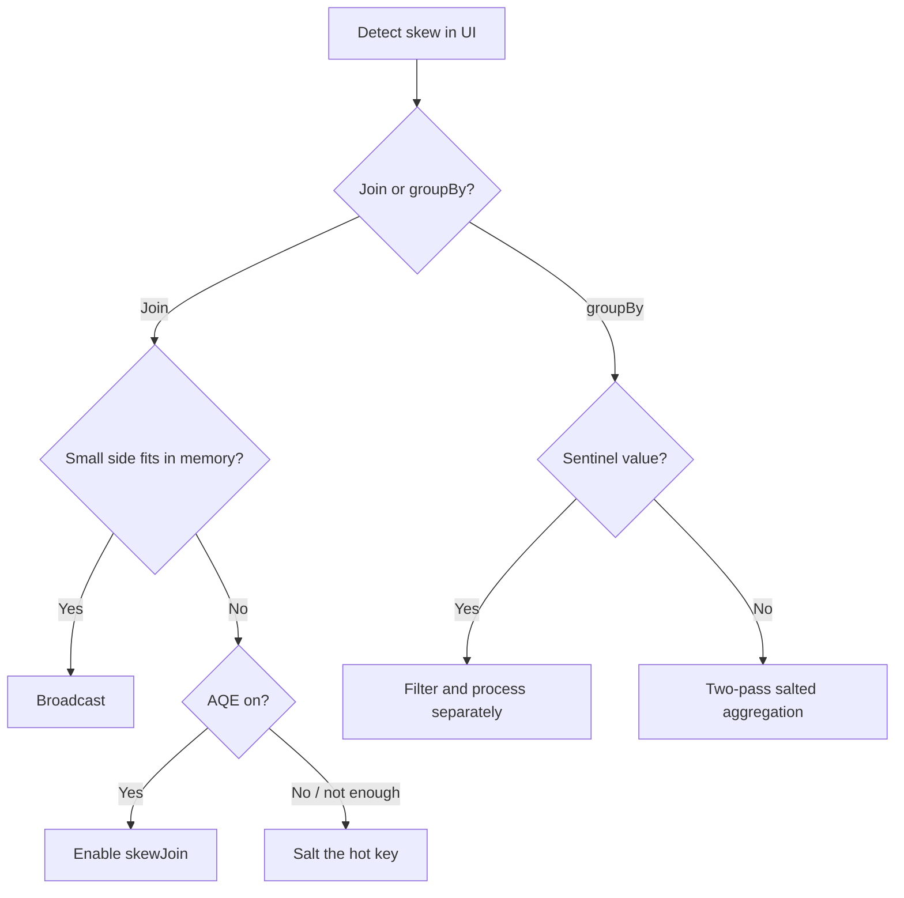

# 08 — Data skew handling

## Why this matters

Skew is the #1 cause of "this job used to finish in 10 minutes, now it runs for hours". One key has way more rows than the others; one task ends up with that key; that task runs forever while the other 199 sit idle. Everything else in this module won't save you if you can't recognize and fix skew.

## How to recognize skew

In the Spark UI, on the Stages tab, look at the task summary:

```
Duration:       Min 1.2 s  Median 2.1 s  Max 14 min
Shuffle Read:   Min 50 MB  Median 80 MB  Max 24 GB
```

When Max ≫ Median (anything > 3×, and definitely > 10×), you have skew. The Max task is the bottleneck.

```python
# Programmatic detection — count rows per key, look at the distribution
(df.groupBy("user_id")
   .count()
   .orderBy(F.desc("count"))
   .show(20, truncate=False))
```

A power-law distribution (one or two keys dominating) is the giveaway.

## Where skew shows up

| Operation | How skew hurts |
|---|---|
| `groupBy` | All rows with the hot key go to one reducer |
| `join` | Hot key's partition becomes a giant join |
| Window function partitioned on hot key | One task does all the work |
| Streaming aggregations | One key dominates each micro-batch |

## Fix 1: Let AQE handle it (Spark 3+)

```python
spark.conf.set("spark.sql.adaptive.enabled", True)
spark.conf.set("spark.sql.adaptive.skewJoin.enabled", True)
spark.conf.set("spark.sql.adaptive.skewJoin.skewedPartitionFactor", 5)
spark.conf.set("spark.sql.adaptive.skewJoin.skewedPartitionThresholdInBytes", "256MB")
```

AQE detects skewed partitions (size > factor × median AND > threshold) and splits them at runtime. Works only for joins, not for `groupBy`.

[LS Ch.7 §"AQE Skew Optimization"], [HPS Ch.6 §"AQE Skew Handling"]

## Fix 2: Salting

When AQE can't help (or you need finer control), salt the hot key. Add a random suffix on the skewed side so the rows distribute across multiple partitions; replicate the small side to match.

```python
from pyspark.sql import functions as F

N_SALTS = 10

# Big side: add a random salt 0..N-1
big_salted = big.withColumn("salt", (F.rand() * N_SALTS).cast("int"))

# Small side: explode to all possible salt values
small_salted = (small
    .withColumn("salt_array", F.array([F.lit(i) for i in range(N_SALTS)]))
    .withColumn("salt", F.explode("salt_array"))
    .drop("salt_array"))

# Join on (original_key, salt)
result = big_salted.join(small_salted, ["user_id", "salt"]).drop("salt")
```

What this buys you: the hot `user_id` is split into 10 sub-keys, each going to a different partition. Cost: the small side is 10× larger after explode — but it's small, so who cares.

### Salting only the hot keys

For extreme skew, salt only the known-hot keys; leave the rest alone:

```python
HOT_KEYS = ["user_42", "user_99"]

big = big.withColumn(
    "salt",
    F.when(F.col("user_id").isin(HOT_KEYS), (F.rand() * N_SALTS).cast("int"))
     .otherwise(F.lit(0))
)
small = small.withColumn(
    "salt_array",
    F.when(F.col("user_id").isin(HOT_KEYS), F.array([F.lit(i) for i in range(N_SALTS)]))
     .otherwise(F.array(F.lit(0)))
).withColumn("salt", F.explode("salt_array")).drop("salt_array")
```

## Fix 3: Two-pass aggregation

For `groupBy` skew, salt for a first pass, then aggregate again unsalted:

```python
# Pass 1: salted partial aggregate
partial = (df
    .withColumn("salt", (F.rand() * 10).cast("int"))
    .groupBy("user_id", "salt")
    .agg(F.sum("amount").alias("partial_sum")))

# Pass 2: final aggregate, no salt
final = (partial
    .groupBy("user_id")
    .agg(F.sum("partial_sum").alias("total")))
```

Trade-off: two shuffles instead of one, but each is balanced.

## Fix 4: Filter the hot key out

If 90% of the data is for one key (e.g. unknown / null / sentinel value):

```python
# Process hot key separately
hot = df.filter(F.col("user_id") == "anonymous")
rest = df.filter(F.col("user_id") != "anonymous")

result_hot = process(hot)        # specialized, maybe no join needed
result_rest = process(rest)      # normal join

result = result_hot.unionByName(result_rest)
```

Real-world: `user_id = null` from anonymous traffic, `device_id = "unknown"`, `country = "XX"`.

## Fix 5: Broadcast the small side

If the small side fits in memory, broadcast it — there's no shuffle at all, and skew on the big side becomes irrelevant for the join.

```python
result = big.join(F.broadcast(small), "user_id")
```

This is the cheapest fix when it applies. AQE will do it automatically if statistics line up.

## Decision tree



## Scale notes

- A 50/50 keyspace skew (top-1 key = 50% of rows) → one task does 50% of the work. Salting with N=10 → bottleneck drops to ~5%.
- AQE skew handling overhead: ~5–10% of stage time. Worth it for any non-trivial skew.
- Real example: ad-click attribution job, `user_id=null` for 30% of rows. Filter+separate-process cut runtime from 4 hr to 25 min.

## Failure modes

| Symptom | Cause | Fix |
|---|---|---|
| One task running for an hour | Skew | One of the fixes above |
| Salting didn't help | Salt cardinality too low; or hot key isn't where you think | Verify with `groupBy(key).count()`; raise N |
| Salting helped but doubled cost on other keys | Salted everything | Conditional salt only on hot keys |
| AQE skew handling didn't trigger | Below `skewedPartitionThresholdInBytes` | Lower the threshold, or salt manually |
| `groupBy` skew + AQE | AQE skew handling is join-only | Use two-pass aggregation |
| OOM on the executor with the hot key | Even after AQE/salt, one bucket too big | More salts; or split processing |

## References

- 📺 [Solving Data Skew in Spark — Daniel Tomes](https://www.youtube.com/results?search_query=spark+data+skew+salting+daniel+tomes)
- [LS Ch.7 §"Handling Data Skew"]
- [HPS Ch.6 §"Skew"]
- [DAS Ch.6 §"Handling Skewed Data"]
