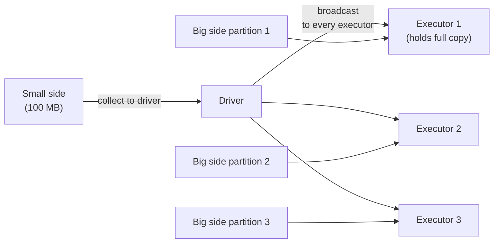

# 09 — Broadcast joins

## Why this matters

If one side of a join fits in memory, you can avoid the shuffle of the other side entirely. This is the single biggest "free" optimization in Spark — a 50 GB ⋈ 100 MB join drops from a 50 GB shuffle to a 100 MB broadcast.

## How it works



1. Driver `collect()`s the small side.
2. Driver serializes it into a broadcast variable, sends it to each executor once.
3. Each executor builds a hash table from the small side.
4. Each big-side partition probes the local hash table — no shuffle needed.

No shuffle on the big side. Each row of the big side is processed by exactly one executor.

[LS Ch.5 §"Broadcast Hash Join"], [HPS Ch.6 §"Broadcast Joins"]

## When Spark does it automatically

Catalyst will pick `BroadcastHashJoin` when one side's estimated size is below:

```python
spark.conf.set("spark.sql.autoBroadcastJoinThreshold", "100MB")  # default 10MB
```

Set to `-1` to disable auto-broadcast entirely (useful for testing SMJ behavior).

AQE can also *switch* to broadcast at runtime if the static estimate was wrong:

```python
spark.conf.set("spark.sql.adaptive.enabled", True)
# AQE will swap SMJ → BHJ if actual size < threshold after filters
```

## Forcing a broadcast

```python
from pyspark.sql.functions import broadcast

result = big.join(broadcast(small), "user_id")
```

Or SQL hint:
```python
spark.sql("SELECT /*+ BROADCAST(small) */ * FROM big JOIN small USING (user_id)")
```

Use this when:
- Catalyst's estimate is wrong (e.g. after a UDF, or partitioned source with bad stats).
- You *know* the side is small and want to force it regardless of estimate.

## When NOT to broadcast

| Situation | Why it's bad |
|---|---|
| Small side > ~1 GB | Driver OOM during `collect`; executors OOM holding the copy |
| Small side has high cardinality of duplicates | Hash table explodes |
| Outer join with broadcast on the *outer* side | Can't broadcast the side that needs all rows preserved — only inner / left+small-right are safe |
| Streaming + watermarked broadcast | The broadcast is fixed; doesn't update. Use stream-static join instead |

### The 8 GB driver memory ceiling

If you broadcast a 2 GB DataFrame, the driver needs to hold:
- The original DataFrame data.
- A serialized copy.
- The block manager bookkeeping.

Easily 4–6 GB of driver memory for a "2 GB broadcast". Set `spark.driver.memory` accordingly (or just don't broadcast that big).

## Checking that it broadcasted

In the plan:
```
*(2) BroadcastHashJoin [user_id#0L], [user_id#10L], Inner, BuildRight
:- *(2) Filter isnotnull(user_id#0L)
:  +- *(2) FileScan parquet [user_id#0L,amount#1L] (big side)
+- BroadcastExchange HashedRelationBroadcastMode(...), [id=#37]
   +- *(1) Filter isnotnull(user_id#10L)
      +- *(1) FileScan parquet [user_id#10L,name#11] (small side)
```

`BroadcastHashJoin` + `BroadcastExchange` = it worked. `BuildRight` means the right (small) side became the hash table.

If you see `SortMergeJoin` instead, broadcast didn't happen — check size estimate (`df.queryExecution.optimizedPlan.stats.sizeInBytes`).

## Broadcast variables (RDD API, but reusable)

You can broadcast arbitrary Python objects, not just DataFrames:

```python
LOOKUP = {"US": "Americas", "DE": "EMEA", "JP": "APAC"}
b_lookup = spark.sparkContext.broadcast(LOOKUP)

def to_region(country):
    return b_lookup.value.get(country, "Unknown")

to_region_udf = F.udf(to_region, "string")
df = df.withColumn("region", to_region_udf("country"))
```

Better: use `F.create_map` and avoid the UDF entirely:
```python
from itertools import chain
mapping_expr = F.create_map([F.lit(x) for x in chain(*LOOKUP.items())])
df = df.withColumn("region", mapping_expr[F.col("country")])
```

## Scale notes

- **Sweet spot**: small side 1 MB to 200 MB, big side anywhere from 1 GB to 1 PB.
- **Overhead**: broadcasting 100 MB to 50 executors = 5 GB network egress from the driver. Slow on weak networks; fast on cloud.
- **Memory per executor**: each executor pays the small side's footprint. 100 MB × 1 copy per executor = no big deal. 1 GB × 100 executors but each only sees one copy still = 1 GB per executor in addition to working set.
- **Multi-broadcast**: broadcasting multiple small dim tables is normal. Star schema fact-dim joins all become BHJ.

## Industry pattern: star schema

In a warehouse with one big fact table and many small dimensions, broadcast all dimensions:

```python
result = (fact
    .join(F.broadcast(dim_customer), "customer_id")
    .join(F.broadcast(dim_product),  "product_id")
    .join(F.broadcast(dim_date),     "date_id")
    .join(F.broadcast(dim_store),    "store_id"))
```

All four joins become BHJ — only one scan of the fact table, no shuffle. This is the bread-and-butter of data-warehouse Spark.

## Failure modes

| Symptom | Cause | Fix |
|---|---|---|
| Driver OOM during job start | Broadcasting too-large table | Lower `autoBroadcastJoinThreshold`, don't force broadcast |
| `BroadcastTimeout` exception | Slow network, small side too big | Raise `spark.sql.broadcastTimeout`, or don't broadcast |
| Expected BHJ but got SMJ | Spark thinks small side is bigger than threshold | Increase threshold, or use `broadcast()` hint |
| Executors OOM holding broadcast | Small side actually big after explode/cross join | Recompute size, don't broadcast |
| Broadcast hint ignored | Outer-join orientation incompatible | Switch to inner+anti, or accept SMJ |
| Recomputing the broadcast every batch in streaming | Static side recomputed | Cache + broadcast the static side once outside the stream |

## References

- 📺 [Broadcast Joins in Apache Spark — Databricks](https://www.youtube.com/results?search_query=spark+broadcast+joins+databricks)
- [LS Ch.5 §"Broadcast Hash Join"]
- [HPS Ch.6 §"Choosing a Join Strategy"]
- [DAS Ch.7 §"Broadcast Variables"]
