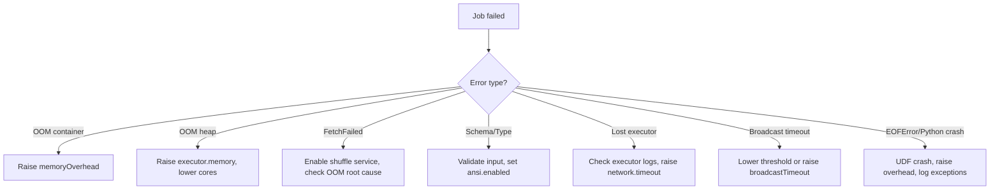

# 12 — Debugging failures

## Why this matters

Production Spark jobs fail in a small set of recurring ways. This note is a triage runbook: error → cause → fix.

## The big buckets

1. **Memory** — OOM in executor, driver, or Python worker.
2. **Shuffle** — fetch failures, file-not-found, partitioner mismatches.
3. **Data** — schema mismatch, corrupt records, type cast failures.
4. **Driver/cluster** — lost executor, broadcast timeouts, scheduling stalls.

## Memory errors

### `Container killed by YARN/K8s for exceeding memory limits`

The container used more than `executor.memory + executor.memoryOverhead`. Almost always the **overhead** (off-heap, Python, direct buffers) that blew up.

```
Diagnostics: Container [pid=12345] is running beyond physical memory limits.
Current usage: 18.0 GB of 16 GB physical memory used
```

**Fix:**
1. Raise `spark.executor.memoryOverhead` (start with 20–30% of executor.memory; for PySpark with Pandas UDFs, 50%+).
2. Reduce per-task memory: smaller partitions, fewer cores per executor.
3. Check for runaway broadcast — collected something too big.

### `java.lang.OutOfMemoryError: Java heap space`

JVM heap exhausted. Distinct from container kill — this is *inside* the JVM.

**Fix:**
1. Raise `spark.executor.memory`.
2. Lower `spark.executor.cores` (fewer concurrent tasks share the heap).
3. Smaller shuffle partitions (less working set per task).
4. Don't cache things you don't reuse.

### `java.lang.OutOfMemoryError: GC overhead limit exceeded`

Spending > 98% of CPU in GC. The heap is "fine" but the JVM can't make progress.

**Fix:** same as above; also consider switching to G1GC if not already, or smaller heap (counter-intuitive but reduces GC time).

### Driver OOM

```
java.lang.OutOfMemoryError at org.apache.spark.api.python.PythonRDD$.collectAndServe
```

You called `collect()`, `take(huge_n)`, `toPandas()`, or broadcast something huge.

**Fix:** Write to storage instead. If you must collect, use `df.toLocalIterator()` or limit aggressively first.

## Shuffle errors

### `FetchFailedException`

```
org.apache.spark.shuffle.FetchFailedException:
  Failed to connect to executor-7.cluster.local:43210
```

A downstream task can't fetch shuffle output from an upstream executor — usually because that executor died (OOM-killed, preempted, network blip).

**Fix:**
1. Enable external shuffle service (`spark.shuffle.service.enabled=true`) so shuffle files survive executor death.
2. Address the underlying cause: was the executor OOM'd? Was it a spot preemption?
3. Increase `spark.shuffle.io.maxRetries` (default 3, raise to 10) and `spark.shuffle.io.retryWait` (5s → 10s).

### `java.io.FileNotFoundException: ... shuffle_*_data`

Same root cause as fetch-failed: shuffle files gone.

### Out of memory in shuffle

```
SortShuffleManager - Unable to acquire ... bytes of memory
```

Shuffle write exceeded execution memory budget. Spills should kick in automatically; if you see OOM, it's because spill itself ran out of disk.

**Fix:** more `spark.local.dir` mounts, bigger executor memory, more partitions.

## Data errors

### Schema mismatch

```
AnalysisException: cannot resolve 'column_x' given input columns: [a, b, c]
```

You referenced a column that isn't in the DataFrame. Often a typo or a wrong upstream version.

**Fix:** `df.printSchema()` first; check spelling and case.

### Type cast failures

```
NumberFormatException: For input string: "N/A"
```

ANSI mode is on (default in 3.4+) and a string column won't cast to int. Spark used to silently produce null; now it raises.

**Fix:** Either clean the data first, or `spark.conf.set("spark.sql.ansi.enabled", False)` for the legacy behavior (silent null).

### Corrupt records in JSON/CSV

```
spark.read.option("mode", "PERMISSIVE")    # default — bad rows become null
                  .option("mode", "DROPMALFORMED") # silently drop
                  .option("mode", "FAILFAST")      # raise on first bad row
                  .option("columnNameOfCorruptRecord", "_corrupt")
                  .json("input.json")
```

**Fix:** Use `PERMISSIVE` with a `_corrupt_record` column, then quarantine those rows. For production, `FAILFAST` is often correct — fail fast and investigate.

## Driver / cluster errors

### Lost executor

```
ExecutorLostFailure (executor 5 exited caused by one of the running tasks)
Reason: Executor heartbeat timed out after 120000 ms
```

Executor stopped responding. Could be:
- OOM kill (check container logs).
- Network partition / preemption (cloud spot).
- Long GC pause exceeding `spark.network.timeout` (default 120s).

**Fix:**
1. Look at the executor's own logs — was there an OOM trace before the timeout?
2. Raise `spark.network.timeout` (e.g. 300s) for GC-heavy jobs.
3. Use on-demand instances for the critical driver+core executors.

### Broadcast timeout

```
SparkException: Could not execute broadcast in 300 secs.
```

Broadcasting too big a DataFrame, or slow network.

**Fix:**
1. Lower `spark.sql.autoBroadcastJoinThreshold` to avoid the broadcast.
2. Raise `spark.sql.broadcastTimeout` if the broadcast is necessary but slow.

### Application stuck — no progress, no errors

Usually one of:
- Driver doing CPU-intensive work (large `explain`, big `collect` post-processing).
- Deadlock between `spark.dynamicAllocation` and `numExecutors` static setting (don't mix them).
- Waiting on resources from cluster manager.

Check driver thread dump (Spark UI → Executors → driver → Thread Dump).

## Python-specific errors

### `Py4JJavaError`

Wrapper around a JVM exception. The Python stacktrace is mostly useless — scroll down for the Java traceback, which is the real error.

### `EOFError` in Python worker

```
PythonException: An exception was thrown from the Python worker.
```

Almost always means the Python worker died (OOM, segfault, crash inside a UDF).

**Fix:**
1. Catch and log exceptions inside UDFs.
2. Reduce `arrow.maxRecordsPerBatch` for Pandas UDFs.
3. Bump `executor.memoryOverhead`.

### Pickling errors

```
PicklingError: Can't pickle <class 'numpy.float64'>
```

A UDF captured something un-picklable (a Spark session, a connection, a local object).

**Fix:** Don't capture; pass primitives. For Pandas UDFs use `Iterator` flavor to load expensive state once per partition without capture.

## Triage flowchart



## A debugging session in 5 steps

1. **Get the error message** — full stack trace, both Python and Java sides.
2. **Find the stage** that failed in the Spark UI.
3. **Find the executor(s)** that failed — pull their full logs.
4. **Look for what came *before*** the error: OOM warnings, full GC, slow shuffle fetches.
5. **Reproduce locally** with a sample of input — often clarifies whether it's data or environment.

## References

- 📺 [Debugging Apache Spark — Holden Karau](https://www.youtube.com/results?search_query=debugging+apache+spark+holden+karau)
- [LS Ch.7] — UI tour and common failures
- [HPS Ch.7 §"Debugging Spark Applications"]
- [DAS Appendix §"Common Errors"]
