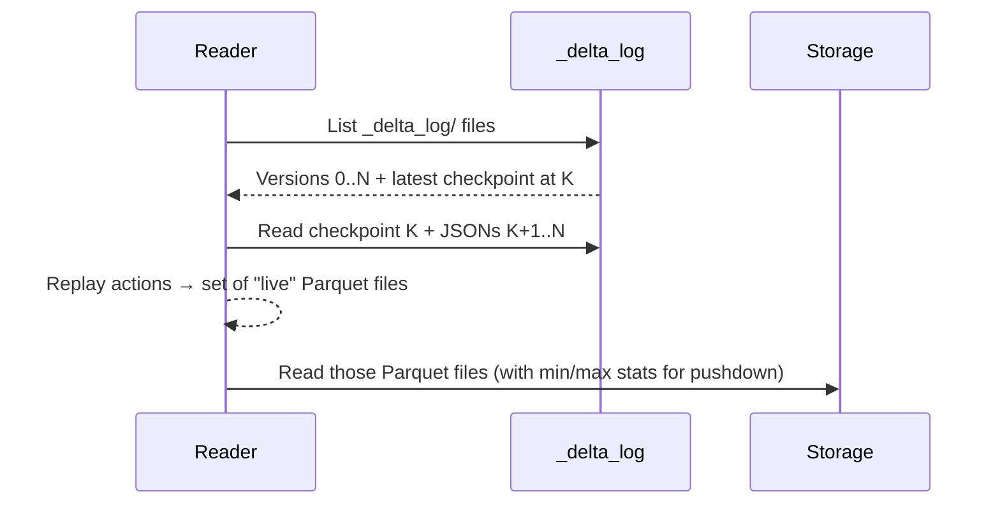
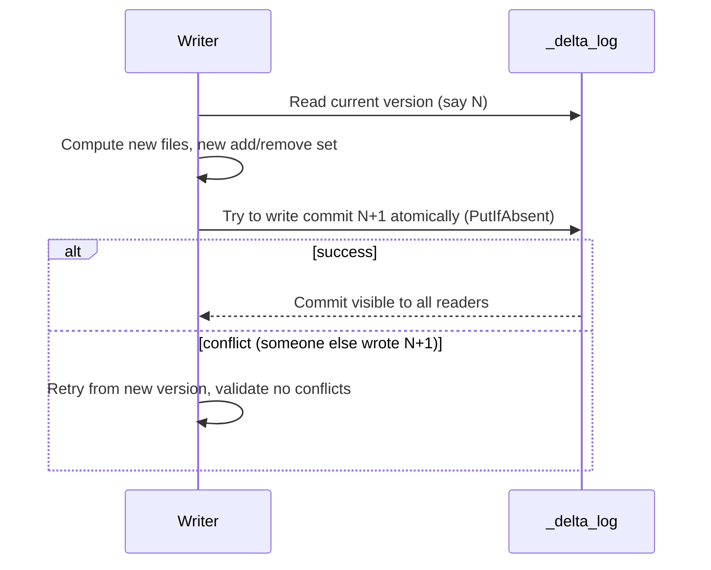

# 02 — The transaction log (`_delta_log`)

## Why this matters

Everything Delta does — ACID, time travel, MERGE — comes from one mechanism: a transaction log sitting in a `_delta_log/` directory next to your Parquet files. Understand the log and you understand Delta.

## What lives in `_delta_log/`

```
s3://my-bucket/orders/
├── _delta_log/
│   ├── 00000000000000000000.json       <- version 0 (table created)
│   ├── 00000000000000000001.json       <- version 1 (first append)
│   ├── 00000000000000000002.json       <- version 2 (a delete)
│   ├── ...
│   ├── 00000000000000000010.checkpoint.parquet  <- every 10 versions
│   ├── _last_checkpoint
│   └── 00000000000000000011.json
├── part-00000-abc.snappy.parquet       <- data files (regular Parquet)
├── part-00001-def.snappy.parquet
└── ...
```

Two file types:
1. **JSON commit files** — one per transaction, numbered sequentially.
2. **Checkpoint Parquet files** — periodic snapshots so readers don't have to replay all JSONs from version 0.

## What's inside a commit file

Each JSON commit is a series of **actions**. The important action types:

| Action | Meaning |
|---|---|
| `metaData` | Schema, partitioning, table properties — emitted on create or schema change |
| `add` | A new Parquet file is now part of the table |
| `remove` | An existing file is logically deleted from the table (file still on disk) |
| `commitInfo` | Operation name, user, timestamp, predicate, version metrics |
| `protocol` | Required reader/writer versions for compatibility |

Example commit (paraphrased):

```json
{"commitInfo": {"timestamp": 1700000000000, "operation": "WRITE", "operationParameters": {"mode": "Append"}}}
{"add": {"path": "part-00000-abc.snappy.parquet", "size": 12345, "modificationTime": 1700000000000, "dataChange": true, "stats": "{...min/max/null counts...}"}}
{"add": {"path": "part-00001-def.snappy.parquet", "size": 23456, ...}}
```

## How a read works

To read the current version of a Delta table:



1. List `_delta_log/`.
2. Find the latest checkpoint (e.g. version 10).
3. Read the checkpoint Parquet to get the file set at version 10.
4. Replay JSON commits 11, 12, ... N on top (apply `add` / `remove`).
5. The resulting set of paths is the current snapshot.
6. Read those Parquet files.

The min/max stats inside `add` actions let the reader skip files at the *log* level — before even opening the data — based on a `WHERE` filter. This is **data skipping**.

[LS Ch.9 §"Transaction Log"], *Delta Definitive Guide* Ch.2

## How a write works (optimistic concurrency)



Writes are **optimistic**:
1. Writer reads the current version.
2. Computes its changes (compute-bound, no lock).
3. Tries to *atomically* create `00000000000000000{N+1}.json` using a storage primitive that fails if it already exists (e.g. S3 conditional put, ADLS lease, HDFS create-exclusive).
4. If two writers collide on N+1, only one wins; the loser re-reads, re-validates, and retries.

This is fast for non-conflicting writes (different partitions/files) and slow only when actual collisions occur (rare in well-partitioned tables).

## Checkpoints — why they exist

If your table has 50,000 versions, a reader doesn't want to replay 50,000 JSONs. Every N versions (default 10), Delta writes a *checkpoint*: a Parquet file containing the full set of actions to date. Readers start from the latest checkpoint and only replay newer JSONs.

```
_last_checkpoint   <- tiny pointer file: "latest checkpoint is at version 100"
00000000000000000100.checkpoint.parquet
00000000000000000101.json
00000000000000000102.json
...
```

`_last_checkpoint` lets the reader find the checkpoint without listing the whole directory — listing huge directories on S3 is expensive.

## What this buys you

| Feature | How |
|---|---|
| ACID | Atomic JSON write + optimistic concurrency |
| Time travel | Replay log to any earlier version (or timestamp) |
| Schema enforcement | `metaData` action defines current schema; conflicting writes fail |
| Data skipping | Min/max stats in `add` actions, before reading data |
| Auditability | Every change has a `commitInfo` |
| Cheap delete | `remove` action; old file stays until VACUUM |
| Concurrent writers | Multiple writers as long as they don't touch the same files |

## What this costs you

- **Many JSON files**: a write-heavy table accumulates one per commit. Checkpointing helps; `OPTIMIZE` compacts.
- **Listing cost**: reading the table requires listing `_delta_log/` — fine on HDFS, can be a bottleneck on S3 with millions of versions.
- **Slow first read** after a long idle period: cache of file listings is cold.
- **Tiny tables, frequent writes**: if you write 1000 rows per second, you'll create 1000 commits per second — Delta is not built for that. Batch your writes.

## Scale notes

- A table with 1M small commits and no checkpointing → first read takes minutes just to list and replay.
- After regular checkpointing + log retention pruning: same table reads in seconds.
- Per-commit overhead: ~5–50 ms on object storage, depending on provider and latency.
- Data file size sweet spot: 100 MB – 1 GB, same as plain Parquet. Use `OPTIMIZE` to coalesce.

## Failure modes

| Symptom | Cause | Fix |
|---|---|---|
| Two writers fail with `ConcurrentAppendException` | Both wrote to the same partition with overlapping files | Re-run; or restructure to write to disjoint partitions |
| Table reads slow after a year of frequent writes | Checkpointing disabled or too infrequent | Set `delta.checkpointInterval`; let it run |
| Old data file referenced in log but missing | VACUUM ran too aggressively (`RETAIN 0 HOURS`) | Don't do that; VACUUM defaults to 7 days for a reason |
| `_last_checkpoint` points at non-existent file | Corrupted by parallel writers without proper isolation | Recover from older checkpoint; investigate storage primitive |
| Listing `_delta_log/` times out | Millions of commits | Enable checkpointing; clean up with `delta.logRetentionDuration` |

## References

- *Delta Lake: The Definitive Guide* — Ch.2 "The Transaction Log"
- [LS Ch.9 §"How Delta Achieves ACID"]
- 📺 [Diving into Delta Lake: Unpacking the Transaction Log — Databricks](https://www.youtube.com/results?search_query=delta+lake+transaction+log+databricks)
- Delta protocol spec: https://github.com/delta-io/delta/blob/master/PROTOCOL.md
