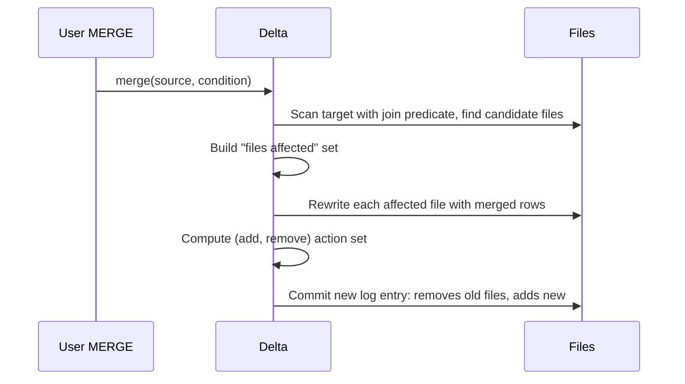

# 06 — `MERGE INTO` — upserts and CDC

## Why this matters

`MERGE` is the operation that makes Delta useful for *anything but append-only logs*. Upserts (insert-or-update), Type 1/2 SCD, CDC ingestion, deletes by key — all are MERGE patterns. If you only learn one Delta-specific operation, learn this one.

## Anatomy

```sql
MERGE INTO target t
USING source s
ON t.id = s.id
WHEN MATCHED [AND <cond>] THEN UPDATE SET col1 = s.col1, col2 = s.col2
WHEN MATCHED [AND <cond>] THEN DELETE
WHEN NOT MATCHED [AND <cond>] THEN INSERT (col1, col2) VALUES (s.col1, s.col2)
WHEN NOT MATCHED BY SOURCE [AND <cond>] THEN DELETE      -- row in target not in source
WHEN NOT MATCHED BY SOURCE [AND <cond>] THEN UPDATE SET col1 = '...'
```

Three clause kinds:
- `WHEN MATCHED` — row exists in both. Update or delete it.
- `WHEN NOT MATCHED` — row in source only. Insert it.
- `WHEN NOT MATCHED BY SOURCE` — row in target only (e.g. dropped from source). Useful for full-sync upserts.

Multiple clauses of the same kind are evaluated in order; first matching condition wins.

## PySpark API

```python
from delta.tables import DeltaTable

target = DeltaTable.forPath(spark, "/tables/users")

(target.alias("t")
   .merge(source_df.alias("s"), "t.user_id = s.user_id")
   .whenMatchedUpdate(set={
       "email":      "s.email",
       "updated_at": "s.event_time",
   })
   .whenNotMatchedInsert(values={
       "user_id":    "s.user_id",
       "email":      "s.email",
       "created_at": "s.event_time",
       "updated_at": "s.event_time",
   })
   .execute())
```

## Common patterns

### Plain upsert

```python
(target.alias("t")
   .merge(source_df.alias("s"), "t.id = s.id")
   .whenMatchedUpdateAll()
   .whenNotMatchedInsertAll()
   .execute())
```

`updateAll`/`insertAll` use every column whose name matches between source and target. Convenient but error-prone if schemas drift — be explicit in production.

### Conditional update (only if newer)

```python
(target.alias("t")
   .merge(source_df.alias("s"), "t.id = s.id")
   .whenMatchedUpdateAll(condition="s.updated_at > t.updated_at")
   .whenNotMatchedInsertAll()
   .execute())
```

Stops late-arriving data from overwriting newer rows.

### Soft delete by tombstone

CDC sources often mark deletes with a flag (`op = 'D'`) rather than removing the row.

```python
(target.alias("t")
   .merge(cdc_df.alias("s"), "t.id = s.id")
   .whenMatchedDelete(condition="s.op = 'D'")
   .whenMatchedUpdateAll(condition="s.op IN ('U','I')")
   .whenNotMatchedInsertAll(condition="s.op IN ('I','U')")
   .execute())
```

### Full sync (mirror source state into target)

```python
(target.alias("t")
   .merge(source_df.alias("s"), "t.id = s.id")
   .whenMatchedUpdateAll()
   .whenNotMatchedInsertAll()
   .whenNotMatchedBySourceDelete()
   .execute())
```

After this, target = source exactly. Be careful — `WHEN NOT MATCHED BY SOURCE` deletes anything in target not in source. A bad source pull empties the table.

### SCD Type 2 (full historical track)

Type 2 keeps a history row per change. Each row has `valid_from`, `valid_to`, and an `is_current` flag.

```python
# Existing rows that change become "old": set valid_to and is_current=false
# Then insert the new row

updates = source_df.alias("s")

# Step 1: build a set of "stage" rows — one for each change
stage = (updates.join(target.toDF().alias("t"),
                      (F.col("s.id") == F.col("t.id")) & F.col("t.is_current"),
                      "left")
         .where("t.id IS NULL OR s.attr != t.attr"))  # truly changed

# Step 2: for each change, generate two rows: a "close old" and an "insert new"
close = stage.where("t.id IS NOT NULL") \
             .select(F.col("t.id").alias("merge_key"),
                     F.col("s.*"))
new   = stage.select(F.col("s.id").alias("merge_key"), F.col("s.*"))
staged = close.unionByName(new)

(target.alias("t")
   .merge(staged.alias("s"), "t.id = s.merge_key AND t.is_current = true")
   .whenMatchedUpdate(condition="t.attr != s.attr",
                      set={"valid_to": "s.event_time", "is_current": "false"})
   .whenNotMatchedInsert(values={
       "id":         "s.id",
       "attr":       "s.attr",
       "valid_from": "s.event_time",
       "valid_to":   "null",
       "is_current": "true"})
   .execute())
```

(Full working example in `examples/04_scd2_merge.py`. See also `06_real_projects/scd2-customers/` for production version.)

## How MERGE works under the hood



Key fact: **MERGE rewrites entire files**, not individual rows. If 5 of your 1000 rows in a file change, the whole file is rewritten. This is why partitioning and bucketing affect MERGE performance dramatically.

### Speeding MERGE up

| Trick | Why it helps |
|---|---|
| Partition on a column in the merge predicate | Limits files scanned and rewritten |
| Z-ORDER on the merge key | Tightens min/max stats → fewer files touched |
| Add a "low-cardinality narrowing" predicate | `AND t.partition_date = s.partition_date` cuts the file set |
| Use Photon/native execution (Databricks) | MERGE is heavily I/O; vectorization helps |
| Cluster the source | Avoid a shuffle on the source side |

Adding `AND t.partition_date = s.partition_date` to the merge condition is the single biggest win for partitioned tables — limits the rewrite to the right partition.

## Scale notes

- A MERGE on 1 GB target rewriting 2% of rows scattered across all files → may touch all files → expensive.
- The same with Z-ORDER on the key → touches ~5% of files → 20× faster.
- Streaming MERGE pattern: micro-batch with `foreachBatch` and MERGE inside. See module 05 streaming.

## Failure modes

| Symptom | Cause | Fix |
|---|---|---|
| `MERGE` is extremely slow | No partition / Z-ORDER on merge key | Add Z-ORDER; partition appropriately |
| `MERGE` matched multiple source rows per target | Source has duplicate keys | Deduplicate source first (`row_number` by event_time) |
| `ConcurrentAppendException` from MERGE | Another writer touched same files | Add partition predicate; or serialize jobs |
| Schema mismatch on insert | Source has extra columns | `.option("mergeSchema", true)` if appropriate; else align schemas |
| `WHEN NOT MATCHED BY SOURCE` deleted everything | Source was empty/null | Validate source row count before MERGE; or add `WHERE EXISTS` guards |
| Tiny commits, log explosion | MERGE called per-row instead of per-batch | Buffer into batches; never MERGE inside a `foreach` row-loop |

## References

- *Delta Lake: The Definitive Guide* — Ch.8 "MERGE INTO"
- Delta docs: https://docs.delta.io/latest/delta-update.html#-merge
- [DAS Ch.10 §"MERGE Patterns"]
- 📺 [MERGE INTO in Delta Lake — Databricks](https://www.youtube.com/results?search_query=delta+lake+merge+into+databricks)
