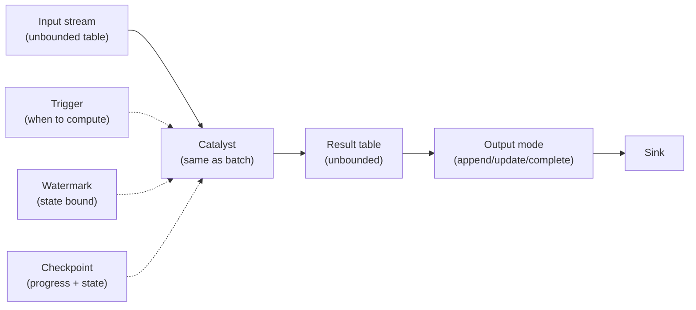
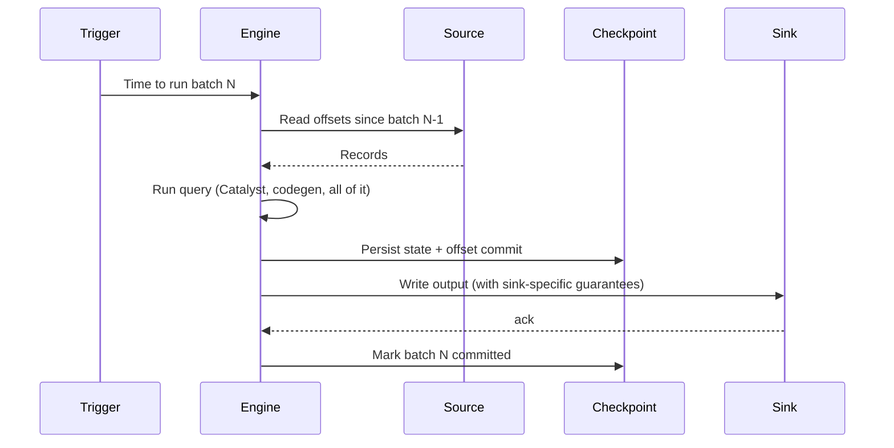

# 01 — The Structured Streaming model

## Why this matters

Streaming systems have a reputation for being hard. Structured Streaming's design tries to make that not true: **a stream is just an unbounded table you query with the same DataFrame API**. Everything else — late data, watermarks, exactly-once — is built on top of that core idea.

If you can write a batch query, you can write a streaming one. The differences are mostly about what guarantees the system gives you, not what code you write.

## The model in one diagram



1. The **input table** grows with each batch of incoming data.
2. Your query is **identical to a batch query** against that input table.
3. Spark **materializes** a result table incrementally — only the new/changed rows.
4. The **output mode** decides what subset of the result table is emitted to the sink.
5. **Triggers** decide when batches run. **Watermarks** bound state. **Checkpoints** persist progress.

[LS Ch.8 §"The Programming Model"]

## A trivial streaming job

```python
# Same as batch — just `readStream` and `writeStream`
events = (spark.readStream
    .format("rate")
    .option("rowsPerSecond", 1000)
    .load())

counts = (events
    .withColumn("bucket", (F.col("value") % 10))
    .groupBy("bucket")
    .count())

query = (counts.writeStream
    .outputMode("complete")
    .format("console")
    .trigger(processingTime="5 seconds")
    .start())

query.awaitTermination()
```

What this does:
- Reads from the `rate` source (built-in test source, 1000 rows/s).
- Groups by `value % 10`, counts.
- Every 5 seconds, prints the entire current result table to the console.

The query is identical to what you'd write in batch. The streaming-ness is in the read/write specifiers and the trigger.

## Two execution modes

| Mode | Spark version | Latency | Throughput | Maturity |
|---|---|---|---|---|
| **Micro-batch** | default | 100ms–seconds | high | mature, most features |
| **Continuous** | experimental since 2.3 | ~1ms | lower | limited operators |

Almost everything in this module is micro-batch. Continuous is rarely used in practice; mention it for completeness.

In micro-batch mode, Spark runs a small batch job every trigger interval, treating incoming data as a new chunk. Each batch is a regular Spark job with its own DAG, stages, and tasks.

## How a batch is processed



The order matters: **state and offsets are persisted before the sink write, and the sink commit before marking the batch done**. This is what makes exactly-once possible (for idempotent sinks). More in note 09.

## What's in the result table

Conceptually, the result table is everything the query would produce against the cumulative input up to "now". In practice, Spark only stores:
- The **state** needed to compute incremental updates (aggregations, joins).
- The **last few batches' results** so it can emit them in the chosen output mode.

The full result table is never materialized in memory — that's the point of incremental computation.

## What changes from batch

Streaming queries can't do everything batch can:

| Operation | Batch | Streaming |
|---|---|---|
| `count()`, `collect()` | Yes | No (use `writeStream`) |
| Multiple aggregations on the same stream | Yes | Limited (chained aggregations need care) |
| `distinct()` without watermark | Yes | Unbounded state — risky |
| Global `orderBy` | Yes | No (would need full data) |
| `show()` | Yes | Use `.format("console")` sink instead |
| `cache()` | Yes | No (use sink as cache) |
| Limit + sort top-N | Yes | Use `withWatermark` + window |

## Scale notes

- A typical Structured Streaming job processes 10K–1M events/s per executor, depending on what the query does.
- State store size — the in-memory map of aggregation keys — is the most common scaling limit. Watermarks bound it.
- Latency floor: ~100 ms per micro-batch on Spark; ~1 ms with continuous (where supported).

## Failure modes (a teaser; full coverage in note 09)

| Symptom | Cause | Fix |
|---|---|---|
| Stream stops with no error | Driver disconnected; query terminated cleanly | `query.exception()` for details; restart |
| State store growing without bound | No watermark on aggregation | Add `withWatermark` |
| Duplicates in sink after restart | Non-idempotent sink + at-least-once | Use idempotent sink (Delta, Kafka with txns) |
| "checkpoint location must be specified" | Forgot `.option("checkpointLocation", ...)` | Always set checkpoint location |

## References

- [LS Ch.8] — entire chapter
- [HPS Ch.10]
- Structured Streaming Programming Guide: https://spark.apache.org/docs/latest/structured-streaming-programming-guide.html
- 📺 [A Deep Dive into Structured Streaming — Tathagata Das](https://www.youtube.com/results?search_query=structured+streaming+tathagata+das)
