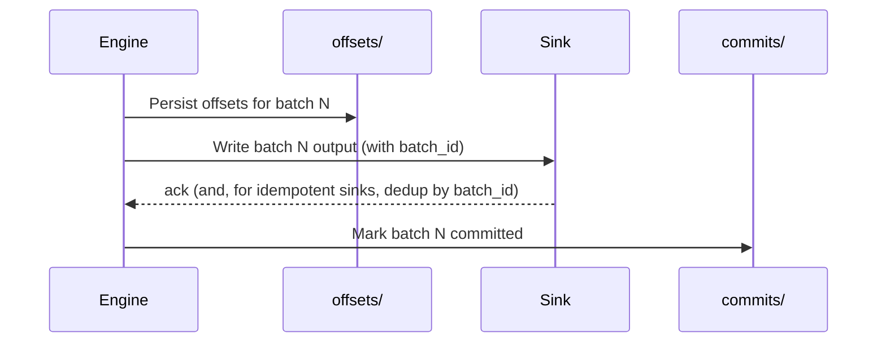

# 03 — Triggers, output modes, and checkpointing

## Why this matters

Three settings every streaming query *must* set. Get them wrong and you'll get unexpected latency, lost rows, duplicate rows, or "why is my output mode invalid for this query" errors.

## Triggers — when does a batch run?

```python
.trigger(processingTime="10 seconds")    # every 10s
.trigger(once=True)                       # one batch, then stop  (DEPRECATED → AvailableNow)
.trigger(availableNow=True)               # consume all currently available data, then stop
.trigger(continuous="1 second")           # continuous mode (experimental)
.trigger()                                # default: fire as soon as previous batch is done
```

| Trigger | Behavior | Use when |
|---|---|---|
| default (none) | Fire next batch immediately after previous one completes | "Stream as fast as possible" |
| `processingTime="N s"` | Every N seconds | Predictable cadence, batched downstream |
| `availableNow=True` | Drain currently-available data into 1+ batches then stop | "Run streaming queries on a cron" |
| `once=True` | One batch then stop (single batch even if more data) | Replaced by `availableNow` in Spark 3.3+ |
| `continuous="N ms"` | Continuous mode | Sub-second latency required, supported ops only |

### `availableNow` — the pattern that often replaces batch ETL

If your job runs every 15 minutes and processes new data, you don't need a long-running stream. Use `availableNow`:

```python
(spark.readStream.format("delta").load("/bronze")
    .transform(silver_transform)
    .writeStream
    .format("delta")
    .option("checkpointLocation", "/ck/silver")
    .trigger(availableNow=True)
    .toTable("silver"))
```

Run this on Airflow / cron every 15 min. The checkpoint resumes from where the last run left off. Cheap, exactly-once, no idle compute between runs.

## Output modes

| Mode | Emits | Compatible with |
|---|---|---|
| `append` | Only new rows; once emitted, never re-emitted | No aggregations (or aggregations with watermark) |
| `update` | Rows that changed since last batch | Aggregations |
| `complete` | The entire result table every batch | Aggregations (and only for queries with aggregations) |

### When each is the right answer

```python
# 1) Pass-through: every input row produces one output row
stream.writeStream.outputMode("append")  # always

# 2) Running counts with no end:
stream.groupBy("user_id").count() \
    .writeStream.outputMode("complete")  # entire table re-emitted each batch
    .format("memory")                     # only memory/console sinks accept complete

# 3) Windowed counts with watermark — `append` works
stream.withWatermark("ts", "10 minutes") \
    .groupBy(F.window("ts", "5 minutes"), "user_id").count() \
    .writeStream.outputMode("append")  # rows emitted once window is "closed"

# 4) Live dashboard — emit updated rows only
stream.groupBy("user_id").count() \
    .writeStream.outputMode("update")  # only changed (user_id, count) rows each batch
```

### The watermark+append trick

For windowed aggregations, you typically want `append` (write once per window, never re-emit). But `append` requires the engine to *know* when a window is "complete" — i.e. no more late data. That's what watermark provides.

Without watermark, windowed aggregation requires `update` or `complete`. With watermark, `append` is allowed.

[LS Ch.8 §"Output Modes"]

## Checkpoints — the source of truth for state and offsets

```python
.option("checkpointLocation", "s3://my-checkpoints/bronze_events/")
```

Mandatory for any non-toy streaming query. The checkpoint directory contains:

```
checkpoint/
├── offsets/              <- per-batch offset commits
│   ├── 0
│   ├── 1
│   └── ...
├── commits/              <- per-batch commit markers (after sink write)
├── sources/              <- source-specific bookkeeping
├── state/                <- aggregation/join state stores
├── metadata             <- query metadata
└── _spark_metadata      <- (file sink only) file commit metadata
```

### What checkpointing buys you

- **Resume on restart** — Spark replays from the last committed batch.
- **Exactly-once with idempotent sinks** — each batch ID is committed once at most.
- **State recovery** — aggregation state, join state, watermark all restored.

### Rules

1. **One checkpoint per query, ever.** Never share between queries.
2. **Stable location** — survives cluster restarts, ideally on durable storage (S3/ADLS/HDFS, not local disk).
3. **Don't delete it casually.** Deleting = full reprocess from `startingOffsets`.
4. **Versioning matters.** Changes to the query (new aggregations, different state) may break the checkpoint. Test on a copy.
5. **Don't reuse across Spark versions** without compatibility check.

### What's NOT in the checkpoint

- The sink's data. (That's in the sink — Delta table, Kafka topic, etc.)
- The query code. (You have to re-deploy it.)
- The cluster config. (You have to re-create it.)

So a "full recovery" needs: code + cluster + checkpoint dir + sink.

## How exactly-once works (the short version)



- If we crash between persist offsets and sink write: on restart, we redo the batch (sink dedups by batch_id).
- If we crash between sink write and commit mark: on restart, we redo the batch (sink dedups).
- If sink is non-idempotent: redoing creates duplicates → at-least-once only.

Idempotent sinks:
- Delta — refuses commits with duplicate `batch_id`.
- Kafka with transactions — abort/replay.
- Custom — use `batch_id` as a primary key in your target.

## Failure modes

| Symptom | Cause | Fix |
|---|---|---|
| Query exits with "checkpoint location must be specified" | Missing `checkpointLocation` | Always set it |
| Two streams overwrite each other's checkpoint | Same checkpoint location | Use distinct paths per query |
| State growing unbounded → executor OOM | Aggregation without watermark | Add `withWatermark` |
| Late data dropped | Watermark too aggressive | Loosen the watermark, accept latency |
| Restart reprocesses all of history | Checkpoint deleted, or `startingOffsets=earliest` and new checkpoint | Preserve checkpoint, or set `startingOffsets=latest` |
| `outputMode("append") not compatible with non-watermark aggregation` | Trying to use append on streaming agg | Add watermark, or switch to `update` |
| Trigger interval ignored | Misnamed option, or processing taking longer than interval | Check option syntax; watch UI batch duration |

## References

- [LS Ch.8 §"Triggers", §"Output Modes"]
- Spark docs: https://spark.apache.org/docs/latest/structured-streaming-programming-guide.html#triggers
- 📺 [Structured Streaming Internals — Tathagata Das](https://www.youtube.com/results?search_query=structured+streaming+internals+tathagata)
