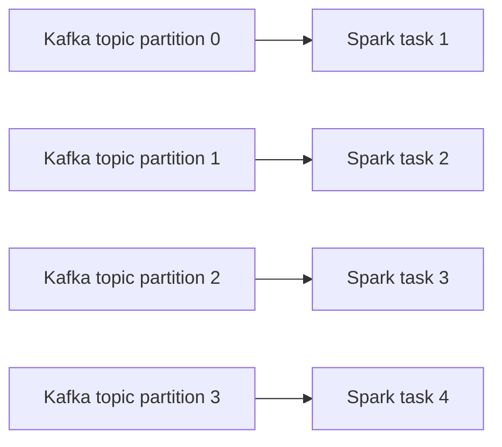

# 07 — Kafka deep dive

## Why this matters

Kafka + Spark Structured Streaming is the most common production streaming pair. Kafka gives you replayable, partitioned, durable event logs; Spark gives you the compute and exactly-once via offset commits.

## Spark's Kafka model



- **One Kafka partition = one Spark task.** Parallelism is determined by Kafka partition count.
- Spark maintains its own offset bookkeeping in the checkpoint location — it does NOT use Kafka consumer groups.
- Each batch reads `(start_offset, end_offset)` per partition; the engine decides those based on `maxOffsetsPerTrigger`.

[LS Ch.8 §"Kafka Integration"]

## The minimum read

```python
df = (spark.readStream
    .format("kafka")
    .option("kafka.bootstrap.servers", "broker1:9092,broker2:9092,broker3:9092")
    .option("subscribe", "user_events")
    .option("startingOffsets", "latest")
    .option("maxOffsetsPerTrigger", 100000)
    .load())
```

What you get — a fixed schema:

| Column | Type | Notes |
|---|---|---|
| `key` | binary | Kafka key, often null |
| `value` | binary | The payload, usually JSON or Avro |
| `topic` | string | |
| `partition` | int | |
| `offset` | long | Monotonic per partition |
| `timestamp` | timestamp | Kafka ingestion time (or per-record CreateTime if producer set it) |
| `timestampType` | int | 0 = NoTimestampType, 1 = CreateTime, 2 = LogAppendTime |
| `headers` | array<struct<key,value>> | Kafka headers (Spark 2.4+) |

You almost always cast `value` to string and parse JSON/Avro from there:

```python
import pyspark.sql.functions as F
from pyspark.sql.types import StructType, StringType, IntegerType, TimestampType

schema = (StructType()
    .add("user_id", IntegerType())
    .add("event_type", StringType())
    .add("amount", IntegerType())
    .add("event_time", TimestampType()))

parsed = (df
    .select(
        F.col("topic"),
        F.col("partition"),
        F.col("offset"),
        F.col("timestamp").alias("kafka_ts"),
        F.from_json(F.col("value").cast("string"), schema).alias("e"))
    .select("topic", "partition", "offset", "kafka_ts", "e.*"))
```

## Subscription options

```python
# Single topic
.option("subscribe", "user_events")

# Multiple topics (comma-separated)
.option("subscribe", "user_events,page_views")

# All topics matching a regex
.option("subscribePattern", "events_.*")

# Specific partitions
.option("assign", '{"user_events":[0,1,2]}')
```

`subscribePattern` is good for evolving topic lists; new topics matching the pattern are picked up at restart.

## startingOffsets / endingOffsets

```python
# Where to start reading from when there's NO checkpoint
.option("startingOffsets", "latest")    # default for streaming; new data only
.option("startingOffsets", "earliest")  # all available data; great for backfill

# Per-partition explicit offsets
.option("startingOffsets",
        '{"user_events":{"0":1000,"1":2000,"2":3000}}')
```

For `spark.read` (batch read of Kafka, not streaming), also specify `endingOffsets`.

The checkpoint, if present, *overrides* `startingOffsets`. So once a stream has run once, the option is essentially ignored.

## maxOffsetsPerTrigger — back-pressure

```python
.option("maxOffsetsPerTrigger", 100000)
```

Caps the total records (across all partitions) read in one micro-batch. Critical for:
- **Backfill**: starting from `earliest` and having a year of data — without this, the first batch tries to read everything and blows up.
- **Bursty traffic**: a 100× spike doesn't make one batch take 100× longer.

A starter value: aim for batches that complete in ~half your trigger interval.

## Writing back to Kafka

```python
(stream
    .selectExpr(
        "CAST(user_id AS STRING) AS key",
        "to_json(struct(*)) AS value")
    .writeStream
    .format("kafka")
    .option("kafka.bootstrap.servers", "broker1:9092")
    .option("topic", "user_events_enriched")
    .option("checkpointLocation", "/ck/kafka_sink")
    .start())
```

Required output columns: `value` (binary or string). Optional: `key`, `topic` (overrides the option), `partition`, `headers`.

For exactly-once to Kafka, you need:
- Spark 2.4+
- Kafka brokers ≥ 0.11
- `enable.idempotence=true` (sets up Kafka transactions)
- Spark transactional sink (set `kafka.transactional.id.prefix`)

Without these: at-least-once, with possible duplicates on retry.

## Common patterns

### Pattern: bronze raw ingestion

Write the raw Kafka records to Delta with minimal parsing:

```python
(spark.readStream
    .format("kafka")
    .option("kafka.bootstrap.servers", BROKERS)
    .option("subscribe", "user_events")
    .option("startingOffsets", "latest")
    .load()
    .selectExpr(
        "CAST(key AS STRING) AS key",
        "CAST(value AS STRING) AS value",
        "topic", "partition", "offset", "timestamp")
    .writeStream
    .format("delta")
    .outputMode("append")
    .option("checkpointLocation", "/ck/bronze")
    .partitionBy("topic")
    .trigger(processingTime="30 seconds")
    .start("/tables/bronze_kafka"))
```

Keep raw payloads as strings. Parse downstream into silver. Easier to recover from schema changes.

### Pattern: silver = parsed + validated

```python
silver = (spark.readStream
    .format("delta")
    .load("/tables/bronze_kafka")
    .filter(F.col("topic") == "user_events")
    .withColumn("payload", F.from_json("value", event_schema))
    .filter(F.col("payload").isNotNull())     # drop bad rows
    .select("payload.*", "kafka_ts"))

(silver.writeStream
    .format("delta")
    .outputMode("append")
    .option("checkpointLocation", "/ck/silver")
    .start("/tables/silver_user_events"))
```

### Pattern: dead-letter for bad records

```python
parsed = df.withColumn("payload", F.from_json("value", event_schema))

good = parsed.filter("payload IS NOT NULL").select("payload.*")
bad  = parsed.filter("payload IS NULL").select("value", "kafka_ts")

# Two sinks — each needs its own checkpoint location
(good.writeStream.format("delta").option("checkpointLocation", "/ck/good")
     .start("/tables/silver"))

(bad.writeStream.format("delta").option("checkpointLocation", "/ck/bad")
    .start("/tables/dead_letter"))
```

Note: in older Spark, splitting one read into two sinks doubled Kafka reads. In recent Spark, you can use `foreachBatch` to write multiple sinks from one stream.

## Operations

### Lag monitoring

Spark doesn't publish to Kafka's consumer-group lag metrics (no consumer group). Instead, read the progress:

```python
prog = query.lastProgress
prog["sources"][0]["endOffset"] - prog["sources"][0]["latestOffset"]
# How far behind "now" we are
```

Or compare `numInputRows` vs `inputRowsPerSecond` to see if processing keeps up.

### Restart / reset

To "start over from a specific offset":
1. Stop the query.
2. Delete the checkpoint directory (NUCLEAR — be sure).
3. Set `startingOffsets` to the new value.
4. Start.

To "resume from where we left off": just start the query with the same checkpoint location. Spark figures it out.

## Failure modes

| Symptom | Cause | Fix |
|---|---|---|
| `OffsetOutOfRangeException` | Topic retention deleted offsets we wanted | Update `startingOffsets` past the deleted range, accept data loss |
| Reading slowly, lag growing | Not enough Spark parallelism for # Kafka partitions | More executors, or scale up Kafka partitions |
| Duplicates in downstream | Non-idempotent sink, no exactly-once setup | Use Delta sink, or Kafka transactions |
| Backfill blows up on first batch | No `maxOffsetsPerTrigger` | Set it; aim for batches of a manageable size |
| `Failed to construct kafka consumer` | Auth / SSL / SASL misconfigured | Check `kafka.security.protocol`, `kafka.sasl.*` configs |
| `Kafka data source does not allow user-specified schemas` | Tried to pass `.schema()` | The Kafka source schema is fixed; parse `value` yourself |
| Stream fails after broker restart | Recoverable; retries exhausted | `option("kafka.reconnect.backoff.max.ms", ...)`; check `failOnDataLoss` |

## References

- [LS Ch.8 §"Kafka Integration"]
- Spark Kafka integration guide: https://spark.apache.org/docs/latest/structured-streaming-kafka-integration.html
- 📺 [Kafka + Spark Structured Streaming — Confluent](https://www.youtube.com/results?search_query=spark+structured+streaming+kafka+confluent)
- [DAS Ch.11 §"Streaming with Kafka"]
