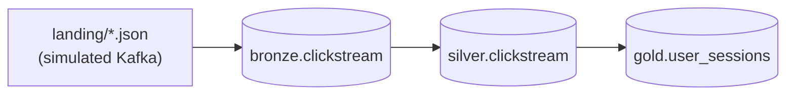

# Project: clickstream-stream

End-to-end streaming pipeline for a clickstream-style event source.

## What this project demonstrates

- Structured Streaming with file source (simulating Kafka).
- Bronze (raw) → silver (parsed, validated) → gold (sessionized) streaming.
- Watermarking and stateful operations.
- Sessionization using a built-in `session_window`.
- foreachBatch + MERGE for the silver upsert layer.
- Idempotent exactly-once via Delta sinks + checkpoint.

## Pipeline shape



Three streaming queries, each with its own checkpoint, each restartable independently.

## Files

- `gen_data.py` — background script that writes new JSON files into the landing dir.
- `stream_bronze.py` — file source → bronze Delta (append-only).
- `stream_silver.py` — bronze Delta source → silver Delta (parsed, MERGE-deduped).
- `stream_gold.py` — silver source → gold sessions (session windows).
- `run_all.py` — convenience runner; in a real pipeline these are separate jobs.

## How to run

In separate terminals:

```bash
# Terminal 1: keep producing events
python gen_data.py

# Terminal 2: run all three streaming queries
python run_all.py
```

Each query prints progress and exits cleanly on Ctrl+C.

## Design choices

### Bronze
- Append-only.
- Schema is loose: stores `value` as STRING. Parsing is silver's problem.
- Partitioned by `bronze_date` for cheap pruning.

### Silver
- Strict schema.
- Foreach-batch MERGE on `event_id`.
- Dedup-on-insert: if the same `event_id` appears twice, latest `event_time` wins.
- Watermark on `event_time` to bound dedup state.

### Gold
- Session windows of 5-minute inactivity gap.
- Watermark 15 minutes, append mode.
- Sessions emit *after* the inactivity gap + watermark grace.
- One row per (user_id, session) with click counts and total duration.

### Restart safety
- Each query has its own checkpoint dir.
- Killing the producer + consumer + re-running picks up where it left off.
