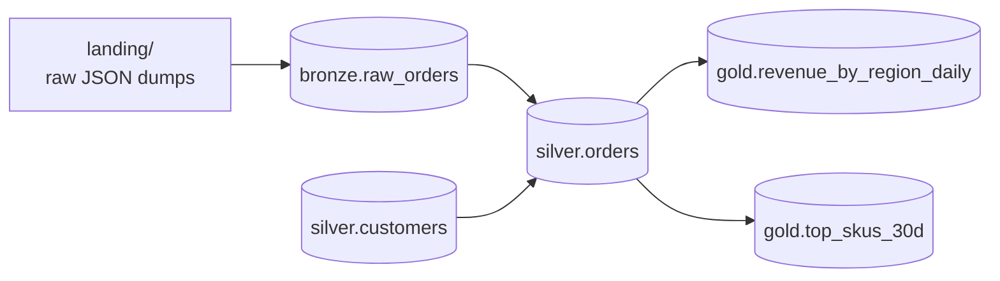

# Project: orders-etl

End-to-end medallion ETL for an `orders` dataset.

## What this project demonstrates

- Bronze ingestion from a JSON landing zone with idempotency.
- Silver layer with schema enforcement, deduplication, and SCD Type 1 customer merge.
- Gold layer aggregations (daily revenue by region, top SKUs).
- Process tracking and re-runnability.

## Data model



Source: JSON files in `landing/` with one record per line:

```json
{"order_id":"o-001","customer_id":"c-100","sku":"SKU-A","amount":12.50,"region":"US","order_time":"2024-09-15T10:23:00Z"}
```

## Layout

```
orders-etl/
├── README.md                       (this file)
├── pyproject.toml
├── src/
│   └── orders_etl/
│       ├── __init__.py
│       ├── config.py
│       ├── schemas.py
│       └── jobs/
│           ├── 01_ingest_bronze.py
│           ├── 02_build_silver.py
│           └── 03_build_gold.py
└── data/
    └── landing/    (generated by the helper script)
```

## How to run

```bash
# 1. Generate sample data
python -m orders_etl.jobs.gen_data        # writes 3 days of JSON to data/landing/

# 2. Ingest to bronze (run multiple times — idempotent)
python -m orders_etl.jobs.01_ingest_bronze --batch-date 2024-09-15
python -m orders_etl.jobs.01_ingest_bronze --batch-date 2024-09-16

# 3. Build silver (uses MERGE; idempotent)
python -m orders_etl.jobs.02_build_silver

# 4. Build gold (rebuild)
python -m orders_etl.jobs.03_build_gold

# Each script prints the resulting row counts and a sample
```

## Design choices worth noting

- **Bronze idempotency** via `replaceWhere` on `batch_date`. Re-running for the same date overwrites that day's bronze.
- **Silver idempotency** via MERGE on `order_id` with `updated_at` condition. Late-arriving older versions don't overwrite.
- **Gold** is fully rebuilt each run from silver. Cheaper than incremental given the small size; rebuild gives an obvious idempotency property.
- **Schema enforcement** in silver via a Delta CHECK constraint on `amount > 0`.
- **Data quality**: bronze accepts anything that's valid JSON; silver filters out rows with missing required fields and writes them to a dead-letter table.

## Exercises

See `exercises/README.md` for a set of extensions:
- Add a quarantine path for bad bronze records.
- Switch bronze → silver to streaming `availableNow`.
- Add a `delta.io` Z-ORDER maintenance step.
- Backfill the silver from a specific bronze version.
