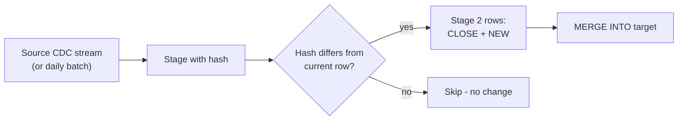

# Project: scd2-customers

A production-shaped Slowly Changing Dimension (SCD) Type 2 implementation for a customer table.

## What this project demonstrates

- Full SCD2 with `valid_from`, `valid_to`, `is_current`.
- The "two-row staging" MERGE pattern (one CLOSE, one INSERT per change).
- Change detection via an attribute hash so adding columns doesn't break the merge.
- A point-in-time query helper.
- Idempotent re-runs.

## Schema

```
customers_scd2:
  customer_key      BIGINT     -- surrogate key, monotonically assigned
  customer_id       STRING     -- natural key (stable)
  name              STRING
  email             STRING
  country           STRING
  tier              STRING     -- bronze / silver / gold / platinum
  source_updated_at TIMESTAMP  -- event time from source
  valid_from        TIMESTAMP
  valid_to          TIMESTAMP  -- NULL for current row
  is_current        BOOLEAN
  attr_hash         STRING     -- sha2(country|tier|name|email)
  inserted_at       TIMESTAMP
```

## Pipeline



## Files

- `run_scd2.py` — runnable end-to-end demo (init table, apply 3 batches, run point-in-time queries).
- `lib/scd2.py` — reusable `apply_scd2_merge` function you can import.

## How to run

```bash
python run_scd2.py
```

Walks through:
1. Initialize an empty SCD2 table.
2. Insert 5 customers (batch 1).
3. Update 2 customers' country, add 1 new customer (batch 2).
4. Idempotent re-run of batch 2 — no new rows.
5. Update 1 customer's tier, delete 1 customer (batch 3, with `is_active` flag).
6. Query "what did the customer table look like on date X".

## Design notes

- **Natural vs surrogate key**: `customer_id` (natural) is stable across history; `customer_key` (surrogate) is unique per row and used by fact tables to join to the correct historical version.
- **Attribute hash**: computed over the Type 2 attributes only. Excludes `source_updated_at` and bookkeeping columns. Adding a new Type 2 attribute = recompute hash, expect new rows on next sync.
- **Idempotency**: the change-detection step (`hash differs`) means the same batch applied twice produces no extra rows.
- **Deletes**: handled by a `whenMatchedDelete` clause OR a soft-delete flag. This demo uses soft-delete by closing the row (set valid_to + is_current=false, do not insert a new row).
