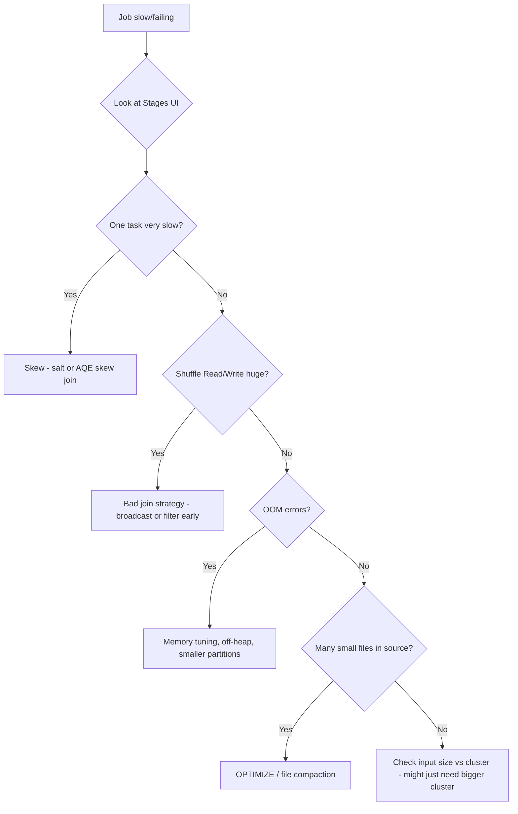
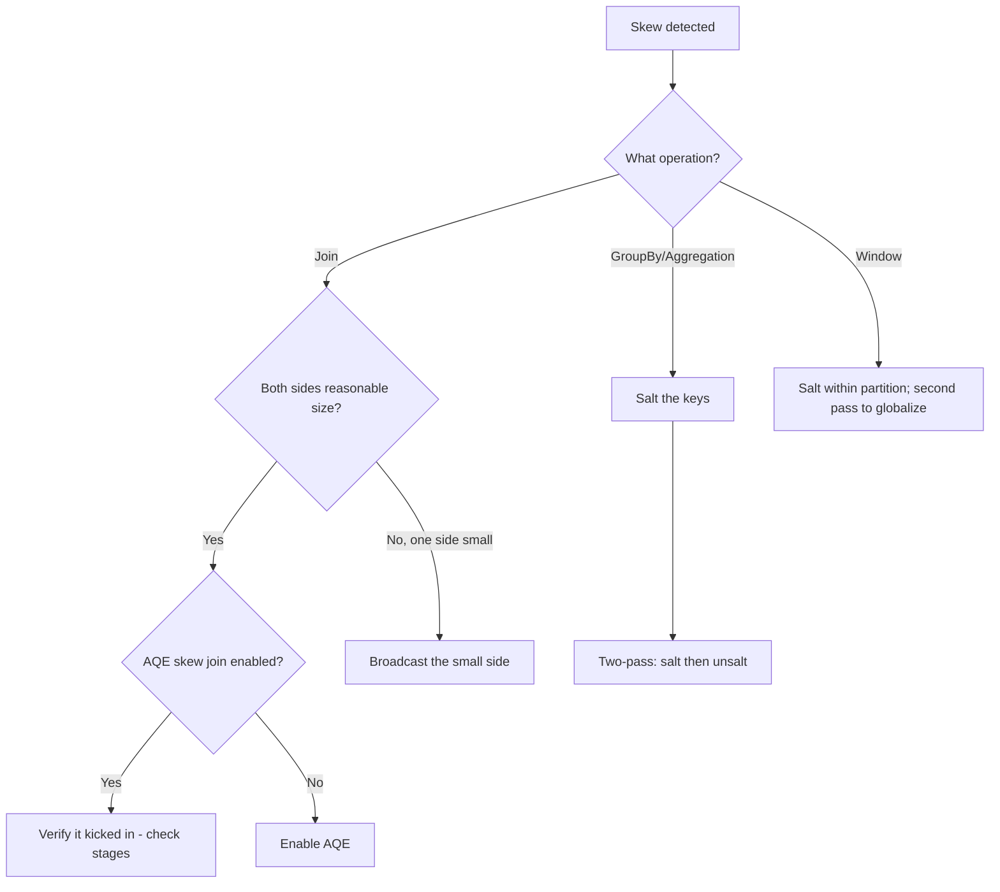

# 04 — Troubleshooting and plan-reading scenarios

The exam asks several questions that look like "here's a Spark UI screenshot / explain output — what's wrong?" or "here's a failing job — what would you do?". This note covers the patterns to recognize.

## Reading the Spark UI Stages tab

What to look for:

| Symptom | Likely cause |
|---|---|
| One task with much longer duration than others | Data skew |
| Many tasks finishing in < 100ms | Too many partitions; coalesce |
| Shuffle write / read GB enormous for input size | Wide join with no broadcast |
| `Spill (memory)` GB > 0 | Out-of-memory; data too large |
| Few stages, one with huge GC time | GC pressure; objects too big |
| Tasks failing with `OutOfMemoryError` | Executor memory too small, or skew |

## Plan-reading

```
== Physical Plan ==
*(3) HashAggregate(keys=[country], functions=[sum(amount)])
+- Exchange hashpartitioning(country, 200)
   +- *(2) HashAggregate(keys=[country], functions=[partial_sum(amount)])
      +- *(2) BroadcastHashJoin [user_id], [user_id], Inner, BuildRight
         :- *(2) Filter isnotnull(user_id)
         :  +- *(2) FileScan parquet [user_id, amount, country] ... PushedFilters: [IsNotNull(user_id)]
         +- BroadcastExchange HashedRelationBroadcastMode
            +- *(1) Filter isnotnull(user_id)
               +- *(1) FileScan parquet [user_id, ...]
```

Reading top to bottom:
- Final aggregation: HashAggregate on `country`.
- Shuffle to gather all rows per `country`.
- Partial aggregation per partition first (combiner optimization).
- Join with `BroadcastHashJoin` — small side broadcast. Good.
- File scans on both sides with `PushedFilters` — predicates pushed to Parquet.

This is a well-optimized plan.

### Spotting a problem in a plan

```
== Physical Plan ==
*(5) SortMergeJoin [user_id], [user_id], Inner
:- *(2) Sort [user_id], false, 0
:  +- Exchange hashpartitioning(user_id, 200)
:     +- *(1) FileScan parquet [user_id, amount] ...
+- *(4) Sort [user_id], false, 0
   +- Exchange hashpartitioning(user_id, 200)
      +- *(3) FileScan parquet [user_id, country] ...
```

Two `Exchange` + two `Sort` for a join. If the small side is < broadcast threshold and it's NOT being broadcast: check `spark.sql.autoBroadcastJoinThreshold`, the small side's stats, and whether you can `F.broadcast(small_df)` manually.

## Performance debugging flowchart



## Common error messages and what they mean

| Error | Likely cause |
|---|---|
| `OutOfMemoryError: GC overhead limit exceeded` | Driver/executor too small; or `.collect()` on a huge DF |
| `Container killed by YARN for exceeding memory limits` | Off-heap memory bloat; tune `spark.executor.memoryOverhead` |
| `Total size of serialized results... is bigger than spark.driver.maxResultSize` | `.collect()` of too much data; raise the limit or don't collect |
| `Failed to fetch shuffle... FetchFailedException` | Lost executor mid-shuffle; investigate executor logs |
| `Task not serializable` | Closure captures non-serializable object (DB connection, SparkSession) |
| `AnalysisException: cannot resolve 'col'` | Column doesn't exist after a rename; check `df.columns` |
| `org.apache.spark.SparkException: Job aborted due to stage failure` | One task failed repeatedly; look at task error |
| `ConcurrentAppendException` (Delta) | Two writers touched the same files |
| `DeltaConcurrentModification` | A commit ID was bumped while we were preparing ours |

## Live-debug walkthrough

You're given: "this job has been running for 6 hours, normally takes 30 min". What do you check, in order?

1. **Spark UI Jobs tab**: which jobs / stages are still active?
2. **Stages tab**: are tasks completing? At what rate?
3. **Executors tab**: are executors alive? Are any stuck on GC?
4. **One stage's task list**: is one straggler? Are some failing and retrying?
5. **Storage tab**: is anything cached that shouldn't be?
6. **SQL tab**: what's the plan? Did AQE kick in differently this time?
7. **Driver logs**: any errors logged?

Most slowness has a single root cause showing up at one of these layers.

## Skew handling decision tree



## Memory tuning quick reference

| Symptom | Tune |
|---|---|
| OOM in tasks | More executor memory; smaller partitions |
| GC time high | Smaller heap; off-heap memory |
| Spill to disk | Tune executor.memoryFraction; smaller partitions |
| Driver OOM | `.collect()` or `.toPandas()` on huge data — avoid |
| `memoryOverhead` exceeded | Bump `spark.executor.memoryOverhead` |

Rule of thumb: target ~128MB per task partition. For 100 GB data: ~800 partitions. For 1 TB: ~8000.

## File size tuning

| Read | Default | Tune |
|---|---|---|
| `spark.sql.files.maxPartitionBytes` | 128 MB | size of each file-read partition |
| `spark.sql.files.openCostInBytes` | 4 MB | "cost" of opening a file; small files combined |

If you have many small files, Spark combines them up to `maxPartitionBytes`. That's good. But it has a per-file overhead — too many small files = high listing + open cost.

## What "good" looks like

A healthy production Spark job has:
- Tasks of similar duration (skew bounded).
- Stage count proportional to the logical complexity (not bloated).
- Cached DataFrames used > 1 time (don't cache and use once).
- Plans that use broadcast joins where appropriate.
- Reasonable partition counts (200–2000 typical).
- < 5% spill ratio.
- < 10% GC time.

If any of these are off, that's where to focus.

## References

- [LS Ch.7] "Spark UI deep dive"
- [HPS Ch.5] "Effective Transformations"
- Spark UI guide: https://spark.apache.org/docs/latest/web-ui.html
- 📺 [Spark UI Deep Dive — Databricks](https://www.youtube.com/results?search_query=spark+ui+deep+dive+databricks)
