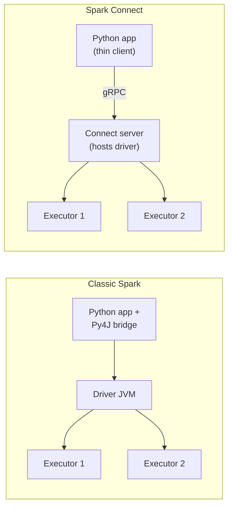

# 03 — Spark Connect: the decoupled architecture

The biggest architectural change since Spark 2.0. Worth understanding even if you don't use it directly.

## What it is

Traditional Spark: the driver runs in the same JVM as your application. If you use PySpark, there's a JVM bridge (Py4J), and the driver is in-process with your Python.

Spark Connect splits this. Your application is a thin client. The Spark driver runs separately in a server. They communicate over gRPC.



## Why this matters

### For users
- **Your laptop doesn't need a JVM.** Install `pip install pyspark[connect]` and you're done.
- **No more Py4J quirks** (lots of subtle errors when serializing Python objects vanish).
- **Multiple applications can share a driver / cluster.** A team's BI tool and ML notebook can both talk to one Spark cluster.
- **IDE-friendly:** auto-complete works better; no SparkContext init on every notebook restart.

### For platforms
- **Driver hosts can be long-lived and centrally managed.** Easier to give the driver more memory than a user laptop has.
- **Auth/authz at the Connect server.** Add identity-aware proxies.
- **Workload isolation.** One client's stuck query doesn't take down another's.

### For Spark itself
- **Decouples API from implementation.** A new client (Go, Rust) can be written without re-implementing Catalyst.
- **Easier upgrades.** Cluster runs Spark 4.x; clients can stay on Spark 3.5 client APIs.

## How to use it

### Server side (cluster admin)

Start the Connect server on the Spark cluster:

```bash
./sbin/start-connect-server.sh
# Listens on port 15002 by default
```

(Databricks runs this for you in clusters > 13.0.)

### Client side (your code)

```python
from pyspark.sql import SparkSession
spark = SparkSession.builder.remote("sc://spark-cluster.example.com:15002").getOrCreate()

# Use exactly like a regular SparkSession
df = spark.range(10)
df.show()
```

That's it. The DataFrame API is identical.

## What works and what doesn't

PySpark with Connect supports most of the DataFrame and SQL API. As of Spark 3.5+:
- ✅ DataFrame / SQL operations
- ✅ Most aggregations, joins, window functions
- ✅ Structured Streaming
- ✅ Pandas-on-Spark
- ✅ `spark.sql(...)`
- ⚠️ UDFs — mostly supported but have constraints (serialization)
- ❌ RDD API — not supported (and unlikely to be)
- ❌ `SparkContext` low-level operations
- ❌ Custom JARs deployed by the client

For 90% of data engineering work, you won't notice the difference.

## When to prefer Connect

- **Notebook environments** — Databricks, Hex, Posit. (Often already on Connect.)
- **BI tools** — they can use a "PySpark client" without needing a JVM.
- **Long-running shared clusters** — a team using a cluster all day.
- **CI/CD running tests** — no need to install JVM.

## When classic Spark might still be needed

- **Custom JARs / Scala UDFs from the client.**
- **RDD-heavy code.**
- **Highly-customized SparkContext usage** (rare).

## Performance

Connect adds a network hop between client and driver. For interactive use, this is negligible (microseconds). For tight loops that call many operations, the latency adds up — but in practice, the bottleneck is always the job, not the API calls.

## Open questions / friction

- The exact list of "what works with Connect" has shifted over releases. Check the docs for your version.
- Error messages from the server side cross the gRPC boundary — sometimes less informative than classic stack traces.
- Logging is slightly different — driver logs are on the server, not your client.

## Where to read more

- Spark Connect docs: https://spark.apache.org/docs/latest/spark-connect-overview.html
- 📺 [Introduction to Spark Connect — Databricks](https://www.youtube.com/results?search_query=apache+spark+connect+databricks)
- Spark Connect blog post (Databricks): https://www.databricks.com/blog/announcing-spark-connect-gold-standard-data-processing-applications

## TL;DR

Spark Connect splits driver from client. For users, it makes installation easier and APIs cleaner. For platforms, it enables better multi-tenancy. The DataFrame API is unchanged. Almost certainly the way Spark will be deployed going forward.
