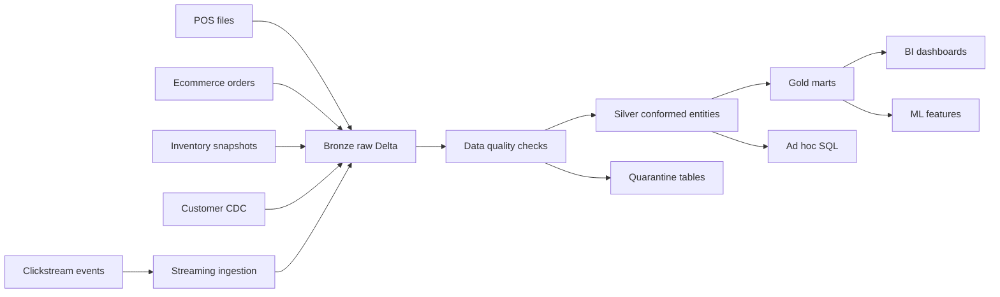

# Lakehouse System Designs

## Design 1 - Retail Data Lakehouse

### Problem Statement

A retailer wants unified reporting across stores, ecommerce, inventory, customer profiles, and clickstream events.

### Requirements

- Daily sales reporting by store, product, and channel.
- Near-real-time clickstream funnel metrics.
- Customer history with SCD Type 2.
- Replay raw data after bad deployments.
- Governed access for analysts, engineers, and finance.
- Freshness target: Gold sales tables by 7 AM; clickstream metrics within 10 minutes.

### Assumptions

- Source files land in cloud storage.
- Events arrive through Kafka or cloud event streaming.
- Delta Lake is the table format.
- Databricks or Spark on cloud is available.

### Architecture Diagram

### Data Flow

1. Land every source in Bronze with source metadata.
2. Validate and standardize records into Silver.
3. Build Gold tables for revenue, inventory, marketing, and customer analytics.
4. Quarantine invalid records with reason codes.
5. Monitor freshness, failed records, and cost.

### Storage Design

- Bronze: append-only, partitioned by ingest date when helpful.
- Silver: conformed business keys and typed columns.
- Gold: query-shaped marts, not raw source replicas.

### Table Design

- `bronze_orders_raw`
- `silver_orders`
- `silver_customers_scd2`
- `silver_products`
- `gold_daily_sales`
- `gold_inventory_position`
- `gold_clickstream_funnel_5m`

### Partitioning Strategy

- Partition large time-series tables by date.
- Avoid high-cardinality partitions like `customer_id`.
- Use clustering or Z-order/liquid clustering where available for common filters.

### Compute Strategy

- Job clusters for scheduled production jobs.
- Autoscaling only with measured workload behavior.
- Photon where supported and beneficial.
- Separate dev/test/prod workspaces or environments.

### Orchestration Strategy

- Use Databricks Workflows, Airflow, ADF, or another orchestrator.
- Make each task idempotent.
- Add retries only for transient failures.
- Backfills should be separate, observable runs.

### Security

- Catalog-level permissions.
- Least-privilege service principals.
- Secrets in secret scopes or cloud secret managers.
- Mask or restrict PII columns.

### Monitoring

- Job success/failure.
- Freshness.
- Row counts.
- Quarantine rate.
- Cost per pipeline.
- Slow stage metrics in Spark UI.

### Failure Handling

- Raw Bronze enables replay.
- Delta time travel enables rollback within retention.
- Quarantine prevents bad rows from silently polluting Gold.
- Idempotent writes prevent duplicate output after retries.

### Cost Optimization

- Use job clusters and auto-termination.
- Compact small files.
- Select only needed columns.
- Avoid over-partitioning.
- Track expensive queries and shuffle-heavy stages.

### Tradeoffs

- More layers increase governance and replayability but add latency and maintenance.
- Streaming improves freshness but adds checkpoint, state, and monitoring complexity.
- Fine-grained Gold tables improve BI performance but can create duplication.

### Interview-Style Explanation

"I would design a medallion lakehouse. Bronze keeps raw replayable data, Silver creates trusted business entities with quality checks, and Gold serves specific analytics. I would use Delta for ACID and time travel, job clusters for scheduled workloads, stable checkpoints for streaming, catalog permissions for governance, and monitoring around freshness, row counts, failed records, and Spark UI performance metrics."

## Design 2 - Near-Real-Time Clickstream Analytics

Use this when the requirement is "dashboard updates every few minutes."

- Source: Kafka or event hub.
- Bronze: raw event Delta table.
- Silver: parsed and deduplicated events with watermarking.
- Gold: 5-minute funnel and session tables.
- Key risk: late events and duplicate events.
- Debug focus: checkpoint health, state size, input rate, processing rate.

## Design 3 - CDC Pipeline

Use this when source systems send inserts, updates, and deletes.

- Source: database CDC logs.
- Bronze: raw CDC events with operation type.
- Silver: latest record table and history table.
- Gold: business-ready dimensions and facts.
- Key risk: out-of-order updates.
- Debug focus: merge condition, sequence column, duplicate keys.
