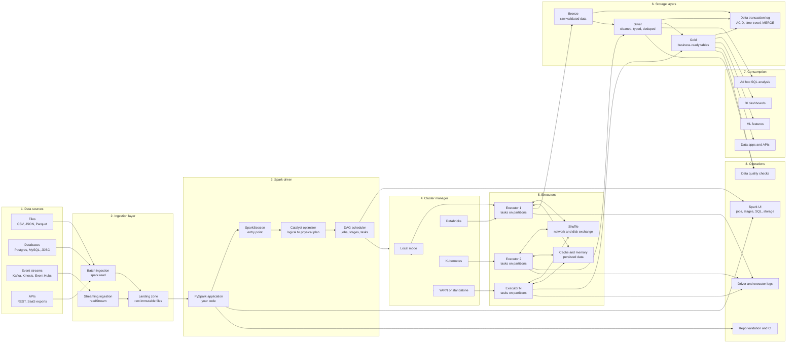

# End-to-End Spark Data Flow

This page explains how data moves through a production-style Spark pipeline and what each part does.



## Connection Guide

| Connection | What happens | Repo area |
| --- | --- | --- |
| Files, databases, APIs to batch ingestion | Spark reads bounded data with `spark.read`, usually on a schedule. | `02_pyspark_core/02-reading-data.md` |
| Event streams to streaming ingestion | Spark reads unbounded events with `readStream` and processes micro-batches. | `05_streaming/` |
| Ingestion to landing zone | Raw source data is copied first, before business transformations. This keeps replay and debugging possible. | `06_real_projects/01-medallion-architecture.md` |
| Landing zone to PySpark application | Your Python code defines the transformations, actions, reads, and writes. | `00_setup/examples/` |
| PySpark application to SparkSession | `SparkSession` is the entry point that connects Python code to Spark SQL, DataFrames, configs, and the JVM engine. | `02_pyspark_core/01-spark-session.md` |
| SparkSession to Catalyst | DataFrame and SQL operations become logical plans, then optimized physical plans. | `03_optimization/01-catalyst.md` |
| Catalyst to DAG scheduler | Spark splits the physical plan into jobs, stages, and tasks. Wide transformations create shuffle boundaries. | `01_fundamentals/02-job-stage-task.md` |
| DAG scheduler to cluster manager | Spark requests compute resources from local mode, Databricks, Kubernetes, YARN, or standalone Spark. | `00_setup/` and `09_latest_updates/04-kubernetes-deployment.md` |
| Cluster manager to executors | Executors are launched. They run tasks against partitions of data. | `01_fundamentals/01-cluster-architecture-deep-dive.md` |
| Executors to shuffle | Joins, aggregations, repartitions, and sorts move data between executors. This is often the expensive part. | `03_optimization/07-shuffle-tuning.md` |
| Executors to cache | Reused DataFrames can be persisted in executor memory or disk to avoid recomputation. | `03_optimization/06-caching-and-persistence.md` |
| Executors to Bronze | Raw but queryable data is written to the first lakehouse layer. | `06_real_projects/orders-etl/` |
| Bronze to Silver | Data is cleaned, typed, deduplicated, and standardized. | `06_real_projects/03-data-quality-patterns.md` |
| Silver to Gold | Business aggregates and serving tables are created. | `06_real_projects/orders-etl/src/orders_etl/jobs/03_build_gold.py` |
| Lakehouse tables to Delta log | Delta records commits, schema changes, MERGE operations, and table versions. | `04_delta_lake/02-transaction-log.md` |
| Gold to BI, ML, apps, and SQL | Curated tables are consumed by dashboards, feature pipelines, APIs, and analysts. | `06_real_projects/05-deployment-patterns.md` |
| Spark application and DAG to Spark UI | Spark UI shows SQL plans, jobs, stages, tasks, storage, executor metrics, and shuffle behavior. | `03_optimization/11-spark-ui-tour.md` |
| Executors to logs | Driver and executor logs explain failures, memory pressure, missing files, and JVM errors. | `TROUBLESHOOTING.md` |
| Silver and Gold to data quality checks | Rules validate nulls, duplicates, ranges, schemas, and referential assumptions before serving. | `06_real_projects/dq-framework/` |
| PySpark application to repo validation and CI | Code and docs are checked before push or pull request so broken links, empty docs, and syntax errors are caught early. | `.github/workflows/validate.yml` |

## How To Read The Diagram

Read left to right.

1. Data starts in external systems.
2. Spark ingests it as batch or streaming data.
3. Your PySpark application creates a logical plan.
4. Spark optimizes the plan, splits it into tasks, and sends work to executors.
5. Executors read, shuffle, cache, transform, and write partitioned data.
6. Delta Lake stores reliable Bronze, Silver, and Gold tables.
7. Business users and systems consume Gold or curated Silver data.
8. Spark UI, logs, data quality checks, and CI keep the pipeline observable and deployable.

## Deployment View

For local learning, use:

```bash
make setup
make validate
make smoke
```

For a real deployment, the same flow maps to:

1. Source data lands in cloud storage or a message bus.
2. Jobs run on Databricks, Kubernetes, YARN, or another Spark cluster.
3. Tables are written as Delta, Parquet, Iceberg, or another lakehouse format.
4. CI validates repo structure before code is merged.
5. A scheduler runs jobs on a cadence or streaming jobs continuously.
6. Spark UI, logs, and data quality results are monitored after deployment.
