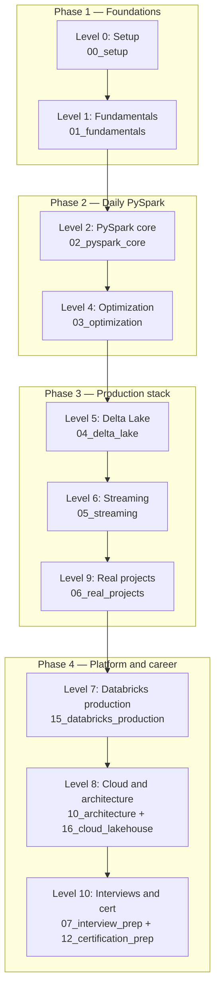
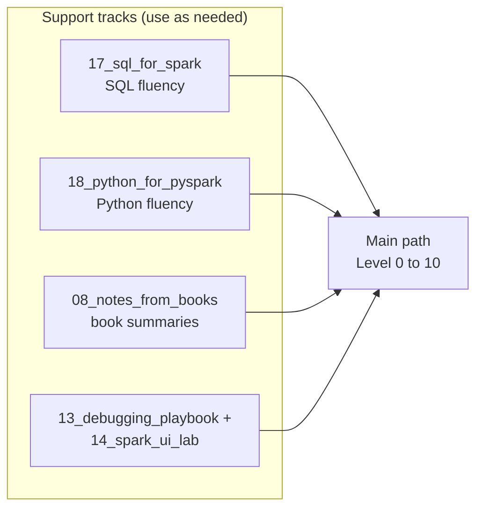

# 01 — Learning Roadmap

## Why this matters

Spark has a reputation for being hard to learn. It isn't — it's hard to learn **in the wrong
order**. If you touch `MERGE INTO` before you understand the shuffle, or tune AQE before you can
read a DAG, everything feels like magic. This map shows the dependency order the whole repo is
built around, so you always know where you are and what unlocks next.

## The idea in plain English

The repo is one path with four phases: get Spark running, understand the engine, use it daily,
then run it in production. Each level builds on the previous one. Interview prep is not a phase —
it runs alongside everything from Level 4 onward.

## Diagram

Two support tracks feed the main path — dip into them whenever a gap shows up:

## Key takeaways

- **Fundamentals before optimization.** You cannot tune a shuffle you don't understand.
- **Optimization before Delta and streaming.** Both are built on the same engine mechanics.
- **Projects before platform.** Build one end-to-end pipeline locally before learning
  Databricks-specific tooling.
- Track progress with the checkboxes in [`ROADMAP.md`](../ROADMAP.md); the study plans in
  [`LEARNING_STRATEGY.md`](../LEARNING_STRATEGY.md) map this path onto 30/60/90-day schedules.

## Common mistakes

- Jumping straight to Databricks features (Auto Loader, DLT) without understanding the open-source
  engine underneath — the first production incident exposes the gap.
- Reading everything without running anything. The repo rule: **if you didn't run it and look at
  the Spark UI, you didn't learn it.**
- Treating interview prep as a final phase instead of spaced repetition alongside learning.

## Interview angle

"Walk me through how you learned Spark" is a real interview question. A dependency-ordered answer
(engine → API → optimization → storage → streaming → platform) signals structured thinking. Use
this diagram as your answer skeleton.

## Related in this repo

- [`ROADMAP.md`](../ROADMAP.md) — the full checklist per level
- [`LEARNING_STRATEGY.md`](../LEARNING_STRATEGY.md) — time-boxed study plans
- [`BOOK_MAP.md`](../BOOK_MAP.md) — which book chapter backs each module
- [`PROJECT_INDEX.md`](../PROJECT_INDEX.md) — portfolio projects per level
