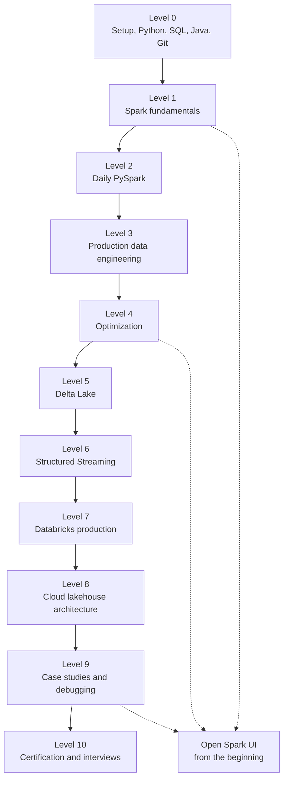

# 01 - Learning Roadmap

## Why it matters

Spark has too many topics to learn randomly. A roadmap prevents two common failures: memorizing API
syntax before understanding execution, and jumping into production tools before you can debug a
single slow job.

## Plain English explanation

Learn Spark in layers. First make the tools run. Then learn how Spark thinks: driver, executors,
partitions, jobs, stages, and shuffles. After that, build daily PySpark skill, then performance,
Delta Lake, streaming, production workflows, architecture, and interview practice.

## Mermaid diagram

## Key takeaways

- Execution model comes before API memorization.
- Every level has a matching folder, runnable code, and failure mode.
- The Spark UI is not an advanced topic. Start using it in fundamentals.
- Interview prep is the last layer, but every page includes an interview angle.

## Common mistakes

- Starting with performance tuning before understanding shuffles.
- Treating Delta Lake and streaming as isolated tools instead of extensions of Spark execution.
- Reading notes without running examples.
- Skipping troubleshooting until a real incident.

## Interview angle

When asked how you learned Spark, describe a progression: architecture first, PySpark fluency
second, then optimization, Delta, streaming, and production debugging. This sounds more credible
than a list of disconnected libraries.

## Related repo folders/files

- [`ROADMAP.md`](../ROADMAP.md)
- [`LEARNING_STRATEGY.md`](../LEARNING_STRATEGY.md)
- [`PROJECT_INDEX.md`](../PROJECT_INDEX.md)
- [`00_setup/`](../00_setup/)
- [`20_learning_strategy/`](../20_learning_strategy/)
