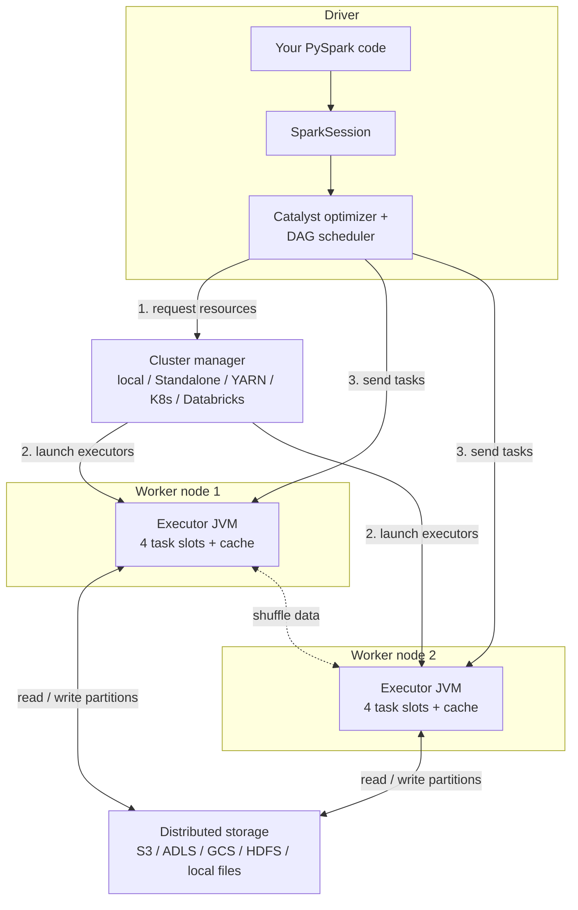
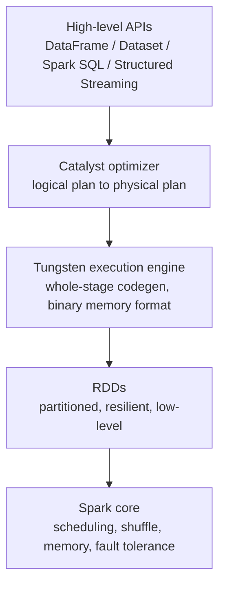

# 02 — Spark Architecture

## Why this matters

Every performance problem, every OOM, every "why is this slow?" comes back to one picture: a
**driver** planning work and **executors** doing it, connected by a **cluster manager**. If you
can draw this from memory, half of the debugging playbook becomes obvious.

## The idea in plain English

Spark is a distributed team. The **driver** is the team lead: it holds your code, builds the plan,
and hands out tasks. **Executors** are the workers: each one is a JVM with CPU slots and memory,
processing its own slice (partition) of the data. The **cluster manager** is HR: it doesn't process
data, it just provides machines when the driver asks. Your PySpark code runs on the driver; the
data (almost) never does.

## Diagram — cluster anatomy

## Diagram — the software stack

What sits between your `df.groupBy(...)` and bytes on disk:

## Key takeaways

- **One driver per application.** If the driver dies, the application dies. `collect()` pulls data
  to the driver — that's why it OOMs on big results.
- Executors do the actual data work: read, transform, shuffle, cache, write.
- The cluster manager only allocates containers; it never touches your data.
- The DataFrame API is a *description* of work. Catalyst and Tungsten turn it into efficient JVM
  code — this is why DataFrames usually beat hand-written RDD code and Python UDFs.

## Common mistakes

- Thinking PySpark data lives in Python. It lives in executor JVMs; Python is the remote control.
  (Crossing that boundary is what makes plain Python UDFs slow.)
- Confusing worker node (machine) with executor (JVM process on that machine).
- Sizing only executor memory and forgetting driver memory — broadcast joins and `collect()`
  pressure the driver too.

## Interview angle

"Explain Spark architecture" is the #1 opener at every level. A strong answer names the four
pieces (driver, cluster manager, executors, storage), states what each one does **and does not**
do, and volunteers one failure mode (e.g. "driver OOM from collect"). Senior follow-up: how does
this change with Spark Connect, where the client is decoupled from the driver?
([`09_latest_updates/`](../09_latest_updates/))

## Related in this repo

- [`01_fundamentals/01-cluster-architecture-deep-dive.md`](../01_fundamentals/01-cluster-architecture-deep-dive.md)
- [`00_setup/02-architecture-overview.md`](../00_setup/02-architecture-overview.md)
- [`01_fundamentals/diagrams/driver-executor.mmd`](../01_fundamentals/diagrams/driver-executor.mmd) — the detailed JVM-level view
- [`ARCHITECTURE.md`](../ARCHITECTURE.md) — the full end-to-end system diagram
