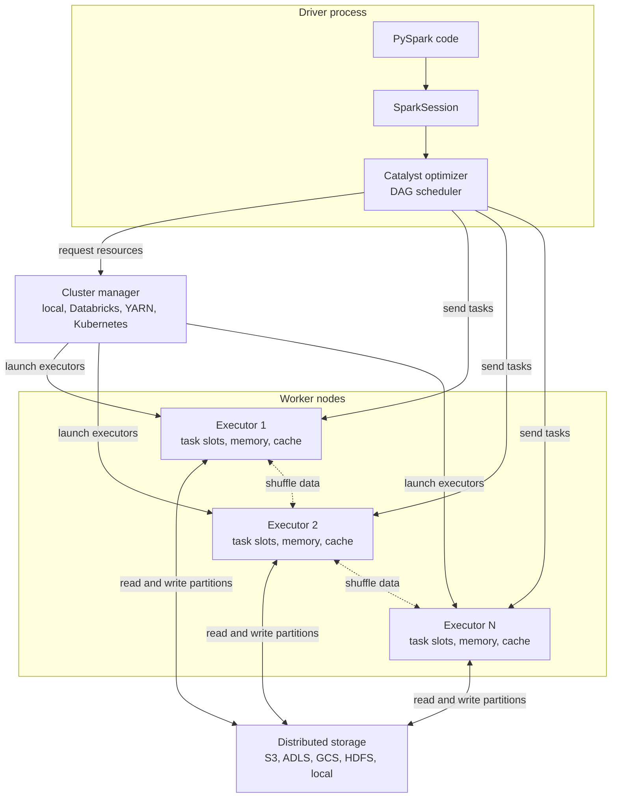

# 02 - Spark Architecture

## Why it matters

Most Spark bugs are architecture bugs in disguise: driver memory pressure, executor spills, bad
partitioning, slow shuffles, or storage bottlenecks. If you can draw the architecture, you can
debug the system.

## Plain English explanation

The driver plans work. The cluster manager gives resources. Executors run tasks against partitions.
Storage holds the data. The driver should coordinate, not hold big datasets. Executors should do
the heavy lifting in parallel.

## Mermaid diagram

## Key takeaways

- One Spark application has one driver.
- Executors run tasks and store cached data.
- The cluster manager allocates resources; it does not process your data.
- Storage is usually remote in production, so file layout and I/O matter.
- `collect()` moves data to the driver and can crash it.

## Common mistakes

- Confusing a worker node with an executor process.
- Assuming PySpark data lives in Python memory.
- Sizing executor memory but ignoring driver memory.
- Debugging performance without checking whether time is spent in CPU, shuffle, spill, or I/O.

## Interview angle

A strong architecture answer names driver, cluster manager, executors, and storage, then gives one
failure mode for each. Example: driver OOM from `collect`, executor OOM from skew, cluster resource
starvation, and slow remote storage reads.

## Related repo folders/files

- [`00_setup/02-architecture-overview.md`](../00_setup/02-architecture-overview.md)
- [`01_fundamentals/01-cluster-architecture-deep-dive.md`](../01_fundamentals/01-cluster-architecture-deep-dive.md)
- [`01_fundamentals/diagrams/driver-executor.mmd`](../01_fundamentals/diagrams/driver-executor.mmd)
- [`ARCHITECTURE.md`](../ARCHITECTURE.md)
