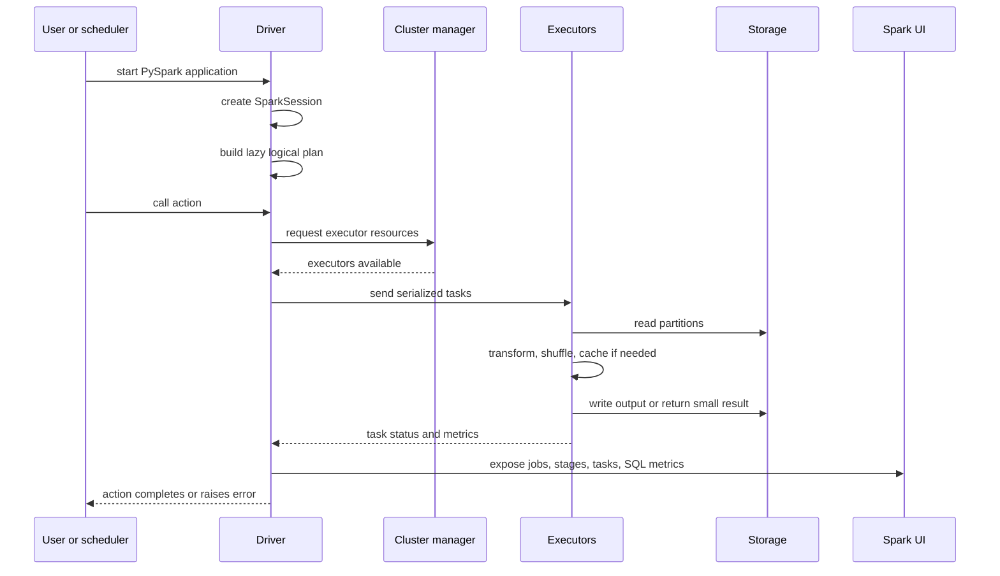

# 03 - Driver Executor Flow

## Why it matters

Spark feels mysterious until you know the lifecycle of one application. This page connects your
Python file to the actual distributed work that appears in the Spark UI.

## Plain English explanation

You start a Spark application. The driver creates a session and builds a plan. When an action runs,
the driver asks the cluster for executors, splits the plan into tasks, sends those tasks to
executors, and collects only the small metadata or final result needed by the action.

## Mermaid diagram

## Key takeaways

- Transformations build a plan on the driver.
- Actions force the driver to schedule real executor work.
- Executors report metrics back to the driver; those metrics power the Spark UI.
- Driver logs often explain planning errors; executor logs explain task failures.

## Common mistakes

- Looking only at Python stack traces and ignoring executor logs.
- Thinking one action always equals one stage. It usually equals one job with one or more stages.
- Using local mode and forgetting that production has real network, storage, and resource delays.
- Returning huge results to the driver instead of writing distributed output.

## Interview angle

If asked what happens when `df.count()` runs, answer in lifecycle order: plan already exists,
action creates a job, the driver schedules stages and tasks, executors read partitions, metrics
return to the driver, and the result is a small number.

## Related repo folders/files

- [`01_fundamentals/02-job-stage-task.md`](../01_fundamentals/02-job-stage-task.md)
- [`00_setup/05-first-pyspark-program.md`](../00_setup/05-first-pyspark-program.md)
- [`14_spark_ui_lab/01_jobs_stages_tasks.md`](../14_spark_ui_lab/01_jobs_stages_tasks.md)
- [`TROUBLESHOOTING.md`](../TROUBLESHOOTING.md)
