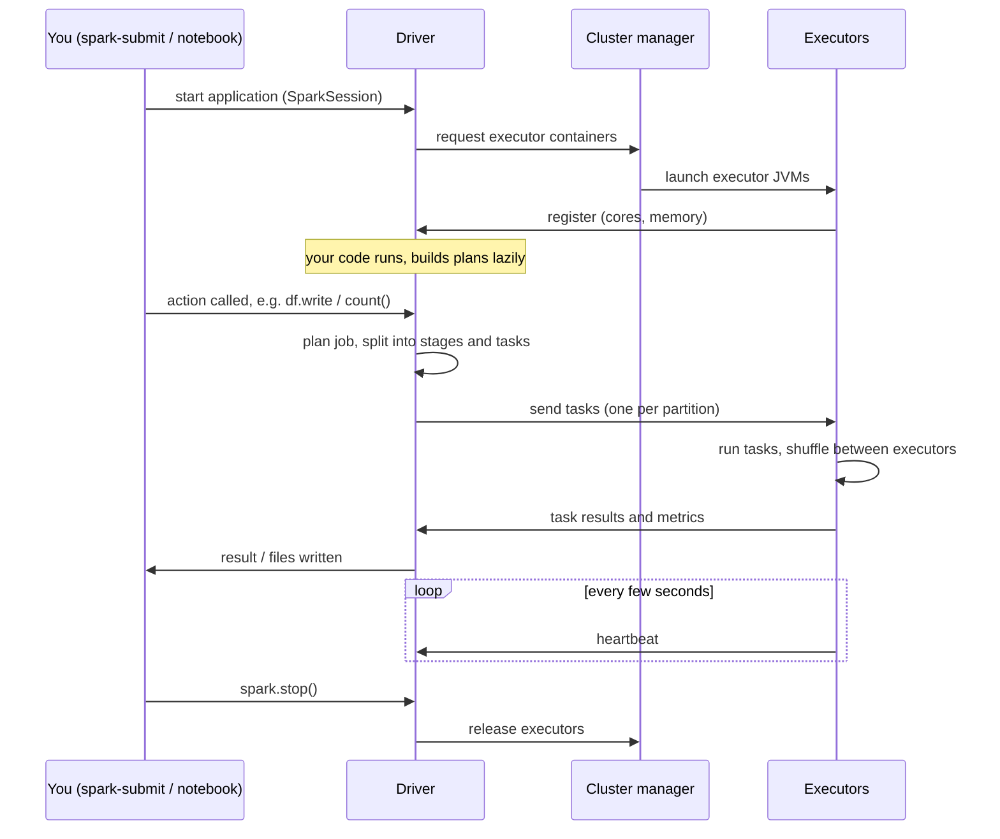
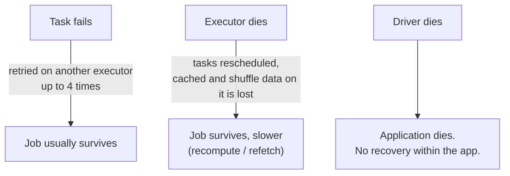

# 03 — Driver–Executor Flow

## Why this matters

Knowing *what* the driver and executors are is static knowledge. Knowing *when* each one acts —
from `spark-submit` to the final result — is what lets you answer "where did my job spend its
time?" and "which process actually threw that error?".

## The idea in plain English

The driver never processes data; it plans and coordinates. An application starts, resources get
allocated, and then a loop repeats for every action in your code: build a job, split it into
stages and tasks, send tasks to executors, collect results. Executors heartbeat back the whole
time so the driver knows who is alive.

## Diagram — application lifecycle

## Diagram — who fails how

## Key takeaways

- Nothing runs on executors until an **action** fires. Ten transformations = zero cluster work.
- One task per partition per stage. 200 partitions → 200 tasks → parallelism capped by total
  executor cores.
- Task failures are cheap (retried), executor failures are survivable (lineage recompute),
  driver failure is fatal — so protect the driver: no huge `collect()`, no giant broadcast
  variables, sensible `spark.driver.memory`.
- Heartbeats explain timeout-style errors: a GC-frozen executor misses heartbeats and gets marked
  dead even though it never "crashed".

## Common mistakes

- Reading executor logs for a planning error (e.g. `AnalysisException`) that happened on the
  driver — or driver logs for a task OOM that happened on an executor.
- Assuming a "lost executor" message means a bug. On spot/preemptible nodes it's routine; the
  question is how expensive the recomputation was.
- Calling `collect()` "to check the data" on a wide table. Use `show()`, `limit()`, or write a
  sample instead.

## Interview angle

Classic sequence question: *"What happens, step by step, when you run a Spark job?"* Answer in
lifecycle order: session → resource allocation → lazy plan → action → job → stages → tasks →
shuffle → result. Then the follow-up everyone gets: *"What happens if an executor is lost?"* —
tasks rescheduled, shuffle/cache data recomputed from lineage, job continues.

## Related in this repo

- [`01_fundamentals/02-job-stage-task.md`](../01_fundamentals/02-job-stage-task.md)
- [`01_fundamentals/07-actions-vs-transformations.md`](../01_fundamentals/07-actions-vs-transformations.md)
- [`01_fundamentals/diagrams/driver-executor.mmd`](../01_fundamentals/diagrams/driver-executor.mmd)
- [`13_debugging_playbook/01_failure_triage.md`](../13_debugging_playbook/01_failure_triage.md)
