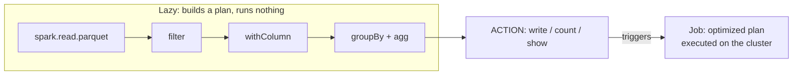
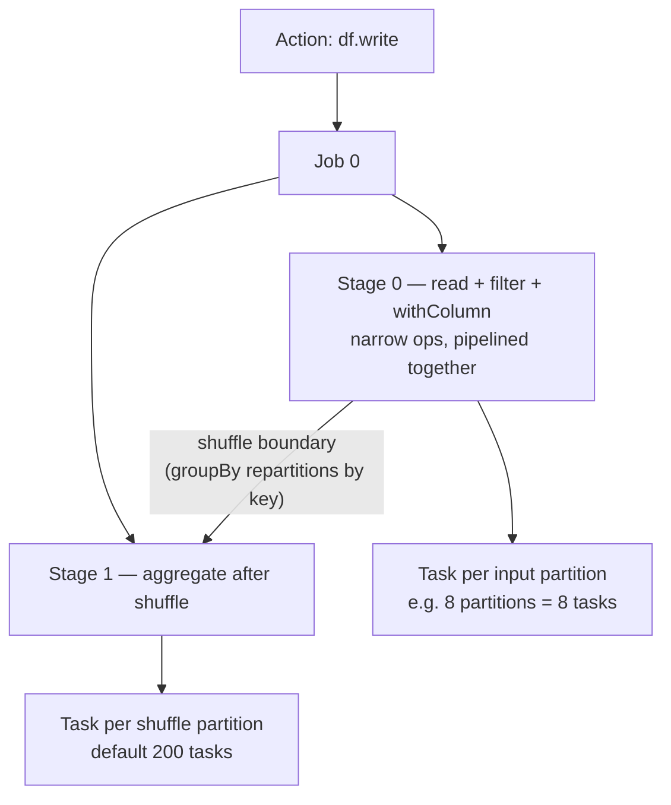

# 04 — Lazy Evaluation & the DAG

## Why this matters

Lazy evaluation is the single most confusing thing for newcomers ("my code ran instantly!") and
the single most powerful thing for the engine (it can optimize the *whole* pipeline before running
anything). Understanding job → stage → task is also the key to reading the Spark UI — the numbers
on the Jobs and Stages tabs are exactly this diagram.

## The idea in plain English

Transformations (`filter`, `select`, `groupBy`, `join`, …) don't run anything — they build a
recipe. Only an **action** (`count`, `collect`, `show`, `write`) says "cook it now". At that
moment Spark turns the recipe into a **DAG** (directed acyclic graph), cuts it into **stages**
wherever data must move between executors (a shuffle), and runs one **task** per partition inside
each stage.

## Diagram — nothing happens until the action

## Diagram — one action becomes jobs, stages, tasks

Read it as: **1 action → 1 job → stages split at shuffles → tasks = partitions.**

## Key takeaways

- Laziness lets Catalyst optimize the whole chain: push filters down to the file scan, prune
  unused columns, collapse consecutive maps into one pass.
- All narrow operations between two shuffles are **pipelined into one stage** — one pass over the
  data, no intermediate materialization.
- The DAG is also the fault-tolerance story: lost data is recomputed from lineage, not restored
  from replicas.
- Each action re-executes the plan from scratch. Two actions on the same expensive DataFrame =
  computed twice — that is exactly what `cache()` is for.

## Common mistakes

- Timing a transformation and concluding "Spark is fast" — you timed plan-building, not work.
- Putting a `count()` after every step "to check progress" — each one is a full job.
- Expecting an error at the line with the bad code. Lazy evaluation surfaces many errors only at
  the action, far from the cause. Use `df.explain()` and schema checks early.
- Confusing job (per action), stage (per shuffle segment), and task (per partition) — the UI
  makes no sense until these are distinct in your head.

## Interview angle

*"Why is Spark lazy?"* — so the optimizer sees the whole query before choosing a plan, and so
narrow operations can be pipelined without materializing intermediates. *"What creates a stage
boundary?"* — a shuffle (wide dependency). Strong candidates connect it to the UI: "a job with 3
stages means the plan had 2 shuffles."

## Related in this repo

- [`01_fundamentals/05-lazy-evaluation-and-dag.md`](../01_fundamentals/05-lazy-evaluation-and-dag.md)
- [`01_fundamentals/02-job-stage-task.md`](../01_fundamentals/02-job-stage-task.md)
- [`01_fundamentals/diagrams/dag-lifecycle.mmd`](../01_fundamentals/diagrams/dag-lifecycle.mmd) and
  [`job-stage-task.mmd`](../01_fundamentals/diagrams/job-stage-task.mmd)
- [`14_spark_ui_lab/01_jobs_stages_tasks.md`](../14_spark_ui_lab/01_jobs_stages_tasks.md) — see this diagram live in the UI
