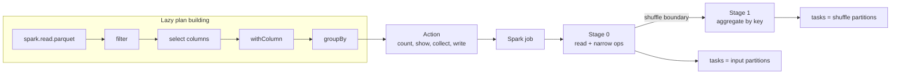

# 04 - Lazy Evaluation and DAG

## Why it matters

Lazy evaluation explains why transformations appear to run instantly, why errors often appear at
actions, and why Spark can optimize several operations as one plan.

## Plain English explanation

Transformations are a recipe. Actions are the moment Spark cooks. When an action runs, Spark turns
the recipe into a DAG, cuts it into stages at shuffle boundaries, and runs one task per partition
inside each stage.

## Mermaid diagram

## Visual asset

Open animation: [Lazy Evaluation DAG Animation](../assets/animations/lazy_evaluation_dag.html)

Plain English: build the recipe first, press the action button later, then Spark turns the recipe
into a DAG, a job, stages, and tasks.

Common interview question: "Why does Spark use lazy evaluation, and what creates a stage boundary?"

Debugging angle: if an error appears at `show()` or `write()`, the broken expression may have been
created several transformations earlier. Use schema checks and `explain()` before the action.

## Key takeaways

- Transformations do not execute until an action appears.
- A shuffle creates a new stage.
- Tasks are tied to partitions.
- Two actions on the same uncached DataFrame can recompute the same lineage twice.
- `df.explain()` lets you inspect the plan before paying for execution.

## Common mistakes

- Benchmarking a transformation line and thinking Spark processed data.
- Adding `count()` after every step and accidentally launching many full jobs.
- Forgetting to cache reused expensive DataFrames.
- Confusing DAG, job, stage, and task.

## Interview angle

For "Why is Spark lazy?", say: Spark waits so Catalyst can optimize the whole plan, pipeline narrow
operations, push filters and columns down, and avoid unnecessary intermediate materialization.

## Related repo folders/files

- [`01_fundamentals/05-lazy-evaluation-and-dag.md`](../01_fundamentals/05-lazy-evaluation-and-dag.md)
- [`01_fundamentals/02-job-stage-task.md`](../01_fundamentals/02-job-stage-task.md)
- [`01_fundamentals/examples/03_lazy_eval_demo.py`](../01_fundamentals/examples/03_lazy_eval_demo.py)
- [`assets/animations/lazy_evaluation_dag.html`](../assets/animations/lazy_evaluation_dag.html)
