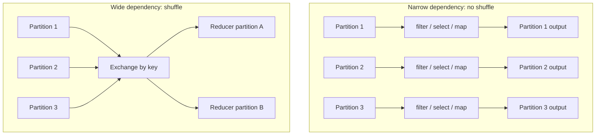

# 05 - Narrow vs Wide Transformations

## Why it matters

This is the first performance fork in Spark. Narrow transformations stay local and pipeline well.
Wide transformations move data across the cluster and create shuffle cost.

## Plain English explanation

A narrow transformation lets each output partition depend on one input partition. A wide
transformation needs records with the same key to meet, so data is shuffled across executors.

## Mermaid diagram

## Key takeaways

- `filter`, `select`, and many `withColumn` operations are usually narrow.
- `groupBy`, `join`, `distinct`, `orderBy`, and `repartition` are usually wide.
- Wide transformations create stage boundaries.
- Narrow chains can be fused into one stage.

## Common mistakes

- Treating all transformations as equal cost.
- Calling `repartition()` casually before every write.
- Sorting large data without a reason.
- Forgetting that a join usually shuffles both sides unless one side is broadcast.

## Interview angle

The standard answer: narrow means one input partition feeds one output partition; wide means many
input partitions contribute to one output partition, requiring a shuffle and new stage.

## Related repo folders/files

- [`01_fundamentals/06-narrow-vs-wide-transformations.md`](../01_fundamentals/06-narrow-vs-wide-transformations.md)
- [`01_fundamentals/examples/04_narrow_wide_demo.py`](../01_fundamentals/examples/04_narrow_wide_demo.py)
- [`01_fundamentals/diagrams/narrow-vs-wide.mmd`](../01_fundamentals/diagrams/narrow-vs-wide.mmd)
- [`03_optimization/07-shuffle-tuning.md`](../03_optimization/07-shuffle-tuning.md)
