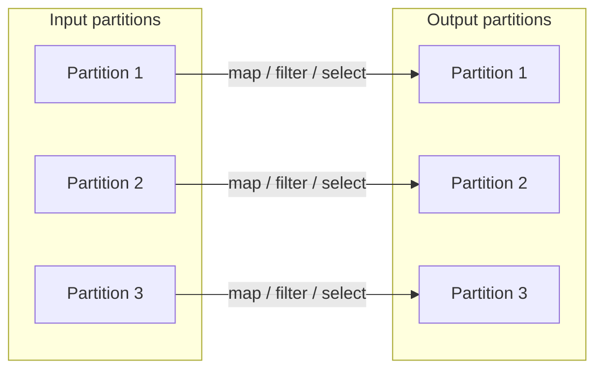
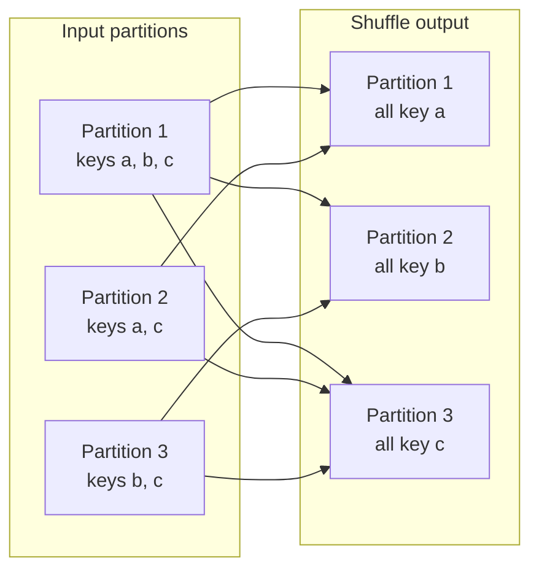

# 05 — Narrow vs Wide Transformations

## Why this matters

This one distinction predicts your job's cost. Narrow transformations are nearly free — they stay
inside a partition. Wide transformations trigger a **shuffle**: data serialized, written to disk,
sent over the network, and read back. Most Spark performance tuning is really just "reduce, delay,
or shrink the wide operations".

## The idea in plain English

Ask one question about any operation: *can each output partition be built from just one input
partition?* If yes (filter a row, add a column), it's **narrow** — every executor works
independently. If no (group all rows with the same key, join two tables), rows must physically
move so matching keys land together — that's **wide**, and the movement is the shuffle.

## Diagram — narrow: partitions stay put

## Diagram — wide: every output reads from every input

## Which operations are which

| Narrow (no shuffle) | Wide (shuffle) |
| --- | --- |
| `select`, `withColumn`, `filter`/`where` | `groupBy` + agg, `distinct` |
| `union`, `drop`, `cast` | `join` (unless broadcast) |
| `coalesce` (reducing partitions) | `orderBy` / `sort` |
| `map`, `flatMap` on RDDs | `repartition`, `repartitionByRange` |
|  | window functions with `partitionBy` |

Edge cases worth knowing: **broadcast join is narrow** (the small side is copied to every
executor, big side never moves). `coalesce` is narrow but can shrink parallelism;
`repartition` is always a full shuffle.

## Key takeaways

- Every wide transformation = a stage boundary = shuffle write + network + shuffle read.
- Chains of narrow ops are pipelined into a single stage — order them freely, they're one pass.
- You can't avoid all shuffles (aggregation needs co-located keys); the goal is **fewer and
  smaller**: filter and project *before* the shuffle, broadcast small join sides.
- The Spark UI shows the cost directly: Stages tab → "Shuffle Read" / "Shuffle Write" columns.

## Common mistakes

- Using `repartition(n)` casually — it's a full shuffle of the entire dataset.
- Using `distinct()` to "clean up" mid-pipeline when a targeted `dropDuplicates` on fewer columns
  (or deduping after filtering) would shuffle far less data.
- Assuming `groupByKey`-style patterns are fine because they work on samples — wide ops are where
  scale problems hide.
- Forgetting window functions with `partitionBy` shuffle just like `groupBy`.

## Interview angle

*"Difference between narrow and wide transformations?"* is guaranteed at junior/mid level. Give
the definition, two examples of each, and then the sentence that scores points: **"wide
transformations create stage boundaries, and shuffle is usually the dominant cost, so
optimization means minimizing data crossing those boundaries."** Follow-up trap:
`coalesce` vs `repartition`.

## Related in this repo

- [`01_fundamentals/06-narrow-vs-wide-transformations.md`](../01_fundamentals/06-narrow-vs-wide-transformations.md)
- [`01_fundamentals/diagrams/narrow-vs-wide.mmd`](../01_fundamentals/diagrams/narrow-vs-wide.mmd)
- [`03_optimization/07-shuffle-tuning.md`](../03_optimization/07-shuffle-tuning.md)
- Next page: [06 — Partitioning & shuffle](./06_partitioning_and_shuffle.md)
