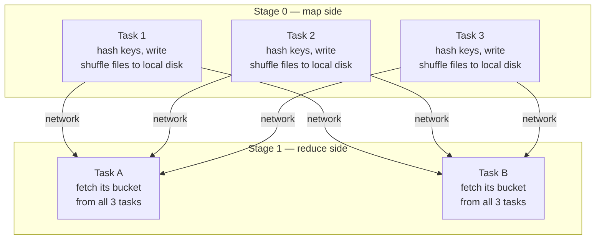
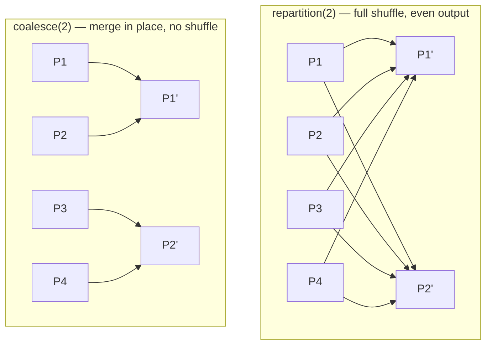

# 06 — Partitioning & Shuffle

## Why this matters

Partitions are Spark's unit of parallelism; the shuffle is Spark's most expensive operation. Wrong
partition counts waste a cluster (too few = idle cores, too many = scheduling overhead and small
files). A misunderstood shuffle turns a 5-minute job into an hour. This page shows the mechanics
so the tuning knobs in `03_optimization/` make sense.

## The idea in plain English

A partition is one chunk of a DataFrame, processed by one task on one core. When a wide operation
needs rows regrouped by key, every task **writes** its rows into per-destination buckets on local
disk (shuffle write), then tasks of the next stage **fetch** their bucket from every previous task
over the network (shuffle read). It's a distributed group-by-mail-sorting step — and disk + network
is why it's slow.

## Diagram — shuffle mechanics

With M map tasks and R reduce tasks, that's up to **M × R** fetches — shuffle cost grows fast.

## Diagram — repartition vs coalesce

## Where partition counts come from

| Moment | What decides the count | Knob |
| --- | --- | --- |
| Reading files | file sizes / split size (~128 MB target) | `spark.sql.files.maxPartitionBytes` |
| After a shuffle | fixed default **200** | `spark.sql.shuffle.partitions`, or AQE coalesces automatically |
| Explicitly | you | `repartition(n)`, `repartition(col)`, `coalesce(n)` |
| Writing | partitions at write time = number of output files | `repartition`/`coalesce` before `write`, `partitionBy(col)` for directory layout |

## Key takeaways

- Rule of thumb: partitions ≈ 2–4 × total executor cores, and roughly **100–200 MB each**.
- The default 200 shuffle partitions is wrong for almost every real workload — too many for small
  data (tiny tasks, small files), too few for huge data (spill). AQE
  ([page 07](./07_catalyst_tungsten_aqe.md)) fixes the small-data case automatically.
- Shuffle files land on **local disk** — "no space left on device" during a big join is shuffle
  spill filling `/tmp` or the local SSD.
- Too many small output files is a *read-side* tax you pay forever. Compact before writing
  (`coalesce`) or after (Delta `OPTIMIZE`, [page 11](./11_merge_optimize_zorder.md)).

## Common mistakes

- `coalesce(1)` to "get one CSV" on a big dataset — it collapses parallelism for the entire final
  stage, not just the write.
- Repartitioning *after* an aggregation instead of letting the shuffle place data correctly with
  `repartition(col)` *before* it.
- Ignoring "Spill (memory)/(disk)" in the Stages tab — spill means partitions don't fit in task
  memory: raise partition count or memory, or reduce data earlier.
- Confusing DataFrame partitions (in-memory parallelism) with `partitionBy` (output directory
  layout on disk).

## Interview angle

*"What is a shuffle and why is it expensive?"* — serialize + disk write + network + disk read +
merge, plus a hard stage boundary that stops pipelining. Then the sizing question: *"200 shuffle
partitions on a 2 TB join — good idea?"* (No: ~10 GB per partition → spill; raise the count or
rely on AQE.) Know `repartition` vs `coalesce` cold.

## Related in this repo

- [`03_optimization/05-partitioning-strategies.md`](../03_optimization/05-partitioning-strategies.md)
- [`03_optimization/07-shuffle-tuning.md`](../03_optimization/07-shuffle-tuning.md)
- [`11_case_studies/02_small_files_case_study.md`](../11_case_studies/02_small_files_case_study.md)
- [`13_debugging_playbook/03_shuffle_skew_and_spill.md`](../13_debugging_playbook/03_shuffle_skew_and_spill.md)
