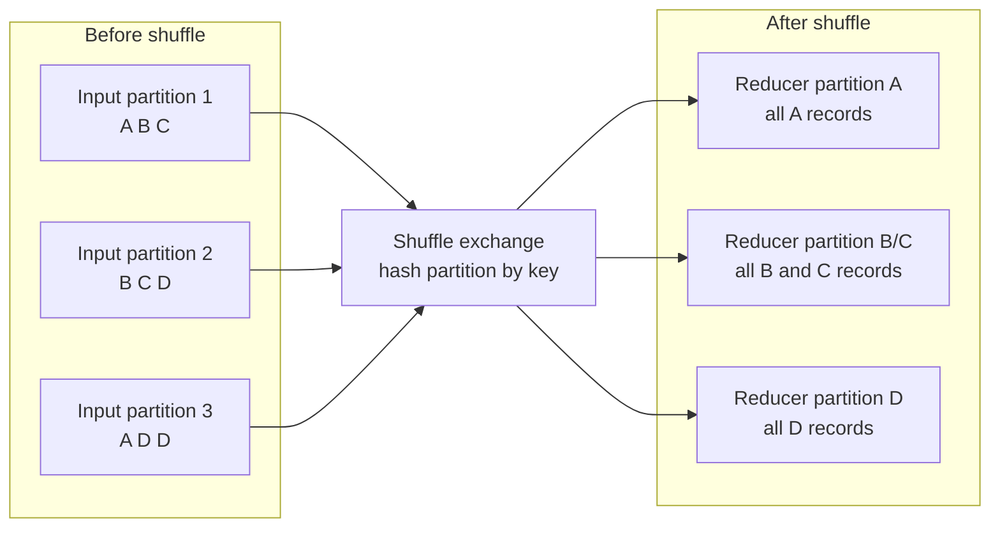

# 06 - Partitioning and Shuffle

## Why it matters

Partitioning controls parallelism. Shuffle controls much of the cost. Bad partitioning gives you
slow jobs, tiny files, skewed tasks, memory spills, and noisy production incidents.

## Plain English explanation

Spark splits data into partitions. Tasks process partitions. When records must be regrouped by
key, Spark writes shuffle data, transfers it, and reads it into new partitions. This is powerful,
but it is network and disk heavy.

## Mermaid diagram

## Key takeaways

- More partitions can improve parallelism but increase scheduling and small-file overhead.
- Fewer partitions can reduce overhead but create large tasks and memory pressure.
- `repartition()` increases or changes partitioning with a shuffle.
- `coalesce()` reduces partitions with less data movement, but can create uneven partitions.
- AQE can coalesce shuffle partitions at runtime.

## Common mistakes

- Leaving `spark.sql.shuffle.partitions=200` for tiny local examples and huge production jobs.
- Using `coalesce(1)` to make one output file and forcing all data through one task.
- Ignoring partition size and only checking row counts.
- Tuning partition count without checking the Spark UI stage metrics.

## Interview angle

For "How do you tune shuffle partitions?", answer with measurement: check input size, task count,
task duration, spill, skew, output file sizes, and whether AQE already coalesced partitions.

## Related repo folders/files

- [`03_optimization/05-partitioning-strategies.md`](../03_optimization/05-partitioning-strategies.md)
- [`03_optimization/07-shuffle-tuning.md`](../03_optimization/07-shuffle-tuning.md)
- [`03_optimization/examples/03_repartition_vs_coalesce.py`](../03_optimization/examples/03_repartition_vs_coalesce.py)
- [`assets/animations/shuffle_animation.html`](../assets/animations/shuffle_animation.html)
