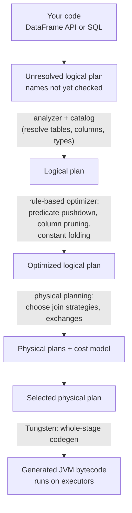
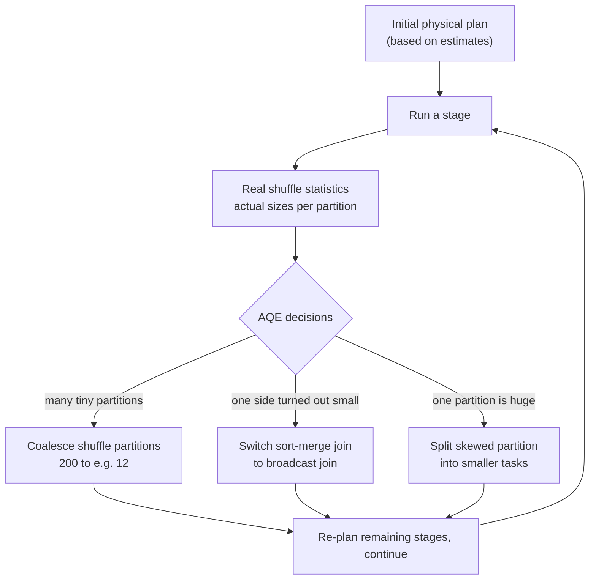

# 07 — Catalyst, Tungsten & AQE

## Why this matters

You write naive-looking DataFrame code and Spark runs something much smarter. Knowing the three
optimization layers — **Catalyst** (plans it), **Tungsten** (executes it fast), **AQE** (fixes it
at runtime) — tells you which problems Spark solves for you and which ones (skew you disabled AQE
for, UDFs that block codegen) are still yours.

## The idea in plain English

- **Catalyst** is the query planner. It turns your DataFrame/SQL into a logical plan, applies
  rule-based rewrites (push filters to the scan, prune columns, fold constants), then picks a
  physical plan (e.g. broadcast vs sort-merge join) using size estimates.
- **Tungsten** is the execution engine. It fuses whole stages into generated JVM bytecode and
  keeps rows in a compact binary format instead of Java objects — less GC, more CPU-cache-friendly.
- **AQE** (Adaptive Query Execution, on by default since Spark 3.2) re-plans **while the job
  runs**, using real shuffle statistics instead of estimates.

## Diagram — the Catalyst pipeline

## Diagram — AQE re-optimizes at runtime

## Key takeaways

- This pipeline is **why DataFrames beat RDDs**: RDD code is opaque to Catalyst; DataFrame code is
  a declarative plan it can rewrite.
- Plain Python UDFs are black boxes: no pushdown through them, no codegen inside them, plus
  JVM↔Python serialization. Prefer built-in functions, then pandas UDFs.
- `df.explain(True)` shows all four plan stages; `explain("formatted")` is the readable version.
  In the Spark UI SQL tab, `AQEShuffleRead` nodes and "final plan" markers show AQE at work.
- AQE's three superpowers map to the three classic manual fixes: partition-count tuning, broadcast
  hints, and skew salting. Check what AQE already did before hand-tuning.

## Common mistakes

- Tuning `spark.sql.shuffle.partitions` obsessively on Spark 3.2+ while AQE
  (`spark.sql.adaptive.enabled=true`) is already coalescing partitions — measure first.
- Wrapping logic in a UDF "for readability" and silently losing pushdown + codegen for the whole
  expression.
- Reading only the final `explain()` plan and not noticing AQE will change it at runtime — trust
  the SQL tab's final plan over the static one.
- Assuming the cost model is right: statistics on fresh un-analyzed tables are guesses, which is
  exactly why AQE exists.

## Interview angle

*"What is Catalyst?"* → the four-phase plan pipeline; name two rule-based optimizations
(predicate pushdown, column pruning). *"What is Tungsten?"* → whole-stage code generation + binary
off-heap-style memory format, less GC. *"What does AQE do?"* → the three runtime fixes: coalesce
partitions, sort-merge→broadcast, skew-split. Senior differentiator: explain **why UDFs defeat all
three layers**.

## Related in this repo

- [`03_optimization/01-catalyst.md`](../03_optimization/01-catalyst.md),
  [`02-tungsten.md`](../03_optimization/02-tungsten.md),
  [`04-aqe.md`](../03_optimization/04-aqe.md)
- [`03_optimization/03-reading-plans.md`](../03_optimization/03-reading-plans.md) — practice with `explain()`
- [`03_optimization/diagrams/catalyst-pipeline.mmd`](../03_optimization/diagrams/catalyst-pipeline.mmd)
- [`02_pyspark_core/11-udfs-and-pandas-udfs.md`](../02_pyspark_core/11-udfs-and-pandas-udfs.md)
