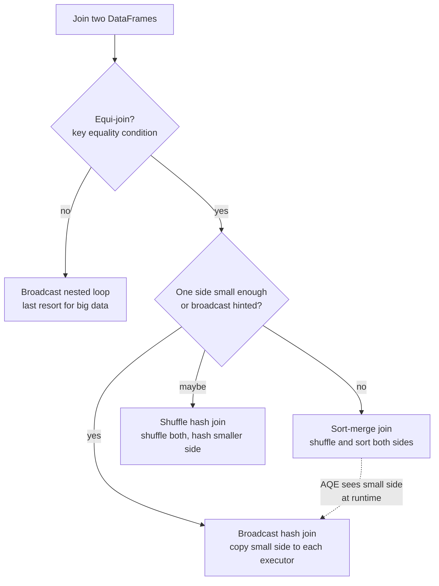

# 07 - Join Strategies

## Why it matters

Joins are where many Spark jobs spend most of their time. The difference between a broadcast hash
join and a sort-merge join can be minutes, memory failures, or a clean production run.

## Plain English explanation

To join two tables, matching keys must meet on the same executor. Spark either broadcasts the
small side to every executor or shuffles both sides by key. The best strategy depends on table
size, join condition, statistics, hints, and AQE.

## Mermaid diagram

## Key takeaways

- Broadcast is usually fastest when the small side truly fits in memory.
- Sort-merge is the scalable default for large equi-joins.
- Non-equi joins are dangerous at scale.
- Filter and select before joining to reduce bytes moved.
- Always verify the physical plan with `explain()` or the Spark UI SQL tab.

## Common mistakes

- Broadcasting a table that is small on disk but large after decompression.
- Joining on different data types and forcing casts.
- Forgetting null-key behavior.
- Creating a cross join by missing a join condition.

## Interview angle

Answer join questions as a decision tree: equi-join or not, small side or not, statistics accurate
or not, AQE enabled or not, then name the expected physical operator.

## Related repo folders/files

- [`02_pyspark_core/08-joins-deep-dive.md`](../02_pyspark_core/08-joins-deep-dive.md)
- [`03_optimization/09-broadcast-joins.md`](../03_optimization/09-broadcast-joins.md)
- [`02_pyspark_core/examples/06_joins_demo.py`](../02_pyspark_core/examples/06_joins_demo.py)
- [`assets/svg/join_strategy.svg`](../assets/svg/join_strategy.svg)
