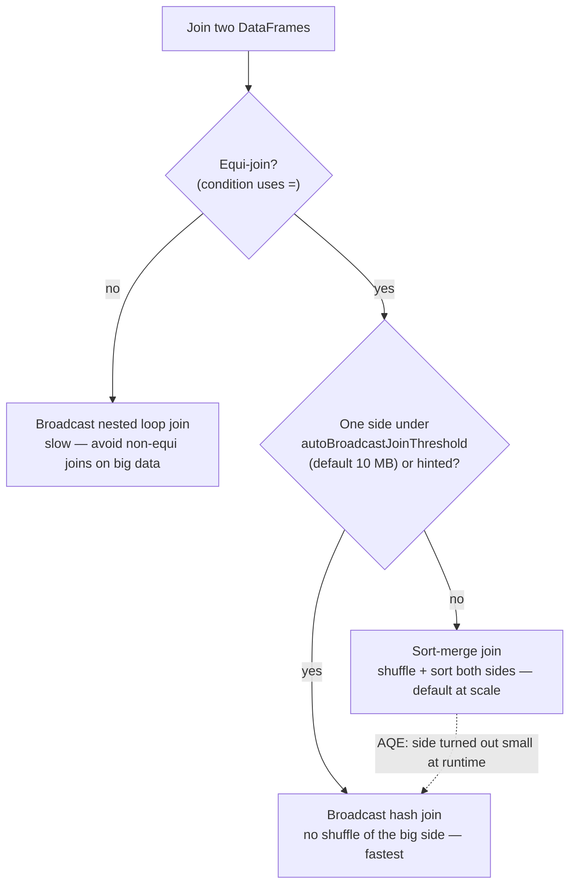
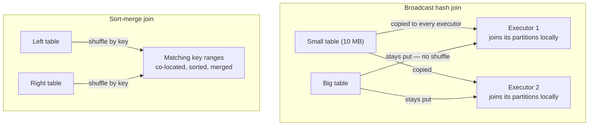

# 08 — Join Strategies

## Why this matters

Joins are where most production Spark time (and most incidents) live. Spark has several physical
join strategies with wildly different costs — the difference between a broadcast hash join and a
sort-merge join on the same query can be 10–100×. You need to know which one Spark picked, why,
and how to change its mind.

## The idea in plain English

To join, matching keys must meet on the same executor. Two ways to make that happen:

1. **Move the small table everywhere** — broadcast it to every executor, join locally. No shuffle
   of the big table. Cheap, but the small side must fit in memory.
2. **Move both tables by key** — shuffle both sides so equal keys land in the same partition, then
   join partition by partition (sorting first = sort-merge join). Scales to any size, costs two
   shuffles.

Everything else is a variation on these two moves.

## Diagram — how Spark chooses

## Diagram — broadcast vs sort-merge, physically

## Strategy cheat sheet

| Strategy | When | Cost profile |
| --- | --- | --- |
| Broadcast hash join (BHJ) | one side small (≤ threshold or `broadcast()` hint) | no big-side shuffle; driver + executor memory for the small side |
| Sort-merge join (SMJ) | both sides large, equi-join | shuffle + sort both sides; the scalable default |
| Shuffle hash join | one side much smaller but too big to broadcast | shuffle both, hash the smaller; no sort |
| Broadcast nested loop | non-equi conditions | O(n×m) per partition pair — last resort |

## Key takeaways

- `from pyspark.sql.functions import broadcast; big.join(broadcast(small), "key")` is the single
  highest-leverage join optimization — when the small side truly is small.
- The broadcast threshold (`spark.sql.autoBroadcastJoinThreshold`, default 10 MB) compares
  Catalyst's **size estimate**, which can be wrong; AQE corrects it at runtime using real sizes.
- Check what you actually got: `df.explain()` → look for `BroadcastHashJoin` vs `SortMergeJoin`,
  or the SQL tab in the UI.
- Filter and select **before** the join — every dropped row/column is data that doesn't shuffle.

## Common mistakes

- Broadcasting a "small" table that's 2 GB after decompression — driver OOM or
  `Broadcast timeout`. Broadcast is for lookup/dimension tables, not medium tables.
- Joining on mismatched types (string vs int key) — Spark casts, kills pushdown and statistics,
  and sometimes silently produces empty matches.
- Ignoring null keys: rows with null join keys all hash to the same place in some plans and never
  match in inner joins — both a skew source and a correctness surprise.
- Cross join by accident (missing join condition) — Spark 3 requires explicit `crossJoin` for a
  reason.

## Interview angle

*"What join strategies does Spark have and when is each used?"* — walk the decision tree above.
Guaranteed follow-ups: *"What if the broadcast table doesn't fit?"* (fails/falls back — use SMJ or
shrink it) and *"the join is slow, what do you check?"* (strategy in the plan, sizes, skew — which
is the next page).

## Related in this repo

- [`02_pyspark_core/08-joins-deep-dive.md`](../02_pyspark_core/08-joins-deep-dive.md)
- [`03_optimization/09-broadcast-joins.md`](../03_optimization/09-broadcast-joins.md)
- [`02_pyspark_core/diagrams/join-strategies.mmd`](../02_pyspark_core/diagrams/join-strategies.mmd)
- Next page: [09 — Skew & broadcast join](./09_skew_and_broadcast_join.md)
