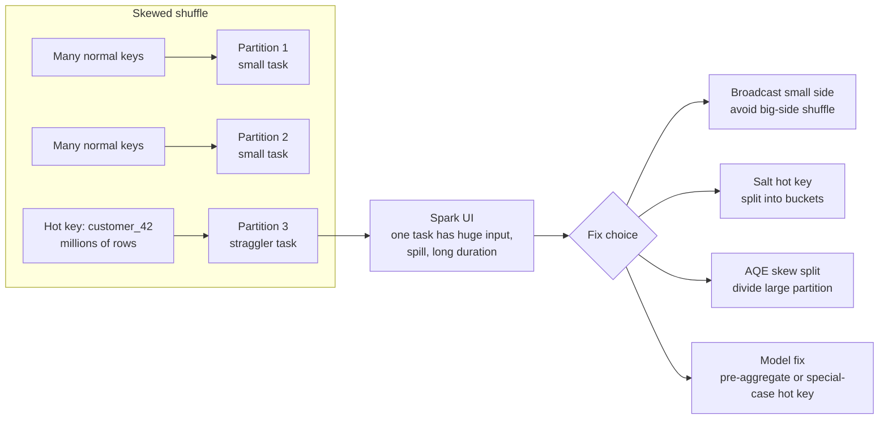

# 08 - Skew and Broadcast Join

## Why it matters

One hot key can make one task run for twenty minutes while every other task finishes in seconds.
That pattern is common in real datasets: unknown users, null keys, one huge customer, one country,
or one device ID.

## Plain English explanation

Skew means work is unevenly distributed. In joins and aggregations, one partition receives much
more data than the others. Fixes include filtering bad keys, broadcasting a small side, salting a
hot key, splitting skewed partitions with AQE, or changing the data model.

## Mermaid diagram

## Key takeaways

- Skew is visible in the Spark UI as uneven task duration and input size.
- Broadcast joins avoid shuffling the big table when the lookup side is small.
- Salting spreads one hot key across multiple buckets, then recombines if needed.
- AQE can split skewed shuffle partitions, but it is not a data-model cure.

## Common mistakes

- Increasing cluster size before proving the bottleneck is skew.
- Salting every key instead of only known hot keys.
- Broadcasting a medium table and creating memory pressure.
- Ignoring nulls, empty strings, and default IDs as skew sources.

## Interview angle

For "one task is slow", describe diagnosis first: compare task durations, input records, shuffle
read, spill, and executor logs. Then propose broadcast, salting, AQE, pre-aggregation, or key
cleanup based on the evidence.

## Related repo folders/files

- [`03_optimization/08-skew-handling.md`](../03_optimization/08-skew-handling.md)
- [`03_optimization/examples/05_skew_salting.py`](../03_optimization/examples/05_skew_salting.py)
- [`11_case_studies/01_skewed_join_case_study.md`](../11_case_studies/01_skewed_join_case_study.md)
- [`13_debugging_playbook/03_shuffle_skew_and_spill.md`](../13_debugging_playbook/03_shuffle_skew_and_spill.md)
