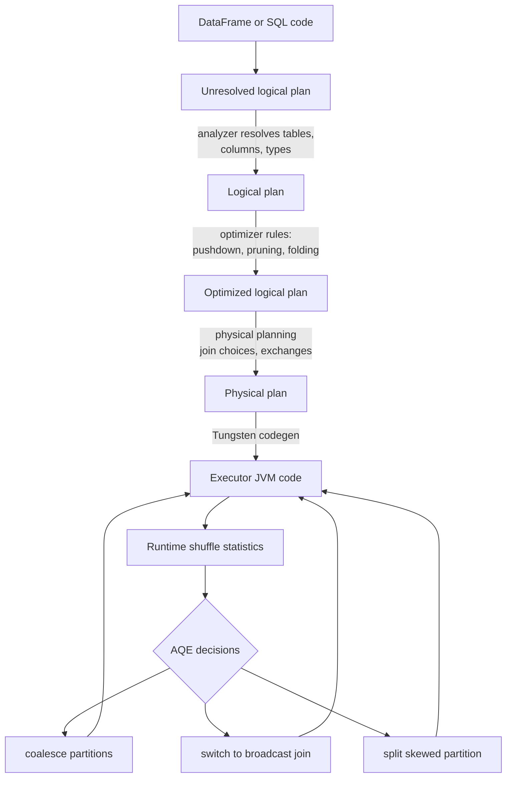

# 09 - Catalyst, Tungsten, and AQE

## Why it matters

You write simple DataFrame code, but Spark runs an optimized physical plan. Knowing the optimizer
layers tells you when Spark can help you and when your code blocks optimization.

## Plain English explanation

Catalyst plans the query. Tungsten executes it efficiently with generated JVM code and compact
memory formats. Adaptive Query Execution, or AQE, revises parts of the plan at runtime using real
shuffle statistics.

## Mermaid diagram

## Key takeaways

- DataFrame and SQL code are optimizable because they are declarative.
- RDD code and Python UDFs hide intent from Catalyst.
- `df.explain("formatted")` is a daily debugging tool.
- AQE helps with partition count, join strategy, and skew, but only after runtime stats exist.

## Common mistakes

- Wrapping built-in expressions in Python UDFs.
- Reading only source code and not the physical plan.
- Tuning shuffle partitions without checking whether AQE already coalesced them.
- Trusting stale table statistics.

## Interview angle

Define the three layers cleanly: Catalyst chooses and rewrites plans, Tungsten makes execution fast,
AQE changes parts of the plan during execution. Senior follow-up: explain how UDFs weaken all three.

## Related repo folders/files

- [`03_optimization/01-catalyst.md`](../03_optimization/01-catalyst.md)
- [`03_optimization/02-tungsten.md`](../03_optimization/02-tungsten.md)
- [`03_optimization/04-aqe.md`](../03_optimization/04-aqe.md)
- [`03_optimization/examples/06_explain_plans.py`](../03_optimization/examples/06_explain_plans.py)
