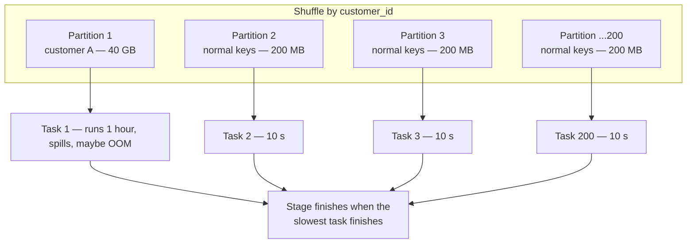
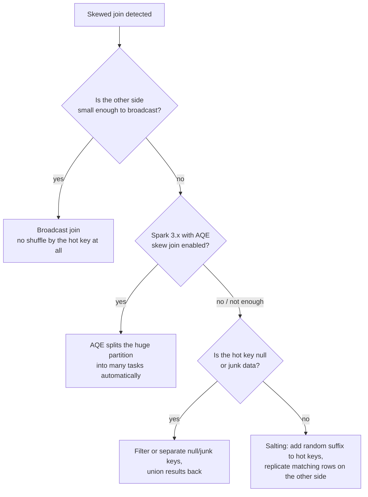

# 09 — Skew & How to Fix It

## Why this matters

Skew is the #1 real-world Spark performance problem: 199 tasks finish in seconds, 1 task runs for
an hour, and the whole stage waits for it. It's also the most common senior interview scenario.
Real data is always skewed — a few customers generate most orders, `null` and `"unknown"` are
giant keys.

## The idea in plain English

A shuffle assigns rows to partitions by hashing the key. If one key holds 40% of the rows, one
partition holds 40% of the data, and the single task processing it becomes the straggler. The
fixes all do one of two things: **avoid partitioning by that key** (broadcast join) or **spread
the hot key across partitions** (AQE skew split, salting).

## Diagram — what skew looks like

**Spark UI signature:** Stages tab → task duration max ≫ median; one task with huge shuffle
read/spill. That asymmetry *is* skew.

## Diagram — picking a fix

## How salting works (the manual fix)

1. Big side: `key` → `concat(key, "_", floor(rand()*N))` for hot keys.
2. Small side: explode each hot-key row into N copies, one per salt value.
3. Join on the salted key; the hot key now spreads over N tasks; aggregate/clean up after.

AQE's skew handling (`spark.sql.adaptive.skewJoin.enabled=true`, default on) does the equivalent
automatically for sort-merge joins — try it before hand-salting.

## Key takeaways

- Skew is a **data property**, not a cluster problem. Adding executors doesn't help — the hot
  partition still lands on one task.
- Diagnose with numbers: `df.groupBy("key").count().orderBy(desc("count"))` — know your top keys.
- Fix order of preference: broadcast > AQE skew join > isolate null/junk keys > salting.
- Skew also hits `groupBy` aggregations, not just joins — partial aggregation usually softens it,
  but count-distinct on a hot key still hurts (two-phase aggregation helps).

## Common mistakes

- Increasing `spark.sql.shuffle.partitions` to fix skew — more partitions, but the hot key still
  hashes to exactly one of them.
- Salting everything instead of only the hot keys — you multiply the small side N× for no reason.
- Not noticing the "hot key" is `null` from a bad upstream join — the fix is data quality, not
  engineering.
- Reporting the *average* task time. Skew hides in averages; always compare median vs max.

## Interview angle

The classic scenario: *"A join runs for hours; 199 of 200 tasks finished in a minute. What's
happening and what do you do?"* Name it (skew), prove it (UI task-time distribution, key counts),
then give the fix ladder: broadcast if possible → AQE skew join → salt the hot keys. Bonus points
for asking whether the hot key is null/junk.

## Related in this repo

- [`03_optimization/08-skew-handling.md`](../03_optimization/08-skew-handling.md)
- [`03_optimization/09-broadcast-joins.md`](../03_optimization/09-broadcast-joins.md)
- [`11_case_studies/01_skewed_join_case_study.md`](../11_case_studies/01_skewed_join_case_study.md) — full worked incident
- [`13_debugging_playbook/03_shuffle_skew_and_spill.md`](../13_debugging_playbook/03_shuffle_skew_and_spill.md)
