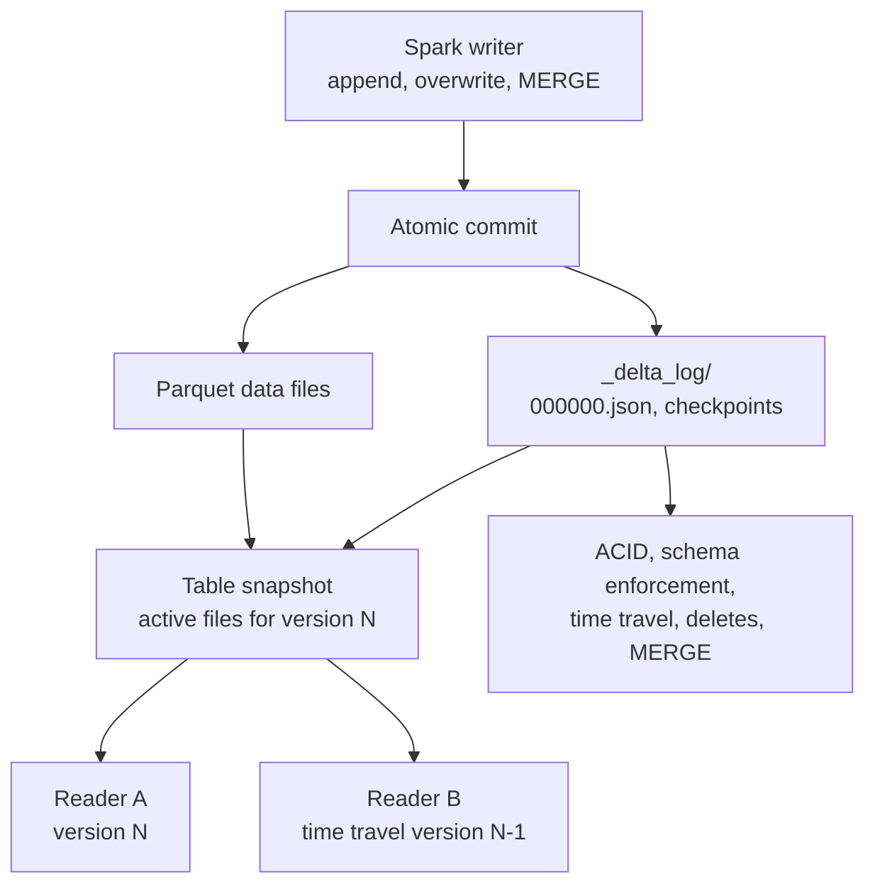

# 10 - Delta Lake Architecture

## Why it matters

Object storage is cheap and scalable, but raw Parquet folders do not give you reliable table
semantics. Delta Lake adds a transaction log so Spark jobs can read and write lakehouse tables
with ACID behavior.

## Plain English explanation

A Delta table is Parquet data files plus a `_delta_log` folder. Every commit writes JSON log
entries that say which files were added, removed, or changed. Readers use the log to build a
consistent snapshot of the table.

## Mermaid diagram

## Visual asset

Open animation: [Delta Lake Transaction Log Animation](../assets/animations/delta_lake_transaction_log.html)

Plain English: the Parquet files hold the data, but the `_delta_log` decides which files make up a
valid table version.

Common interview question: "How does Delta Lake provide ACID transactions and time travel on object
storage?"

Debugging angle: when a Delta table looks wrong, inspect the transaction log, recent commits, table
history, and whether anyone modified files outside Delta.

## Key takeaways

- The transaction log is the source of truth.
- Delta does not rewrite every file for every change; it tracks file-level adds and removes.
- Time travel works because old versions are recorded in the log.
- VACUUM removes old files after the retention period, so time travel is not infinite.

## Common mistakes

- Editing Parquet files under a Delta table path manually.
- Deleting `_delta_log`.
- Assuming Delta makes bad partitioning irrelevant.
- Running VACUUM aggressively and losing recovery history.

## Interview angle

For "How does Delta Lake give ACID on object storage?", explain optimistic concurrency plus the
transaction log: writers attempt atomic commits, readers use the committed log to choose a stable
set of files.

## Related repo folders/files

- [`04_delta_lake/01-why-delta.md`](../04_delta_lake/01-why-delta.md)
- [`04_delta_lake/02-transaction-log.md`](../04_delta_lake/02-transaction-log.md)
- [`04_delta_lake/03-acid-semantics.md`](../04_delta_lake/03-acid-semantics.md)
- [`assets/animations/delta_lake_transaction_log.html`](../assets/animations/delta_lake_transaction_log.html)
