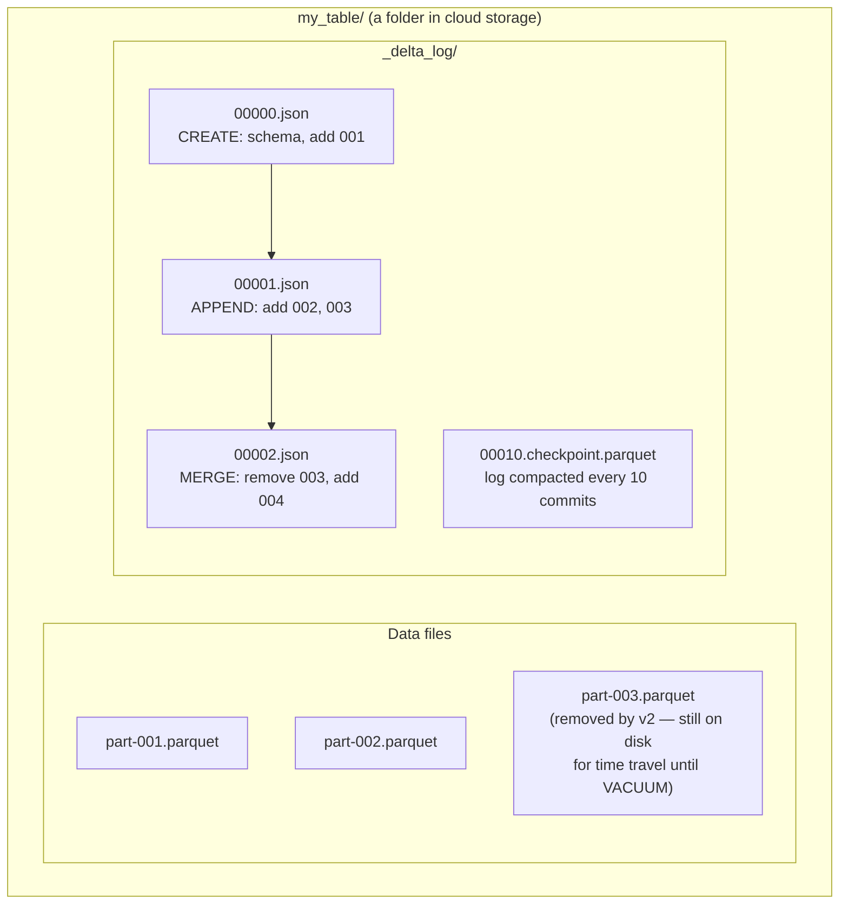
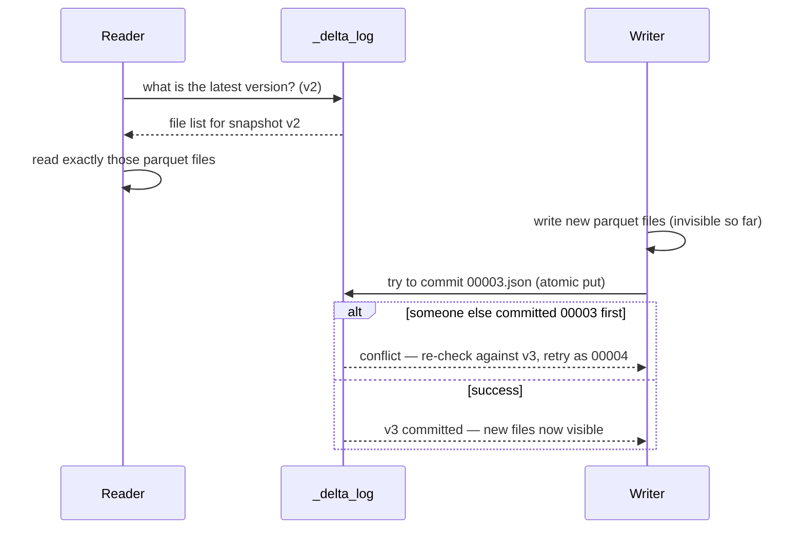

# 10 — Delta Lake Architecture

## Why this matters

Plain Parquet on cloud storage has no transactions: a killed job leaves half-written files, two
writers corrupt each other, and there's no delete/update. Delta Lake fixes this with one idea —
**an ordered transaction log next to the data files** — and that one idea gives you ACID, time
travel, `MERGE`, schema enforcement, and streaming + batch on the same table.

## The idea in plain English

A Delta table is just a folder: ordinary **Parquet files** plus a `_delta_log/` subfolder of
numbered **JSON commit files**. Each commit says "add these files, remove those files". The
current state of the table = replay the log. Readers pick a log version and see a consistent
snapshot; writers append the next numbered commit atomically. Nobody ever edits a data file in
place — every change is new files + a new log entry.

## Diagram — what's inside a Delta table

## Diagram — how a read and a write use the log

This is **optimistic concurrency control**: writers don't lock, they race to the next log number
and retry on conflict. Readers are never blocked and never see partial writes.

## Key takeaways

- **The log is the table.** Parquet files not referenced by the log don't exist as far as readers
  are concerned — that's how atomic writes and rollback work on eventual-consistency-era object
  stores.
- Time travel (`VERSION AS OF` / `TIMESTAMP AS OF`) = replay the log to an older version. It works
  only while old files survive — `VACUUM` (default retention 7 days) deletes them.
- Schema enforcement happens at commit time: writes with mismatched schemas are rejected instead
  of silently corrupting the table (`mergeSchema` opts in to evolution).
- Every 10 commits Delta writes a **checkpoint parquet** so readers don't replay thousands of
  JSON files.
- Updates/deletes rewrite whole files (copy-on-write): a one-row update rewrites the file
  containing that row. Deletion vectors (Delta 3.x) soften this.

## Common mistakes

- Deleting or adding parquet files in a Delta folder by hand — the log no longer matches reality
  and the table is corrupt. Always go through the Delta API.
- Running `VACUUM RETAIN 0 HOURS` to save storage, then discovering time travel and long-running
  readers are broken.
- Treating Delta as a database server: there's no server — concurrency limits come from optimistic
  commits, so hundreds of tiny concurrent writers = constant conflict retries. Batch your writes.
- Assuming a Delta read only sees committed data but forgetting streaming sinks also commit per
  micro-batch — small files pile up ([page 11](./11_merge_optimize_zorder.md)).

## Interview angle

*"How does Delta Lake provide ACID on object storage?"* is the defining lakehouse question.
Answer: ordered JSON log + atomic commit of the next version + optimistic conflict resolution;
readers get snapshot isolation by pinning a version. Follow-ups: time travel mechanics, what
VACUUM breaks, and how checkpointing keeps log replay fast.

## Related in this repo

- [`04_delta_lake/01-why-delta.md`](../04_delta_lake/01-why-delta.md) and
  [`02-transaction-log.md`](../04_delta_lake/02-transaction-log.md)
- [`04_delta_lake/03-acid-semantics.md`](../04_delta_lake/03-acid-semantics.md),
  [`05-time-travel.md`](../04_delta_lake/05-time-travel.md)
- [`04_delta_lake/diagrams/delta-log-structure.mmd`](../04_delta_lake/diagrams/delta-log-structure.mmd)
- Next page: [11 — MERGE, OPTIMIZE, Z-ORDER](./11_merge_optimize_zorder.md)
