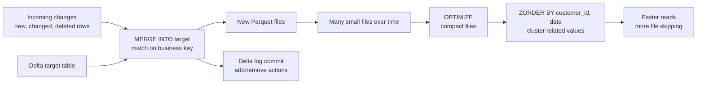

# 11 - MERGE, OPTIMIZE, and Z-ORDER

## Why it matters

Production Delta tables are not just appended forever. They need upserts, file compaction, and
layout improvements so reads stay fast and pipelines stay idempotent.

## Plain English explanation

`MERGE` applies updates, inserts, and deletes from a source into a target table. `OPTIMIZE`
compacts many small files into fewer larger files. `ZORDER` co-locates related values so filters
can skip more files.

## Mermaid diagram

## Key takeaways

- `MERGE` is the backbone of CDC, SCD, dedup, and idempotent loads.
- Small files hurt planning and scan performance.
- `OPTIMIZE` improves file size; `ZORDER` improves data skipping for common filters.
- Maintenance must match query patterns, not run blindly.

## Common mistakes

- Running `MERGE` without a stable business key.
- Z-ordering on columns nobody filters by.
- Optimizing too frequently on tiny tables.
- Forgetting that `VACUUM` can remove old files needed for time travel.

## Interview angle

Describe the trio by responsibility: `MERGE` changes rows safely, `OPTIMIZE` fixes file size, and
`ZORDER` improves skipping for selective queries.

## Related repo folders/files

- [`04_delta_lake/06-merge-into.md`](../04_delta_lake/06-merge-into.md)
- [`04_delta_lake/08-optimize-zorder-vacuum.md`](../04_delta_lake/08-optimize-zorder-vacuum.md)
- [`04_delta_lake/examples/03_merge_upsert.py`](../04_delta_lake/examples/03_merge_upsert.py)
- [`06_real_projects/scd2-customers/`](../06_real_projects/scd2-customers/)
