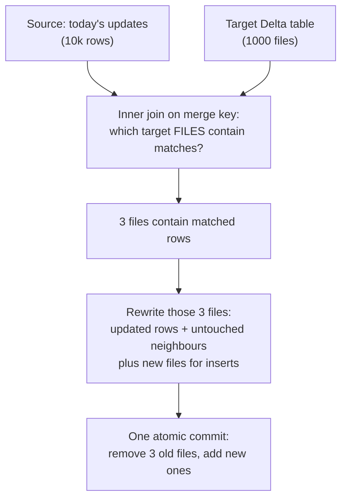
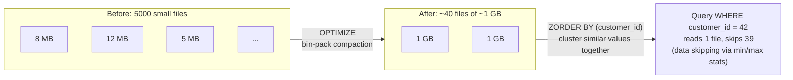

# 11 — MERGE, OPTIMIZE & Z-ORDER

## Why this matters

These three commands are the daily bread of Delta-based data engineering: `MERGE` is how every
upsert/CDC/SCD2 pipeline writes, and `OPTIMIZE` + `ZORDER` are why one team's queries are 20×
faster than another's on the same data. They're also where the costs hide — MERGE rewrites files,
and skipping maintenance quietly degrades every downstream reader.

## The idea in plain English

- **MERGE INTO** = "match incoming rows against the table by key; update matches, insert the
  rest." Under the hood it finds which *files* contain matched rows and rewrites those whole files.
- **OPTIMIZE** = compaction. Many small files (from streaming or frequent MERGEs) become few
  ~1 GB files, so readers open 50 files instead of 50,000.
- **ZORDER BY (col)** = sort-ish clustering during OPTIMIZE so rows with similar values of `col`
  sit in the same files — then Delta's per-file min/max stats let queries **skip** most files.

## Diagram — what MERGE actually does

The cost lesson: MERGE cost is proportional to **files touched**, not rows changed. 10k updates
scattered across 1000 files = rewrite 1000 files.

## Diagram — OPTIMIZE and Z-ORDER

## When to use what

| Symptom | Tool |
| --- | --- |
| Streaming/frequent-append table getting slower to read | `OPTIMIZE` on a schedule (or auto-compaction / predictive optimization on Databricks) |
| Selective queries always filter on 1–3 high-cardinality columns | `OPTIMIZE ... ZORDER BY (those columns)` — or Liquid Clustering on newer runtimes |
| MERGE getting slower over time | Z-ORDER by the merge key so matches concentrate in few files; add partition/key filters to the merge condition |
| Storage growing forever | `VACUUM` (after checking time-travel needs) |

## Key takeaways

- MERGE is two scans: one to find touched files, one to rewrite. Making the *source* small and the
  *match condition* selective (e.g. add a date filter) is the main tuning lever.
- Z-ORDER helps only columns you actually filter on, and effectiveness decays with each added
  column — 1–3 columns, highest-cardinality filters first.
- OPTIMIZE doesn't delete the small files — it logically removes them; `VACUUM` reclaims storage
  later. (This is why "I ran OPTIMIZE and storage grew" is expected.)
- Partitioning (directory-level) and Z-ORDER (file-level, within partitions) are complementary:
  partition by low-cardinality columns like date; Z-order by high-cardinality ones like id.

## Common mistakes

- MERGE without a deduplicated source: two source rows matching one target row →
  `Cannot perform Merge as multiple source rows matched...` error. Dedupe first.
- Z-ordering by a column nobody filters on (or by the partition column — pointless).
- Running OPTIMIZE once and never again — compaction is maintenance, schedule it.
- Partitioning a Delta table by a high-cardinality column (e.g. customer_id) creating millions of
  tiny directories — that's what Z-order/clustering is for.

## Interview angle

*"How would you build an upsert pipeline on a data lake?"* → MERGE INTO with the file-rewrite
mechanics ([diagram above](#diagram--what-merge-actually-does)). *"Query on a huge Delta table is
slow — what do you do?"* → check file count and sizes (`DESCRIBE DETAIL`), OPTIMIZE, then Z-ORDER
by the filter columns, and explain **data skipping** — that phrase is what interviewers listen for.

## Related in this repo

- [`04_delta_lake/06-merge-into.md`](../04_delta_lake/06-merge-into.md)
- [`04_delta_lake/08-optimize-zorder-vacuum.md`](../04_delta_lake/08-optimize-zorder-vacuum.md)
- [`04_delta_lake/diagrams/merge-execution.mmd`](../04_delta_lake/diagrams/merge-execution.mmd) and
  [`optimize-zorder.mmd`](../04_delta_lake/diagrams/optimize-zorder.mmd)
- [`06_real_projects/04-scd-types.md`](../06_real_projects/04-scd-types.md) — MERGE-based SCD2
- [`11_case_studies/02_small_files_case_study.md`](../11_case_studies/02_small_files_case_study.md)
