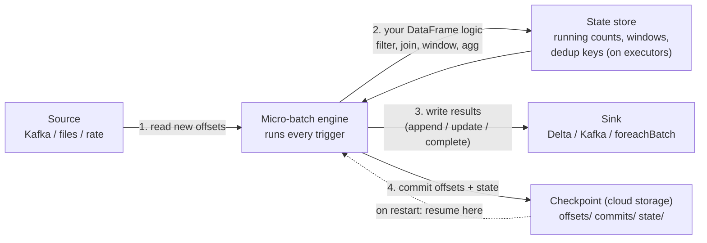
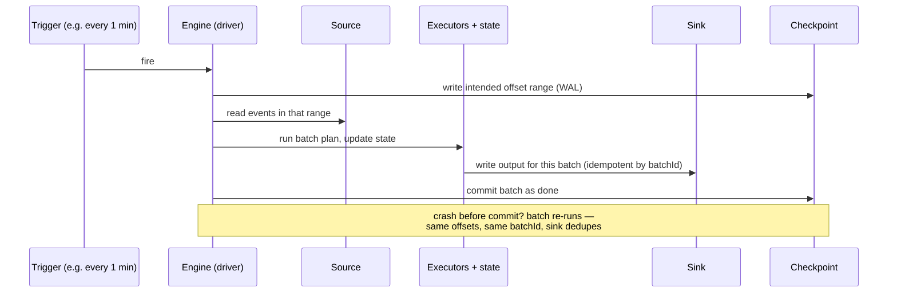

# 12 — Structured Streaming Pipeline

## Why this matters

Structured Streaming is how Spark does real-time — and it's deliberately *not* a new API. The
same DataFrame operations run on an unbounded table. What's new is the machinery around it:
sources with offsets, a micro-batch engine, state, and checkpoints. See those parts once as a
system and every streaming option (`trigger`, `outputMode`, `checkpointLocation`) has an obvious
home.

## The idea in plain English

Think of the stream as a table that never stops growing. Every trigger interval, Spark asks the
source "what's new since my last offsets?", runs your normal DataFrame logic on just that slice
(a **micro-batch**), keeps any running aggregations in a **state store**, writes results to the
sink, and records progress in the **checkpoint**. Crash, restart, and it resumes from the
checkpoint — nothing lost, nothing double-counted (with the right sink).

## Diagram — the pipeline

## Diagram — one micro-batch, step by step

## Key takeaways

- **Same engine as batch:** each micro-batch is planned by Catalyst like a normal job — you can
  read its plan in the SQL tab, and skew/shuffle knowledge applies unchanged.
- Exactly-once = **replayable source** (Kafka offsets, file lists) + **checkpointed progress** +
  **idempotent/transactional sink** (Delta). Break any leg and you're at at-least-once.
- The checkpoint directory *is* the stream's identity: offsets, batch commits, and state live
  there. One checkpoint per query, never shared, never hand-edited.
- Output modes: `append` (finalized rows only), `update` (changed aggregates), `complete` (whole
  result table). Aggregations in append mode need a watermark to know when rows are final
  ([page 13](./13_watermark_checkpoint_flow.md)).
- `foreachBatch` is the escape hatch: run arbitrary batch code (like MERGE) per micro-batch.

## Common mistakes

- Deleting or reusing a checkpoint directory to "fix" a stuck stream — you either lose your place
  or resume someone else's. Understand *why* it's stuck first
  ([`13_debugging_playbook/04_streaming_checkpoint_issues.md`](../13_debugging_playbook/04_streaming_checkpoint_issues.md)).
- Changing the query (new aggregation keys, different source) against an old checkpoint — state
  schemas no longer match; many changes require a new checkpoint and a backfill plan.
- Unbounded state: aggregating or deduping without a watermark means state grows forever until
  executors OOM — slowly, in production, weeks later.
- Using `complete` mode on a high-cardinality aggregation — the entire result rewrites every batch.

## Interview angle

*"How does Structured Streaming achieve exactly-once?"* — the three-legged answer: replayable
source + WAL/checkpoint + idempotent sink, with the batchId re-run story from the sequence diagram.
*"Micro-batch vs record-at-a-time?"* — micro-batching trades a little latency (seconds) for
throughput, full Catalyst optimization, and simple fault tolerance; continuous processing exists
but is niche.

## Related in this repo

- [`05_streaming/01-the-model.md`](../05_streaming/01-the-model.md) and
  [`02-sources-and-sinks.md`](../05_streaming/02-sources-and-sinks.md)
- [`05_streaming/07-kafka.md`](../05_streaming/07-kafka.md),
  [`08-foreachbatch.md`](../05_streaming/08-foreachbatch.md),
  [`09-exactly-once-and-failures.md`](../05_streaming/09-exactly-once-and-failures.md)
- [`05_streaming/diagrams/streaming-model.mmd`](../05_streaming/diagrams/streaming-model.mmd) and
  [`exactly-once-flow.mmd`](../05_streaming/diagrams/exactly-once-flow.mmd)
- [`06_real_projects/clickstream-stream/`](../06_real_projects/clickstream-stream/) — build one
