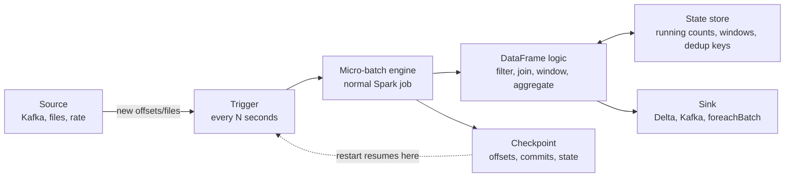

# 12 - Structured Streaming

## Why it matters

Structured Streaming lets you use DataFrame logic on data that never stops arriving. The hard part
is not the syntax; it is understanding offsets, micro-batches, state, checkpoints, and sinks.

## Plain English explanation

Spark treats a stream like an unbounded table. On each trigger, it reads new data, runs a
micro-batch through your DataFrame plan, updates state if needed, writes output, and records
progress in a checkpoint.

## Mermaid diagram

## Visual asset

Open animation: [Streaming Micro-Batches Animation](../assets/animations/streaming_micro_batches.html)

Plain English: each trigger reads new input, runs a normal Spark micro-batch, updates state, writes
output, and records progress in the checkpoint.

Common interview question: "How does Structured Streaming achieve exactly-once processing?"

Debugging angle: for stuck or duplicated streaming output, check source offsets, checkpoint
location, state size, sink idempotency, and whether the query changed incompatibly.

## Key takeaways

- Each micro-batch is a Spark job.
- Exactly-once needs replayable source, checkpointed progress, and idempotent or transactional sink.
- Stateful operations need a state store and usually a watermark.
- The checkpoint directory is the identity of the streaming query.

## Common mistakes

- Reusing a checkpoint across different queries.
- Changing stateful query logic against an incompatible old checkpoint.
- Using `foreachBatch` without idempotency by `batchId`.
- Treating streaming as record-at-a-time processing when Spark is usually micro-batch based.

## Interview angle

For exactly-once, give the three-part answer: replayable source, checkpoint or WAL, and sink that
can handle retries without duplicating output.

## Related repo folders/files

- [`05_streaming/01-the-model.md`](../05_streaming/01-the-model.md)
- [`05_streaming/03-triggers-modes-checkpoints.md`](../05_streaming/03-triggers-modes-checkpoints.md)
- [`05_streaming/examples/01_rate_source_basic.py`](../05_streaming/examples/01_rate_source_basic.py)
- [`assets/animations/streaming_micro_batches.html`](../assets/animations/streaming_micro_batches.html)
