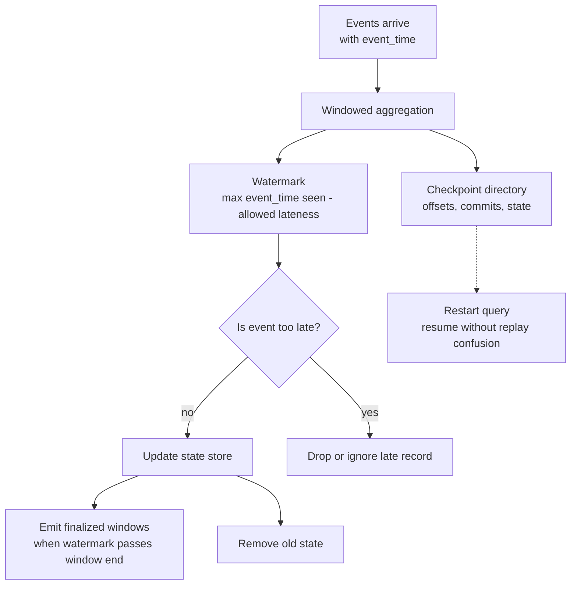

# 13 - Watermark and Checkpointing

## Why it matters

Streaming jobs fail when state grows forever or recovery is unclear. Watermarks control late data
and state cleanup. Checkpoints control restart behavior.

## Plain English explanation

A watermark says how late data is allowed to be based on event time. Once Spark is confident a time
window is too old to change, it can finalize output and remove state. A checkpoint records offsets,
commits, and state so the query can resume after failure.

## Mermaid diagram

## Key takeaways

- Watermarks are based on event time, not processing time.
- Checkpoints are required for reliable streaming recovery.
- Stateful aggregations without watermarks can grow without bound.
- Late data policy is a business decision, not just a Spark setting.

## Common mistakes

- Using ingestion time when the business question needs event time.
- Setting the watermark too low and dropping valid late data.
- Setting the watermark too high and keeping too much state.
- Deleting checkpoints to clear an error without planning replay consequences.

## Interview angle

Explain the split: watermark answers "when can old state be closed?", checkpoint answers "where do
we resume after failure?" They solve different streaming problems.

## Related repo folders/files

- [`05_streaming/04-event-time-and-watermarks.md`](../05_streaming/04-event-time-and-watermarks.md)
- [`05_streaming/09-exactly-once-and-failures.md`](../05_streaming/09-exactly-once-and-failures.md)
- [`05_streaming/examples/03_watermark_windowed_agg.py`](../05_streaming/examples/03_watermark_windowed_agg.py)
- [`13_debugging_playbook/04_streaming_checkpoint_issues.md`](../13_debugging_playbook/04_streaming_checkpoint_issues.md)
